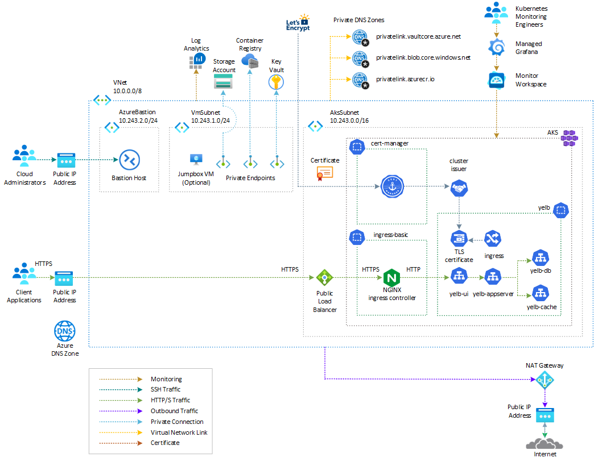

# Porting a Web Application from AWS Elastic Kubernetes Service (EKS) to Azure Kubernetes Service (AKS)

In this sample, you learn how to migrate a web application from [Amazon Elastic Kubernetes Service (EKS)](https://docs.aws.amazon.com/en_us/eks/latest/userguide/what-is-eks.html) to [Azure Kubernetes Service (AKS)](https://docs.microsoft.com/en-us/azure/aks/intro-kubernetes).

## Architecture on Azure

Azure offers several options for deploying the [Yelb application](https://github.com/mreferre/yelb/) on an [Azure Kubernetes Service (AKS)](https://docs.microsoft.com/en-us/azure/aks/intro-kubernetes) cluster and securing it with a web application firewall. For a comprehensive list of the available options, please consult the [README](./azure/README.md) located in the [azure](./azure/) folder. In this sample, we'll provide detailed instructions and resources t for deploying th following solutions.

### Use Application Gateway WAFv2 with NGINX Ingress controller

In this solution, the [Yelb](https://github.com/mreferre/yelb/) application is deployed hosted by an [Azure Kubernetes Service (AKS)](https://docs.microsoft.com/en-us/azure/aks/intro-kubernetes) cluster and exposed via an ingress controller such as [NGINX ingress controller](https://github.com/kubernetes/ingress-nginx). The ingress controller service is exposed via an [internal (or private) load balancer](https://learn.microsoft.com/en-us/azure/load-balancer/load-balancer-overview). Internal load balancers are used to load balance traffic inside a virtual network, in this case the virtual network hosting the AKS cluster. An internal load balancer frontend can be accessed from an on-premises network in a hybrid scenario. For more information on how to use an internal load balancer to restrict access to your applications in Azure Kubernetes Service (AKS), see [Use an internal load balancer with Azure Kubernetes Service (AKS)](https://learn.microsoft.com/en-us/azure/aks/internal-lb?tabs=set-service-annotations). The [Yelb](https://github.com/mreferre/yelb/) application is secured with an [Azure Application Gateway](https://learn.microsoft.com/en-us/azure/application-gateway/overview) resource that is deployed in a dedicated subnet within the same virtual network as the AKS cluster or in a peered virtual network. The access to the Yelb application hosted by Azure Kubernetes Service (AKS) and exposed via an [Azure Application Gateway](https://learn.microsoft.com/en-us/azure/application-gateway/overview) is secured by the [Azure Web Application Firewall (WAF)](https://learn.microsoft.com/en-us/azure/web-application-firewall/overview) that provides centralized protection of web applications from common exploits and vulnerabilities. The solution architecture is depicted in the diagram below.

The solution architecture is designed as follows:

- The AKS cluster is deployed with the following features:
  - Network Configuration: Azure CNI Overlay
  - Network Dataplane: Cilium
  - Network Policy: Cilium
- The Application Gateway handles TLS termination and communicates with the backend application over HTTPS.
- The Application Gateway Listener utilizes an SSL certificate obtained from [Azure Key Vault](https://learn.microsoft.com/en-us/azure/key-vault/general/overview).
- The Azure WAF Policy associated to the Listener is used to run OWASP rules and custom rules against the incoming request and block malicous attacks.
- The Application Gateway Backend HTTP Settings are configured to invoke the Yelb application via HTTPS on port 443.
- The Application Gateway Backend Pool and Health Probe are set to call the NGINX ingress controller through the AKS internal load balancer using HTTPS.
- The NGINX ingress controller is deployed to use the AKS internal load balancer instead of the public one.
- The Azure Kubernetes Service (AKS) cluster is configured with the [Azure Key Vault provider for Secrets Store CSI Driver](https://learn.microsoft.com/en-us/azure/aks/csi-secrets-store-driver) addonto retrieve secret, certificates, and keys from Azure Key Vault via a [CSI volume](https://kubernetes-csi.github.io/docs/).
- A [SecretProviderClass](https://learn.microsoft.com/en-us/azure/aks/hybrid/secrets-store-csi-driver)  is used to retrieve the same certificate used by the Application Gateway from Key Vault.
- An [Kubernetes ingress](https://kubernetes.io/docs/concepts/services-networking/ingress/) object employs the NGINX ingress controller to expose the application via HTTPS through the AKS internal load balancer.
- The Yelb service is of type ClusterIP, as it is exposed via the NGINX ingress controller.

For comprehensive instructions and resources to successfully deploy the [Yelb application](https://github.com/mreferre/yelb/) on [Azure Kubernetes Service (AKS)](https://docs.microsoft.com/en-us/azure/aks/intro-kubernetes) using this architecture, please refer to the [README](./azure/nginx-with-azure-waf/README.md) located in the [azure/nginx-with-azure-waf](./azure/nginx-with-azure-waf/) folder.

### Use NGINX Ingress Controller and ModSecurity

The following solution makes use of [NGINX ingress controller](https://docs.nginx.com/nginx-ingress-controller/intro/overview/) to expose the Yelb application and ModSecurity to block any malicious or suspicious traffic based on predefined OWASP or custom rules. [ModSecurity](https://github.com/SpiderLabs/ModSecurity) is an open-source web application firewall (WAF) that is compatible with popular web servers such as Apache, NGINX, and ISS. It provides protection from a wide range of attacks by using a powerful rule-definition language.

ModSecurity can be used with the NGINX Ingress controller to provide an extra layer of security to web applications exposed via Kubernetes. The NGINX Ingress controller acts as a reverse proxy, forwarding traffic to the web application, while ModSecurity inspects the incoming requests and blocks any malicious or suspicious traffic based on the defined rules.

Using ModSecurity with NGINX Ingress controllers in Kubernetes provides a cloud-agnostic solution that can be deployed on any managed Kubernetes cluster on any cloud platform. This means the solution can be deployed "as is" on various cloud platforms, including:

- [Amazon Elastic Kubernetes Service (EKS)](https://aws.amazon.com/eks/)
- [Azure Kubernetes Service (AKS)](https://docs.microsoft.com/en-us/azure/aks/intro-kubernetes)
- [Google Kubernetes Engine (GKE)](https://cloud.google.com/kubernetes-engine)

The cloud-agnostic nature of this solution allows multi-cloud customers to deploy and configure their web applications, such as Yelb, consistently across different cloud platforms without significant modifications. It provides flexibility and portability, enabling you to switch between cloud providers or have a multi-cloud setup while maintaining consistent security measures.

For detailed instructions and resources to successfully deploy the [Yelb application](https://github.com/mreferre/yelb/) on [Azure Kubernetes Service (AKS)](https://docs.microsoft.com/en-us/azure/aks/intro-kubernetes) using this architecture, please refer to the [README](./azure/nginx-with-modsecurity-waf/README.md) located in the [azure/nginx-with-modsecurity-waf](./azure/nginx-with-modsecurity-waf/) folder.

## Architecture on AWS

In order to easily protect web applications and APIs from common web exploits, AWS offers [AWS Web Application Firewall (WAF)](https://aws.amazon.com/waf/) and [AWS Firewall Manager](https://aws.amazon.com/firewall-manager). These services allow you to monitor HTTP(S) requests and defend against DDoS attacks, bots, and common attack patterns such as SQL injection or cross-site scripting.

To demonstrate the implementation of a web application firewall using [AWS Web Application Firewall (WAF)](https://aws.amazon.com/waf/) to safeguard applications running on [Amazon Elastic Kubernetes Service (EKS)](https://docs.aws.amazon.com/en_us/eks/latest/userguide/what-is-eks.html), the following solution can be followed:

1. Create an EKS cluster and deploy a sample workload.
2. Expose the sample application using an [Application Load Balancer (ALB)](https://aws.amazon.com/elasticloadbalancing/application-load-balancer).
3. Create a [Kubernetes ingress](https://kubernetes.io/docs/concepts/services-networking/ingress/) and associate an [AWS WAF web access control list (web ACL)](https://docs.aws.amazon.com/waf/latest/developerguide/web-acl.html) with the ALB in front of the ingress.

AWS WAF provides control over the type of traffic that reaches your web applications, ensuring protection against unauthorized access attempts and unwanted traffic. It integrates seamlessly with [Amazon CloudFront](https://aws.amazon.com/cloudfront), ALB, [Amazon API Gateway](https://aws.amazon.com/api-gateway), and [AWS AppSync](https://aws.amazon.com/appsync). By leveraging an existing ALB as an ingress for Kubernetes-hosted applications, adding a web application firewall to your apps can be accomplished quickly.

For customers operating in multiple AWS accounts, [AWS Organizations](https://aws.amazon.com/organizations) and AWS Firewall Manager offer centralized control over AWS WAF rules. With Firewall Manager, security policies can be enforced across accounts to ensure compliance and adherence to best practices. It is recommended to run EKS clusters in dedicated Virtual Private Clouds (VPCs), and Firewall Manager can ensure that WAF rules are correctly applied across accounts, regardless of where your applications run.

By implementing these measures, the [Yelb](https://github.com/mreferre/yelb/) can be effectively deployed on [AWS EKS](https://docs.aws.amazon.com/eks/latest/userguide/what-is-eks.html) and protected by [AWS WAF](https://aws.amazon.com/waf/)  - safeguarding web-based workloads and ensuring a secure and reliable user experience.

For more information, see [Protecting your Amazon EKS web apps with AWS WAF](https://aws.amazon.com/blogs/containers/protecting-your-amazon-eks-web-apps-with-aws-waf/). For comprehensive instructions and resources to successfully deploy the [Yelb application](https://github.com/mreferre/yelb/) on [AWS Elastic Kubernetes Service (EKS)](https://docs.aws.amazon.com/eks/latest/userguide/what-is-eks.html), please refer to the [README](./aws/README.md) located in the [aws](./aws/) folder.