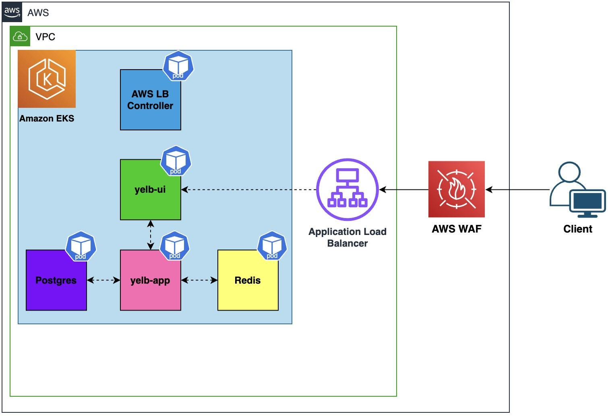

# Yelb Architecture on AWS

This section contains a list of scripts that you can use to automate the deployment of the [Yelb](https://github.com/mreferre/yelb/) application on [AWS Elastic Kubernetes Service (EKS)](https://docs.aws.amazon.com/eks/latest/userguide/what-is-eks.html). This solution demonstrates how to implement a web application firewall  using AWS WAF to protect applications running on EKS. You will start by  creating an EKS cluster and deploying a sample workload. The sample  application that you will use for this walkthrough is a web-based  application that we’ll expose using an [Application Load Balancer](https://docs.aws.amazon.com/elasticloadbalancing/latest/application/introduction.html). You will then create a [Kubernetes ingress](https://kubernetes.io/docs/concepts/services-networking/ingress/) and associate an [AWS WAF web access control list (web ACL)](https://docs.aws.amazon.com/waf/latest/developerguide/web-acl.html) control list (web ACL) with an ALB in front of the ingress.

.

For more information, see [Protecting your Amazon EKS web apps with AWS WAF](https://aws.amazon.com/blogs/containers/protecting-your-amazon-eks-web-apps-with-aws-waf/).

## Prerequisites

You will need the following to complete the tutorial:

- [AWS CLI **version 2**](https://docs.aws.amazon.com/cli/latest/userguide/install-cliv2.html)
- [eksctl](https://eksctl.io/installation/)
- [kubectl](https://docs.aws.amazon.com/eks/latest/userguide/install-kubectl.html)
- [Helm](https://helm.sh/docs/intro/install/)
- [Git](https://git-scm.com/downloads)

## Architecture

In order to easily protect web applications and APIs from common web exploits, AWS offers [AWS Web Application Firewall (WAF)](https://aws.amazon.com/waf/) and [AWS Firewall Manager](https://aws.amazon.com/firewall-manager). These services allow you to monitor HTTP(S) requests and defend against DDoS attacks, bots, and common attack patterns such as SQL injection or cross-site scripting.

To demonstrate the implementation of a web application firewall using [AWS Web Application Firewall (WAF)](https://aws.amazon.com/waf/) to safeguard applications running on [Amazon Elastic Kubernetes Service (EKS)](https://docs.aws.amazon.com/en_us/eks/latest/userguide/what-is-eks.html), the following solution can be followed:

1. Create an EKS cluster and deploy a sample workload.
2. Expose the sample application using an [Application Load Balancer (ALB)](https://aws.amazon.com/elasticloadbalancing/application-load-balancer).
3. Create a [Kubernetes ingress](https://kubernetes.io/docs/concepts/services-networking/ingress/) and associate an [AWS WAF web access control list (web ACL)](https://docs.aws.amazon.com/waf/latest/developerguide/web-acl.html) with the ALB in front of the ingress.

AWS WAF provides control over the type of traffic that reaches your web applications, ensuring protection against unauthorized access attempts and unwanted traffic. It integrates seamlessly with [Amazon CloudFront](https://aws.amazon.com/cloudfront), ALB, [Amazon API Gateway](https://aws.amazon.com/api-gateway), and [AWS AppSync](https://aws.amazon.com/appsync). By leveraging an existing ALB as an ingress for Kubernetes-hosted applications, adding a web application firewall to your apps can be accomplished quickly.

For customers operating in multiple AWS accounts, [AWS Organizations](https://aws.amazon.com/organizations) and AWS Firewall Manager offer centralized control over AWS WAF rules. With Firewall Manager, security policies can be enforced across accounts to ensure compliance and adherence to best practices. It is recommended to run EKS clusters in dedicated Virtual Private Clouds (VPCs), and Firewall Manager can ensure that WAF rules are correctly applied across accounts, regardless of where your applications run.

By implementing these measures, the [Yelb](https://github.com/mreferre/yelb/) can be effectively deployed on [AWS EKS](https://docs.aws.amazon.com/eks/latest/userguide/what-is-eks.html) and protected by [AWS WAF](https://aws.amazon.com/waf/)  - safeguarding web-based workloads and ensuring a secure and reliable user experience.



For more information, see [Protecting your Amazon EKS web apps with AWS WAF](https://aws.amazon.com/blogs/containers/protecting-your-amazon-eks-web-apps-with-aws-waf/).

## Create an EKS cluster

Let’s start by setting a few environment variables in the [00-variables.sh](./scripts/00-variables.sh) file in the `scripts` folder:

```bash
WAF_AWS_REGION="us-east-2" 
WAF_ACCOUNT_ID=$(aws sts get-caller-identity --query 'Account' --output text)
WAF_EKS_CLUSTER_NAME="waf-eks-sample"
WAF_NAME="WAF-FOR-YELB"
```

You can create an EKS cluster using [eksctl](https://eksctl.io/) tool. You can use the [01-create-eks-cluster.sh](./scripts/01-create-eks-cluster.sh) Bash script in the `scripts` folder:

```bash
#!/bin/bash

# For more information, see https://aws.amazon.com/it/blogs/containers/protecting-your-amazon-eks-web-apps-with-aws-waf/

# Load environment variables
source ./00-variables.sh

# Check if the cluster already exists
EXISTING_CLUSTER=$(eksctl get cluster -o json | jq -r ".[].Name" | grep -E "^${WAF_EKS_CLUSTER_NAME}$")

if [ -n "$EXISTING_CLUSTER" ]; then
  echo "Cluster [$WAF_EKS_CLUSTER_NAME] already exists. Skipping cluster creation."
else
  echo "Cluster [$WAF_EKS_CLUSTER_NAME] does not exist. Creating a new cluster..."

  # Create EKS cluster
  eksctl create cluster \
    --name $WAF_EKS_CLUSTER_NAME \
    --region $WAF_AWS_REGION \
    --managed \
    --nodegroup-name default \
    --ssh-access=true \
    --nodes-min 3 \
    --nodes-max 5 \
    --node-type t3.medium \
    --node-labels "env=dev" \
    --tags "env=dev" \
    --with-oidc \
    --zones $WAF_AWS_REGION"a,"$WAF_AWS_REGION"b,"$WAF_AWS_REGION"c" \
    --asg-access \
    --alb-ingress-access=true

  # Check if the kubectl config already exists for the cluster
  EXISTING_CONFIG=$(kubectl config get-contexts -o name | grep -E "^$WAF_EKS_CLUSTER_NAME$")

  if [ -n "$EXISTING_CONFIG" ]; then
    echo "Kubectl config for cluster [$WAF_EKS_CLUSTER_NAME] already exists. Removing existing config..."

    # Remove the existing kubectl config
    kubectl config delete-context "$WAF_EKS_CLUSTER_NAME"
    kubectl config delete-cluster "$WAF_EKS_CLUSTER_NAME"
  fi

  # Update the kubectl config for the cluster
  aws eks update-kubeconfig --name "$WAF_EKS_CLUSTER_NAME" --alias "$WAF_EKS_CLUSTER_NAME"
fi
```


## Install the AWS Load Balancer Controller

The AWS Load Balancer Controller is a Kubernetes controller  that runs in your EKS cluster and handles the configuration of the  Network Load Balancers and Application Load Balancers on your behalf. It allows you to configure Load Balancers declaratively in the same manner as you handle the configuration of your application.

Install the AWS Load Balancer Controller by running the [02-install-aws-load-balancer-controller.sh](./scripts/02-install-aws-load-balancer-controller.sh) Bash script in the `scripts` folder:

```bash
# Load environment variables
source ./00-variables.sh

# The AWS Load Balancer Controller is a Kubernetes controller that runs in your EKS cluster and handles the configuration of the Network Load Balancers and Application Load Balancers on your behalf.
# It allows you to configure Load Balancers declaratively in the same manner as you handle the configuration of your application.

# Get the VPC ID
WAF_VPC_ID=$(aws eks describe-cluster \
  --name $WAF_EKS_CLUSTER_NAME \
  --region $WAF_AWS_REGION \
  --query 'cluster.resourcesVpcConfig.vpcId' \
  --output text)

# Install the AWS Load Balancer Controller by running these commands:
## Associate OIDC provider
eksctl utils associate-iam-oidc-provider \
  --cluster $WAF_EKS_CLUSTER_NAME \
  --region $WAF_AWS_REGION \
  --approve

# Download the IAM policy document
curl -o iam-policy.json https://raw.githubusercontent.com/aws-samples/containers-blog-maelstrom/main/eks-waf-blog/iam-policy.json

# Create an IAM policy
WAF_LBC_IAM_POLICY=$(aws iam create-policy \
  --policy-name AWSLoadBalancerControllerIAMPolicy-WAFDEMO \
  --policy-document file://iam-policy.json)

# Get IAM Policy ARN
WAF_LBC_IAM_POLICY_ARN=$(aws iam list-policies \
  --query "Policies[?PolicyName=='AWSLoadBalancerControllerIAMPolicy-WAFDEMO'].Arn" \
  --output text)

# Create a service account
eksctl create iamserviceaccount \
  --cluster=$WAF_EKS_CLUSTER_NAME \
  --region $WAF_AWS_REGION \
  --namespace=kube-system \
  --name=aws-load-balancer-controller \
  --override-existing-serviceaccounts \
  --attach-policy-arn=${WAF_LBC_IAM_POLICY_ARN} \
  --approve

# Add the helm repo and install the AWS Load Balancer Controller
helm repo add eks https://aws.github.io/eks-charts && helm repo update

# Update the Helm repo
helm repo update

# Install the AWS Load Balancer Controller via Helm
helm install aws-load-balancer-controller \
  eks/aws-load-balancer-controller \
  --namespace kube-system \
  --set clusterName=$WAF_EKS_CLUSTER_NAME \
  --set serviceAccount.create=false \
  --set serviceAccount.name=aws-load-balancer-controller \
  --set vpcId=$WAF_VPC_ID \
  --set region=$WAF_AWS_REGION

# Verify that the controller is installed
kubectl get deployment -n kube-system aws-load-balancer-controller
```


## 

## Deploy the sample app

This demo uses a sample application called [Yelb](https://github.com/mreferre/yelb/). It provides an Angular 2-based UI that will represent a real-world  application for this post. Here’s a high-level architectural view of  Yelb:high-level architectural view of Yelb:


You can clone the repository and deploy Yelb in your EKS cluster using the following code:

```bash
git clone https://github.com/aws/aws-app-mesh-examples.git
cd aws-app-mesh-examples/walkthroughs/eks-getting-started/
kubectl apply -f infrastructure/yelb_initial_deployment.yaml

// Check the deployed resources within the yelb namespace
kubectl get all -n yelb
```

As an alternativem, you can use the [](./scripts/03-deploy-sample-app.sh) Bash script to deploy the Yelb application:

```bash
 Download the Yelb YAML manifest from the official repository
curl -o yelb_initial_deployment.yaml https://raw.githubusercontent.com/aws/aws-app-mesh-examples/main/walkthroughs/eks-getting-started/infrastructure/yelb_initial_deployment.yaml

# Apply the YAML configuration
kubectl apply -f yelb_initial_deployment.yaml

# Check the deployed resources within the yelb namespace:
kubectl get all -n yelb
```


Note: The Postgres database that Yelb uses is not configured to use a persistent volume.

## Expose Yelb using an ingress

You can now create a Kubernetes ingress to make Yelb available  publicly. The AWS Load Balancer Controller will associate the the  ingress with an Application Load Balancer.``

```bash
cat << EOF > yelb-ingress.yaml
apiVersion: networking.k8s.io/v1
kind: Ingress
metadata:
  name: yelb.app
  namespace: yelb
  annotations:
    alb.ingress.kubernetes.io/scheme: internet-facing
    alb.ingress.kubernetes.io/target-type: ip
spec:
  ingressClassName: alb # Updated method to attach ingress class
  rules:
    - http:
        paths:
          - path: /
            pathType: Prefix
            backend:
              service:
                name: yelb-ui
                port:
                  number: 80
EOF
kubectl apply -f yelb-ingress.yaml  
```

You can now test the application by sending a request using `curl` or by using a web browser to navigate to the URL. It may take some time for the load balancer to become available, use command below to confirm:

```bash
kubectl wait -n yelb ingress yelb.app --for=jsonpath='{.status.loadBalancer.ingress}' &&

YELB_URL=$(kubectl get ingress yelb.app -n yelb \
-o jsonpath="{.status.loadBalancer.ingress[].hostname}")
```

You can obtain the URL using Kubernetes API and also navigate to the site by entering the URL:

```bash
echo $YELB_URL
```

## Add a web application firewall to the ingress

Now that the sample application is functional, you can add a web application firewall to it. The first thing you need to do is create a  WAS web ACL. In AWS WAF, a web access control list or a web ACL monitors HTTP(S) requests for one or more AWS resources. These resources can be  an [Amazon API Gateway](https://aws.amazon.com/it/api-gateway/), [AWS AppSync](https://aws.amazon.com/it/appsync/), [Amazon CloudFront](https://aws.amazon.com/it/cloudfront/), or an [Application Load Balancer](https://aws.amazon.com/it/elasticloadbalancing/application-load-balancer/).

Within an AWS WAF Web ACL, you associate rule groups that  define the attack patterns to look for in web requests and the action to take when a request matches the patterns. Rule groups are reusable  collections of rules. You can use Managed rule groups offered and  maintained by AWS and AWS Marketplace sellers. When you use managed  rules, AWS WAF automatically updates your WAF Rules regularly to ensure  that your web apps are protected against newer threats. You can also  write your own rules and use your own rule groups.

Create an AWS WAF web ACL:

```bash
WAF_WACL_ARN=$(aws wafv2 create-web-acl \
--name WAF-FOR-YELB \
--region $WAF_AWS_REGION \
--default-action Allow={} \
--scope REGIONAL \
--visibility-config SampledRequestsEnabled=true,CloudWatchMetricsEnabled=true,MetricName=YelbWAFAclMetrics \
--description 'WAF Web ACL for Yelb' \
--query 'Summary.ARN' \
--output text)

echo $WAF_WACL_ARN
```

Store the AWS WAF web ACL’s Id in an environment variable as  it is required for updating the AWS WAF web ACL in the upcoming steps:

```bash
WAF_WAF_ID=$(aws wafv2 list-web-acls \
  --region $WAF_AWS_REGION \
  --scope REGIONAL \
  --query "WebACLs[?Name=='WAF-for-Yelb'].Id" \
  --output text)
```

Update the ingress and associate this AWS WAF web ACL with the ALB that the ingress uses:

```bash
cat << EOF > yelb-ingress-waf.yaml
apiVersion: networking.k8s.io/v1
kind: Ingress
metadata:
  name: yelb.app
  namespace: yelb
  annotations:
    alb.ingress.kubernetes.io/scheme: internet-facing
    alb.ingress.kubernetes.io/target-type: ip
    alb.ingress.kubernetes.io/wafv2-acl-arn: ${WAF_WACL_ARN}
spec:
  ingressClassName: alb 
  rules:
    - http:
        paths:
          - path: /
            pathType: Prefix
            backend:
              service:
                name: yelb-ui
                port:
                  number: 80
EOF
kubectl apply -f yelb-ingress-waf.yaml 
```

By adding `alb.ingress.kubernetes.io/wafv2-acl-arn` annotation to the ingress, AWS WAF is inspecting incoming traffic.  However, it’s not blocking any traffic yet. Before you send a request to the sample app using `curl,` make sure to wait for the load balancer to become ready for traffic.

```bash
kubectl wait -n yelb ingress yelb.app --for=jsonpath='{.status.loadBalancer.ingress}'
```

Now you can send traffic to the Yelb sample app:

```bash
curl $YELB_URL
```

You should see a response from Yelb’s UI server:


You can use the [06-create-aws-waf-web-acl-with-no-rules.sh](./scripts/06-create-aws-waf-web-acl-with-no-rules.sh) Bash script to execute the above steps.

## Enable traffic filtering in AWS WAF

You have associated the ALB that the Kubernetes ingress uses  with an AWS WAF web ACL Every request that’s handled by the sample  application Yelb pods goes through AWS WAF for inspection. The AWS WAF  web ACL is currently allowing every request to pass because you haven’t configured any [AWS WAF rules](https://docs.aws.amazon.com/waf/latest/developerguide/waf-rules.html). In order to filter out potentially malicious traffic, you have to  specify rules. These rules will tell AWS WAF how to inspect web requests and what to do when it finds a request that matches the inspection  criteria.

AWS WAF [Bot Control](https://docs.aws.amazon.com/waf/latest/developerguide/waf-bot-control.html) is a managed rule group that provides visibility and control over  common and pervasive bot traffic to web applications. The Bot Control  managed rule group has been tuned to detect various types of bots seen  on the web. It can also detect requests that are generated from HTTP  libraries, such as `libcurl.`

Since the sample workload isn’t popular enough to attract malicious traffic, let’s use `curl` to generate bot-like traffic. Once enabled, we expect users who are  accessing the application from a web browser like Firefox or Chrome to  be allowed in, whereas traffic generated from `curl` would be blocked out.

While Bot Control has been optimized to minimize [false positives](https://docs.aws.amazon.com/waf/latest/developerguide/waf-bot-control-false-positives.html), you should deploy Bot Control in [count mode](https://docs.aws.amazon.com/waf/latest/developerguide/waf-bot-control-deploying.html) first and review CloudWatch metrics and AWS WAF logs to ensure that you are not accidentally blocking legitimate traffic. You can use the [Labels feature](https://docs.aws.amazon.com/waf/latest/developerguide/waf-rule-labels.html) within AWS WAF to customize how Bot Control behaves. Based on labels  generated by Bot Control, you can have AWS WAF take an alternative  action, such as sending out [customized responses](https://docs.aws.amazon.com/waf/latest/developerguide/customizing-the-response-for-blocked-requests.html) back to the client. Customers use custom responses to override the default response, which is `403 (Forbidden)`, for block actions when they’d like to send a nondefault status, serve a static error page code back to the client, or redirect the client to a  different URL by specifying a `3xx` redirection status code.

Create a rules file:

```bash
cat << EOF > waf-rules.json 
[
    {
      "Name": "AWS-AWSManagedRulesBotControlRuleSet",
      "Priority": 0,
      "Statement": {
        "ManagedRuleGroupStatement": {
          "VendorName": "AWS",
          "Name": "AWSManagedRulesBotControlRuleSet"
        }
      },
      "OverrideAction": {
        "None": {}
      },
      "VisibilityConfig": {
        "SampledRequestsEnabled": true,
        "CloudWatchMetricsEnabled": true,
        "MetricName": "AWS-AWSManagedRulesBotControlRuleSet"
      }
    }
]
EOF
```

Update the AWS WAF web ACL with the following rule:

```bash
aws wafv2 update-web-acl \
--name WAF-FOR-YELB \
--scope REGIONAL \
--id $WAF_WAF_ID \
--default-action Allow={} \
--lock-token $(aws wafv2 list-web-acls \
--region $WAF_AWS_REGION \
--scope REGIONAL \
--query "WebACLs[?Name=='WAF-FOR-YELB'].LockToken" \
--output text) \
--visibility-config SampledRequestsEnabled=true,CloudWatchMetricsEnabled=true,MetricName=YelbWAFAclMetrics \
--region $WAF_AWS_REGION \
--rules file://waf-rules.json
```

Press `q` to exit the `NextLockToken` section. After waiting about 10 seconds, test the rule by sending a request:

```bash
curl $YELB_URL
```


As you see, access to the application is no longer accessible via the terminal.

Now lets open the same URL in your browser below and you should see the Yelb UI.

```bash
echo http://$YELB_URL
```


Note that you added `AWSManagedRulesBotControlRuleSet` rule group to AWS WAF web ACL (see configuration file `waf-rules.json`). This rule group contains rules to block and manage requests from bots as described in [AWS WAF documentation](https://docs.aws.amazon.com/waf/latest/developerguide/aws-managed-rule-groups-list.html#aws-managed-rule-groups-bot). AWS WAF blocks the requests you send using `curl` because AWS WAF web ACL rules are configured to inspect and block  requests for user agent strings that don’t seem to be from a web  browser.

## AWS WAF logging and monitoring

Network security teams require AWS WAF logging to meet their  compliance and auditing needs. AWS WAF provides near-real-time logs  through [Amazon Kinesis Data Firehose](https://aws.amazon.com/kinesis/data-firehose/?kinesis-blogs.sort-by=item.additionalFields.createdDate&kinesis-blogs.sort-order=desc). AWS WAF [logs each request along with information](https://docs.aws.amazon.com/waf/latest/developerguide/logging.html) such as timestamp, header details, and the action of the rule that matched. Customers can integrate AWS WAF logs with [Security information and event management (SIEM)](https://aws.amazon.com/marketplace/solutions/control-tower/siem) solutions or other log analysis tools for debugging and forensics. You  can enable access logging in AWS WAF, save AWS WAF logs to [Amazon S3](https://aws.amazon.com/s3/), and use [Amazon Athena](https://aws.amazon.com/athena/?whats-new-cards.sort-by=item.additionalFields.postDateTime&whats-new-cards.sort-order=desc) to [query WAF logs](https://docs.aws.amazon.com/athena/latest/ug/waf-logs.html) without creating servers. AWS WAF also allows you to redact certain  fields during logging, which is helpful if your requests contain  sensitive information that should not be logged.

After implementing an AWS WAF, it is critical to regularly  review your applications’ traffic to develop a baseline understanding of its traffic patterns. Application and security teams should review [AWS WAF metrics and dimensions](https://docs.aws.amazon.com/waf/latest/developerguide/monitoring-cloudwatch.html#waf-metrics) to ensure that the web ACL rules block requests that can potentially compromise the application’s security and availability.

## AWS Shield Advanced and WAF

[AWS Shield Advanced](https://aws.amazon.com/shield/?whats-new-cards.sort-by=item.additionalFields.postDateTime&whats-new-cards.sort-order=desc) subscribers can also engage the AWS Shield response team during an  active DDoS attack. The AWS Shield Response team helps you analyze  suspicious activity and assists you in mitigating the issue. The  mitigation often involves updating or creating AWS WAF rules and AWS WAF web ACLs in your account.

## AWS Firewall Manager

AWS Firewall Manager enables customers that operate multiple  AWS accounts to centrally manage their web ACL. It simplifies  administration and maintenance tasks across multiple accounts and  resources for a variety of protections, including AWS WAF, AWS Shield  Advanced, Amazon VPC security groups, AWS Network Firewall, and Amazon  Route 53 Resolver DNS Firewall.

If you’d like to use AWS Firewall Manager to centralize the control of AWS WAF in multiple AWS accounts, you’d also need:

1. [AWS Organizations](https://aws.amazon.com/organizations/): Your organization must be using AWS Organizations to manage your  accounts, and All Features must be enabled. For more information, see [Creating an organization](https://docs.aws.amazon.com/organizations/latest/userguide/orgs_manage_create.html) and [Enabling all features in your organization](https://docs.aws.amazon.com/organizations/latest/userguide/orgs_manage_org_support-all-features.html).
2. [A Firewall Manager administrator account](https://docs.aws.amazon.com/waf/latest/developerguide/enable-integration.html): You must designate one of the AWS accounts in your organization as the  Firewall Manager administrator for Firewall Manager. This gives the  account permission to deploy security policies across the organization.
3. [AWS Config](https://aws.amazon.com/config/): You must enable AWS Config for all of the accounts in your organization so  that Firewall Manager can detect newly created resources. To enable AWS  Config for all of the accounts in your organization, use the Enable AWS  Config template from the [StackSets sample templates](https://docs.aws.amazon.com/AWSCloudFormation/latest/UserGuide/stacksets-sampletemplates.html).

You can associate [Firewall Manager](https://aws.amazon.com/firewall-manager/) with either a management account or a member account that has  appropriate permissions as a delegated administrator. AWS Organizations’ documentation includes more information about [using Firewall Manager with AWS Organizations. ](https://docs.aws.amazon.com/organizations/latest/userguide/services-that-can-integrate-fms.html)

## Cleanup

Use the following commands to delete resources created during this post:

```bash
kubectl delete ingress yelb.app -n yelb
aws wafv2 delete-web-acl --id $WAF_WAF_ID --name  WAF-FOR-YELB --scope REGIONAL \
    --lock-token $(aws wafv2 list-web-acls \
      --region $WAF_AWS_REGION \
      --scope REGIONAL \
      --query "WebACLs[?Name=='WAF-FOR-YELB'].LockToken" \
      --output text) \
    --region $WAF_AWS_REGION
helm delete aws-load-balancer-controller -n kube-system
```

```bash
eksctl delete iamserviceaccount \
--cluster $WAF_EKS_CLUSTER_NAME \
--region $WAF_AWS_REGION \
--name aws-load-balancer-controller
```

```bash
aws iam detach-role-policy \
--policy-arn $WAF_LBC_IAM_POLICY_ARN \
--role-name $(aws iam list-entities-for-policy --policy-arn $WAF_LBC_IAM_POLICY_ARN --query 'PolicyRoles[0].RoleName' --output text)

aws iam delete-policy \
--policy-arn $WAF_LBC_IAM_POLICY_ARN

kubectl patch targetgroupbinding k8s-yelb-yelbui-87f2ba1d97 -n yelb --type='json' -p='[{"op": "remove", "path": "/metadata/finalizers"}]'

kubectl patch svc yelb-ui -n yelb --type='json' -p='[{"op": "remove", "path": "/metadata/finalizers"}]'

kubectl delete ns yelb

eksctl delete cluster --name $WAF_EKS_CLUSTER_NAME --region $WAF_AWS_REGION
```

## **Conclusion**

This post demonstrates how to protect your web workloads using AWS WAF. Amazon EKS customers benefit from AWS WAF-provided AWS Managed Rules to add a web application firewall to web apps without learning  how to write AWS WAF rules. Additionally, AWS WAF Bot Control gives you  visibility and control over common and pervasive bot traffic that can  consume excess resources, skew metrics, cause downtime, or perform other undesired activities. You can implement an AWS WAF and testing its  effectiveness by conducting penetration tests regularly to identify gaps in your AWS WAF rules. The [Guidelines for Implementing AWS WAF](https://www.google.com/url?sa=t&rct=j&q=&esrc=s&source=web&cd=&ved=2ahUKEwi4h6rL1JjzAhW4IDQIHWlbAMAQFnoECEMQAQ&url=https%3A%2F%2Fd1.awsstatic.com%2Fwhitepapers%2Fguidelines-implementing-aws-waf.pdf&usg=AOvVaw24QmUPm-xsy-x7o2G15k3F) whitepaper provides a detailed implementation guide for anyone looking to protect web applications.
