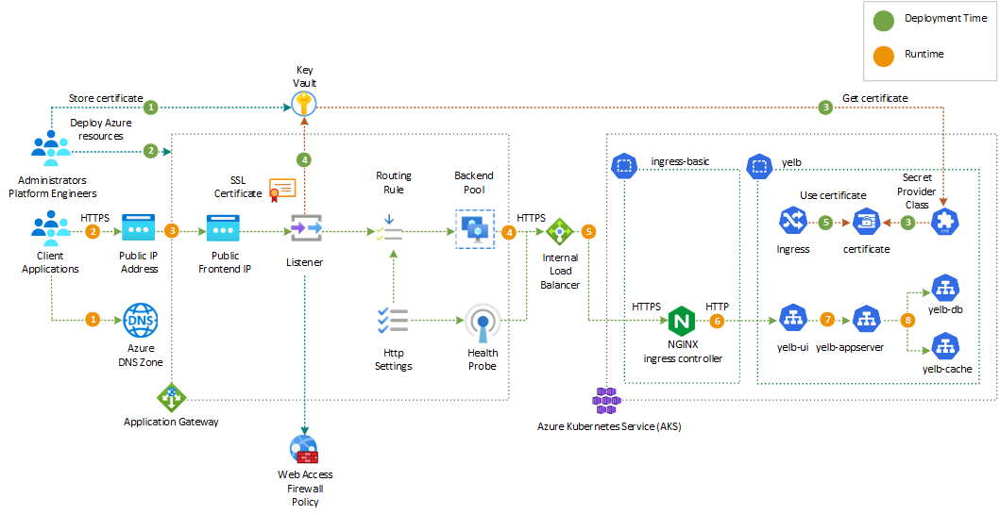

# Yelb Architecture on Azure

Azure offers several options for deploying a web application such as the [Yelb application](https://github.com/mreferre/yelb/) on an [Azure Kubernetes Service (AKS)](https://docs.microsoft.com/en-us/azure/aks/intro-kubernetes) cluster and securing it with a web application firewall. Currently, the Azure services that support [Azure Web Application Firewall (WAF)](https://learn.microsoft.com/en-us/azure/web-application-firewall/overview) are [Azure Front Door](https://learn.microsoft.com/en-us/azure/frontdoor/front-door-overview) and [Azure Application Gateway](https://learn.microsoft.com/en-us/azure/application-gateway/overview). You can find more information about them here:

- [What is Azure Web Application Firewall on Azure Front Door?](https://learn.microsoft.com/en-us/azure/web-application-firewall/afds/afds-overview)
- [What is Azure Web Application Firewall on Azure Application Gateway?](https://learn.microsoft.com/en-us/azure/web-application-firewall/ag/ag-overview) 

Please note that [Application Gateway for Containers](https://learn.microsoft.com/en-us/azure/application-gateway/for-containers/overview) currently does not support Azure Web Application Firewall.

Alternatively, you can use the [ModSecurity](https://github.com/owasp-modsecurity/ModSecurity-nginx) open-source web access firewall with the [NGINX ingress controller](https://github.com/kubernetes/ingress-nginx) instead of the Azure Web Application Firewall. Each of these solutions has its own benefits, caveats, and suggested scenarios, which we can explore further.

## Table of Contents

- [Yelb Architecture on Azure](#yelb-architecture-on-azure)
  - [Table of Contents](#table-of-contents)
  - [Azure Load Balancers and Web Access Firewall](#azure-load-balancers-and-web-access-firewall)
    - [Azure Application Gateway](#azure-application-gateway)
    - [Azure Web Access Firewall (WAF)](#azure-web-access-firewall-waf)
    - [Azure Application Gateway for Containers](#azure-application-gateway-for-containers)
    - [Azure Front Door](#azure-front-door)
  - [Solutions to deploy and protect the Yelb application on Azure](#solutions-to-deploy-and-protect-the-yelb-application-on-azure)
    - [Use Application Gateway WAFv2 with NGINX Ingress controller](#use-application-gateway-wafv2-with-nginx-ingress-controller)
      - [Deployment workflow](#deployment-workflow)
      - [Runtime workflow](#runtime-workflow)
    - [Use Application Gateway Ingress Controller and Azure WAF Policy](#use-application-gateway-ingress-controller-and-azure-waf-policy)
    - [Use Azure Application Gateway for Containers](#use-azure-application-gateway-for-containers)
    - [Use Azure Front Door](#use-azure-front-door)
      - [Deployment workflow](#deployment-workflow-1)
      - [Runtime workflow](#runtime-workflow-1)
    - [Use NGINX Ingress Controller and ModSecurity](#use-nginx-ingress-controller-and-modsecurity)
  - [Conclusions](#conclusions)

## Azure Load Balancers and Web Access Firewall

Prior to examining each solution, let's take a brief look at the Azure services utilized by the proposed architectural solutions:

- [Azure Application Gateway](https://learn.microsoft.com/en-us/azure/application-gateway/overview)
- [Azure Web Application Firewall (WAF)](https://learn.microsoft.com/en-us/azure/web-application-firewall/overview)
- [Application Gateway for Containers](https://learn.microsoft.com/en-us/azure/application-gateway/for-containers/overview)
- [Azure Front Door](https://learn.microsoft.com/en-us/azure/frontdoor/front-door-overview)

### Azure Application Gateway

[Azure Application Gateway](https://learn.microsoft.com/en-us/azure/application-gateway/overview) deployed in a dedicated subnet within the same virtual network hosting the AKS cluster or in a peered virtual network. Azure Application Gateway is a web traffic regional load balancer that enables customers to manage the inbound traffic to multiple downstream web applications and REST APIs. Traditional load balancers operate at the transport layer (OSI layer 4 - TCP and UDP) and route traffic based on source IP address and port, to a destination IP address and port. The Application Gateway instead is an application layer (OSI layer 7) load balancer. Azure Application Gateway provides a rich set of features:

- [Secure Sockets Layer (SSL/TLS) termination](https://docs.microsoft.com/en-us/azure/application-gateway/features#secure-sockets-layer-ssltls-termination)
- [Autoscaling](https://docs.microsoft.com/en-us/azure/application-gateway/features#autoscaling)
- [Zone redundancy](https://docs.microsoft.com/en-us/azure/application-gateway/features#zone-redundancy)
- [Static VIP](https://docs.microsoft.com/en-us/azure/application-gateway/features#static-vip)
- [Web Application Firewall](https://docs.microsoft.com/en-us/azure/application-gateway/features#web-application-firewall)
- [Ingress Controller for AKS](https://docs.microsoft.com/en-us/azure/application-gateway/features#ingress-controller-for-aks)
- [URL-based routing](https://docs.microsoft.com/en-us/azure/application-gateway/features#url-based-routing)
- [Multiple-site hosting](https://docs.microsoft.com/en-us/azure/application-gateway/features#multiple-site-hosting)
- [Redirection](https://docs.microsoft.com/en-us/azure/application-gateway/features#redirection)
- [Session affinity](https://docs.microsoft.com/en-us/azure/application-gateway/features#session-affinity)
- [WebSocket and HTTP/2 traffic](https://docs.microsoft.com/en-us/azure/application-gateway/features#websocket-and-http2-traffic)
- [Connection draining](https://docs.microsoft.com/en-us/azure/application-gateway/features#connection-draining)
- [Custom error pages](https://docs.microsoft.com/en-us/azure/application-gateway/features#custom-error-pages)
- [Rewrite HTTP headers](https://docs.microsoft.com/en-us/azure/application-gateway/features#rewrite-http-headers-and-url)
- [Sizing](https://docs.microsoft.com/en-us/azure/application-gateway/features#sizing)

An Application Gateway serves as the single point of contact for client applications. It distributes incoming application traffic across multiple backend pools, which include public and private Azure Load Balancers, Azure virtual machines, Virtual mMchine Scale Sets, hostnames, Azure App Service, and on-premises/external servers. Azure Application Gateway uses several components, shown in the following picture, to distrubute the incoming traffic across the backend applications.

For more information, see [How an Application Gateway works](https://docs.microsoft.com/en-us/azure/application-gateway/how-application-gateway-works).

### Azure Web Access Firewall (WAF)

[Azure Web Application Firewall (WAF)](https://learn.microsoft.com/en-us/azure/web-application-firewall/overview) that provides centralized protection of web applications from common exploits and vulnerabilities. WAF is based on rules from the [OWASP (Open Web Application Security Project) core rule sets](https://owasp.org/www-project-modsecurity-core-rule-set/).

[Azure Web Application Firewall (WAF)](https://learn.microsoft.com/en-us/azure/web-application-firewall/overview) also provides the ability to create custom rules that are evaluated for each request. These rules hold a higher priority than the rest of the rules in the managed rule sets. The custom rules contain a rule name, rule priority, and an array of matching conditions. If these conditions are met, an action is taken (to allow or block). 

Web applications can be the target of malicious attacks that exploit common, known vulnerabilities that include SQL injection attacks, DDOS attacks, and cross-site scripting attacks. Preventing such attacks in application code can be challenging and may require rigorous maintenance, patching, and monitoring at many layers of the application topology. A centralized web application firewall helps make security management much simpler and gives better assurance to application administrators against threats or intrusions. A WAF solution can also react to a security threat faster by patching a known vulnerability at a central location versus securing each of individual web applications. Existing application gateways can be converted to a Web Application Firewall enabled application gateway very easily.

Azure Application Gateway allows the association of a separate WAF policy to each individual listener. For example, if there are three sites behind the same Application Gateway or WAF, you can configure three separate WAF policies (one for each listener) to customize the exclusions, custom rules, and managed rule sets for one site without affecting the other two. If you want a single policy to apply to all sites, you can just associate the policy with the Application Gateway, rather than the individual listeners, to make it apply globally. Application Gateway also supports per-URI WAF Policies. This feature requires the use of a Path-based routing rule instead of a basic routing rule and requires the definition of a URL Path Map where a specific WAF policy can be associated with a given URL. For more information, see [Configure per-site WAF policies using Azure PowerShell](https://docs.microsoft.com/en-us/azure/web-application-firewall/ag/per-site-policies). The order of precedence for WAF policies is as follows:

- If a per-URI WAF policy exists for the current path, this will take effect / apply and no other WAF policy will apply
- If no per-URI WAF policy exists for the current path, but a WAF policy exists for the current listener, this policy will apply, and no other WAF policy will take effect
- If no WAF policy exists for the current URI and listener, the global WAF policy will apply, if any.

The Application Gateway WAF can be configured to run in the following two modes:

- Detection mode: Monitors and logs all threat alerts. You turn on logging diagnostics for Application Gateway in the Diagnostics section. You must also make sure that the WAF log is selected and turned on. Web application firewall doesn't block incoming requests when it's operating in Detection mode.
- Prevention mode: Blocks intrusions and attacks that the rules detect. The attacker receives a "403 unauthorized access" exception, and the connection is closed. Prevention mode records such attacks in the WAF logs.

You can configure the Application Gateway to store diagnostic logs and metrics to Log Analytics. In this case, also WAF logs will be stored in the Log Analytics workspace and they can be queried using [Kusto Query Language](https://learn.microsoft.com/en-us/kusto/query/?view=microsoft-fabric).

### Azure Application Gateway for Containers

The [Application Gateway for Containers](https://learn.microsoft.com/en-us/azure/application-gateway/for-containers/overview) is a new cutting-edge Azure service that offers load balancing and dynamic traffic management for applications running in a Kubernetes cluster. As part of Azure's Application Load Balancing portfolio, this innovative product provides an enhanced experience for developers and administrators. The Application Gateway for Containers represents the evolution of the [Application Gateway Ingress Controller (AGIC)](https://learn.microsoft.com/en-us/azure/application-gateway/ingress-controller-overview) and enables Azure Kubernetes Service (AKS) customers to leverage Azure's native Application Gateway load balancer. Azure Application Gateway for Containers enables you to host multiple web applications on the same port, utilizing unique backend services. This allows for efficient multi-site hosting and simplifies the management of your containerized applications. The Application Gateway for Containers fully supports both the [Gateway API](https://gateway-api.sigs.k8s.io/) and [Ingress API](https://kubernetes.io/docs/concepts/services-networking/ingress/) Kubernetes objects for traffic load balancing.

Azure Application Gateway for Containers offers a range of features and benefits, including:

- Load Balancing: The service efficiently distributes incoming traffic across multiple containers, ensuring optimal performance and scalability. For more information, see [Load balancing features](https://learn.microsoft.com/en-us/azure/application-gateway/for-containers/overview#load-balancing-features).
- Implementation of Gateway API: Application Gateway for Containers supports the Gateway API, which allows for the definition of routing rules and policies in a Kubernetes-native way. For more information, see [Implementation of Gateway API](https://learn.microsoft.com/en-us/azure/application-gateway/for-containers/overview#implementation-of-gateway-api).
- Custom Health Probe: You can define custom health probes to monitor the health of your containers and automatically route traffic away from unhealthy instances. For more information, see [Custom health probe for Application Gateway for Containers](https://learn.microsoft.com/en-us/azure/application-gateway/for-containers/custom-health-probe).
- Session Affinity: The service provides session affinity, allowing you to maintain a consistent user experience by routing subsequent requests from the same client to the same container. For more information, see [Application Gateway for Containers session affinity overview](https://learn.microsoft.com/en-us/azure/application-gateway/for-containers/session-affinity?tabs=session-affinity-gateway-api).
- TLS Policy: Application Gateway for Containers supports TLS termination, allowing you to offload the SSL/TLS encryption and decryption process to the gateway. For more information, see [Application Gateway for Containers TLS policy overview](https://learn.microsoft.com/en-us/azure/application-gateway/for-containers/tls-policy?tabs=tls-policy-gateway-api).
- Header Rewrites: Application Gateway for Containers offers the capability to rewrite HTTP headers of client requests and responses from backend targets. Header Rewrites utilize the `IngressExtension` custom resource definition (CRD) of the Application Gateway for Containers. For more details, refer to the documentation on Header Rewrites for [Ingress API](https://learn.microsoft.com/en-us/azure/application-gateway/for-containers/how-to-header-rewrite-ingress-api) and [Gateway API](https://learn.microsoft.com/en-us/azure/application-gateway/for-containers/how-to-header-rewrite-gateway-api).
- URL Rewrites: Application Gateway for Containers allows you to modify the URL of a client request, including the hostname and/or path. When Application Gateway for Containers initiates the request to the backend target, it includes the newly rewritten URL. Additional information on URL Rewrites can be found in the documentation for [Ingress API](https://learn.microsoft.com/en-us/azure/application-gateway/for-containers/how-to-url-rewrite-ingress-api) and [Gateway API](https://learn.microsoft.com/en-us/azure/application-gateway/for-containers/how-to-url-rewrite-gateway-api).

For more information, see:

- [What is Application Gateway for Containers?](https://learn.microsoft.com/en-us/azure/application-gateway/for-containers/overview)
- [Application Gateway for Containers components](https://learn.microsoft.com/en-us/azure/application-gateway/for-containers/application-gateway-for-containers-components)
- [Quickstart: Deploy Application Gateway for Containers ALB Controller](https://learn.microsoft.com/en-us/azure/application-gateway/for-containers/quickstart-deploy-application-gateway-for-containers-alb-controller?tabs=install-helm-windows)
- [Quickstart: Create Application Gateway for Containers - Bring your own deployment](https://learn.microsoft.com/en-us/azure/application-gateway/for-containers/quickstart-create-application-gateway-for-containers-byo-deployment?tabs=existing-vnet-subnet)
- [Quickstart: Create Application Gateway for Containers managed by ALB Controller](https://learn.microsoft.com/en-us/azure/application-gateway/for-containers/quickstart-create-application-gateway-for-containers-managed-by-alb-controller?tabs=new-subnet-aks-vnet)
- [Advanced load balancing scenarios with the new Azure Application Gateway for Containers](https://denniszielke.medium.com/advanced-load-balancing-scenarios-with-the-new-azure-application-gateway-for-containers-dd35c4de64df)

### Azure Front Door

[Azure Front Door](https://learn.microsoft.com/en-us/azure/frontdoor/front-door-overview) is a cloud Content Delivery Network (CDN) offered by Microsoft that allows for fast, reliable, and secure access to web content. It operates using Microsoft's global edge network, which includes numerous points of presence (PoPs) distributed around the world. Some of the supported features of Azure Front Door include:

- Global delivery scale: Leveraging over 118 edge locations across 100 metro cities, Azure Front Door improves application performance and reduces latency. It also supports anycast network and split TCP connections.
- Modern app and architecture delivery: Azure Front Door integrates with DevOps tools, supports custom domains, and enables load balancing and routing across different origins. It also provides enhanced rules engine capabilities and built-in analytics and reporting.
- Simple and cost-effective: Azure Front Door offers unified static and dynamic delivery in a single tier, providing caching, SSL offload, and DDoS protection. It includes free managed SSL certificates and has a simplified cost model.
- Intelligent secure internet perimeter: Azure Front Door provides built-in layer 3-4 DDoS protection, seamless integration with Web Application Firewall (WAF), and Azure DNS for domain protection. It also offers protection against layer 7 DDoS attacks and malicious actors using Bot manager rules. Additionally, it supports private connections to backend services using Private Link.

For more information on Azure Front Door and its features, you can visit the [Azure Front Door documentation](https://learn.microsoft.com/en-us/azure/frontdoor/).

## Solutions to deploy and protect the Yelb application on Azure

This section provides an overview of various solutions to deploy the Yelb application to an Azure Kubernetes Service (AKS) cluster and secure access to its UI service. 

One option is to deploy the Yelb application to an AKS cluster and secure access to its UI service using Azure Web Application Firewall (WAF). Azure WAF provides a layer of protection against common web vulnerabilities and allows you to define security rules to protect your application. For more information on deploying Yelb with Azure WAF, refer to the [Azure Web Application Firewall documentation](https://docs.microsoft.com/en-us/azure/web-application-firewall/).

Another option is to deploy the Yelb application to an AKS cluster and secure access to its UI service using an open source web access firewall like ModSecurity. ModSecurity is a widely used web application firewall that can provide additional security and protection for your application. To learn more about deploying Yelb with ModSecurity, refer to the [ModSecurity documentation](https://modsecurity.org/).

### Use Application Gateway WAFv2 with NGINX Ingress controller

In this solution, the [Yelb](https://github.com/mreferre/yelb/) application is deployed hosted by an [Azure Kubernetes Service (AKS)](https://docs.microsoft.com/en-us/azure/aks/intro-kubernetes) cluster and exposed via an ingress controller such as [NGINX ingress controller](https://github.com/kubernetes/ingress-nginx). The ingress controller service is exposed via an [internal (or private) load balancer](https://learn.microsoft.com/en-us/azure/load-balancer/load-balancer-overview). Internal load balancers are used to load balance traffic inside a virtual network, in this case the virtual network hosting the AKS cluster. An internal load balancer frontend can be accessed from an on-premises network in a hybrid scenario. For more information on how to use an internal load balancer to restrict access to your applications in Azure Kubernetes Service (AKS), see [Use an internal load balancer with Azure Kubernetes Service (AKS)](https://learn.microsoft.com/en-us/azure/aks/internal-lb?tabs=set-service-annotations).

This sample supports installing the a [managed NGINX ingress controller with the application routing add-on](https://learn.microsoft.com/en-us/azure/aks/app-routing) or an unmanaged [NGINX ingress controller](https://github.com/kubernetes/ingress-nginx) using the [Helm chart](https://kubernetes.github.io/ingress-nginx). The application routing add-on with NGINX ingress controller provides the following features:

- Easy configuration of managed NGINX Ingress controllers based on [Kubernetes NGINX Ingress controller](https://kubernetes.github.io/ingress-nginx/).
- Integration with [Azure DNS](https://learn.microsoft.com/en-us/azure/dns/dns-overview) for public and private zone management.
- SSL termination with certificates stored in [Azure Key Vault](https://learn.microsoft.com/en-us/azure/key-vault/general/overview).

For other configurations, see:

- [DNS and SSL configuration](https://learn.microsoft.com/en-us/azure/aks/app-routing-dns-ssl)
- [Application routing add-on configuration](https://learn.microsoft.com/en-us/azure/aks/app-routing-nginx-configuration)
- [Configure internal NGIX ingress controller for Azure private DNS zone](https://learn.microsoft.com/en-us/azure/aks/create-nginx-ingress-private-controller).

The [Yelb](https://github.com/mreferre/yelb/) application is secured with an [Azure Application Gateway](https://learn.microsoft.com/en-us/azure/application-gateway/overview) resource that is deployed in a dedicated subnet within the same virtual network as the AKS cluster or in a peered virtual network. The access to the Yelb application hosted by Azure Kubernetes Service (AKS) and exposed via an [Azure Application Gateway](https://learn.microsoft.com/en-us/azure/application-gateway/overview) is secured by the [Azure Web Application Firewall (WAF)](https://learn.microsoft.com/en-us/azure/web-application-firewall/overview) that provides centralized protection of web applications from common exploits and vulnerabilities. The solution architecture is depicted in the diagram below.

The solution architecture is designed as follows:

- The AKS cluster is deployed with the following features:
  - Network Configuration: Azure CNI Overlay
  - Network Dataplane: Cilium
  - Network Policy: Cilium
- The Application Gateway handles TLS termination and communicates with the backend application over HTTPS.
- The Application Gateway Listener utilizes an SSL certificate obtained from [Azure Key Vault](https://learn.microsoft.com/en-us/azure/key-vault/general/overview).
- The Azure WAF Policy associated to the Listener is used to run OWASP rules and custom rules against the incoming request and block malicous attacks.
- The Application Gateway Backend HTTP Settings are configured to invoke the Yelb application via HTTPS on port 443.
- The Application Gateway Backend Pool and Health Probe are set to call the NGINX ingress controller through the AKS internal load balancer using HTTPS.
- The NGINX ingress controller is deployed to use the AKS internal load balancer instead of the public one.
- The Azure Kubernetes Service (AKS) cluster is configured with the [Azure Key Vault provider for Secrets Store CSI Driver](https://learn.microsoft.com/en-us/azure/aks/csi-secrets-store-driver) addonto retrieve secret, certificates, and keys from Azure Key Vault via a [CSI volume](https://kubernetes-csi.github.io/docs/).
- A [SecretProviderClass](https://learn.microsoft.com/en-us/azure/aks/hybrid/secrets-store-csi-driver)  is used to retrieve the same certificate used by the Application Gateway from Key Vault.
- An [Kubernetes ingress](https://kubernetes.io/docs/concepts/services-networking/ingress/) object employs the NGINX ingress controller to expose the application via HTTPS through the AKS internal load balancer.
- The Yelb service is of type ClusterIP, as it is exposed via the NGINX ingress controller.

The Application Gateway Listener and the [Kubernetes ingress](https://kubernetes.io/docs/concepts/services-networking/ingress/) are configured to use the same hostname. Here are the reasons why it is important to use the same hostname for a service proxy and a backend web application:

- Preservation of Session State: When a different hostname is used between the proxy and the backend application, session state can get lost. This means that user sessions may not persist properly, resulting in a poor user experience and potential loss of data.
- Authentication Failure: If the hostname differs between the proxy and the backend application, authentication mechanisms may fail. This can lead to users being unable to login or access secure resources within the application.
- Inadvertent Exposure of URLs: If the hostname is not preserved, there is a risk that backend URLs may be exposed to end users. This can lead to potential security vulnerabilities and unauthorized access to sensitive information.
- Cookie Issues: Cookies play a crucial role in maintaining user sessions and passing information between the client and the server. When the hostname differs, cookies may not work as expected, leading to issues such as failed authentication, improper session handling, and incorrect redirection.
- End-to-End TLS/SSL Requirements: If end-to-end TLS/SSL is required for secure communication between the proxy and the backend service, a matching TLS certificate for the original hostname is necessary. Using the same hostname simplifies the certificate management process and ensures that secure communication is established seamlessly.

By using the same hostname for the service proxy and the backend web application, these potential problems can be avoided. The backend application will see the same domain as the web browser, ensuring that session state, authentication, and URL handling are all functioning correctly. This is especially important in platform as a service (PaaS) offerings, where the complexity of certificate management can be reduced by utilizing the managed TLS certificates provided by the PaaS service. The following diagram shows the steps for the message flow during deployment and runtime.

#### Deployment workflow

The following steps describe the deployment process. This workflow corresponds to the green numbers in the preceding diagram.

1. A security engineer generates a certificate for the custom domain that the workload uses, and saves it in an Azure key vault. You can obtain a valid certificate from a well-known [certification authority (CA)](https://en.wikipedia.org/wiki/Certificate_authority).
2. A platform engineer specifies the necessary information in the *main.bicepparams* Bicep parameters file and deploys the Bicep modules to create the Azure resources. The necessary information includes:
   - A prefix for the Azure resources.
   - The name and resource group of the existing Azure Key Vault that holds the TLS certificate for the workload hostname and the Azure Front Door custom domain.
   - The name of the certificate in the key vault.
   - The name and resource group of the DNS zone that's used to resolve the Azure Front Door custom domain.
3. The [deployment script](/azure/azure-resource-manager/bicep/deployment-script-bicep) uses Helm and YAML manifests to create the [NGINX ingress controller](https://docs.nginx.com/nginx-ingress-controller/intro/overview/) and a sample [httpbin](https://httpbin.org/) web application. The script defines a `SecretProviderClass` that retrieves the TLS certificate from the specified Azure key vault by using the user-defined managed identity of the [Azure Key Vault provider for Secrets Store CSI Driver](/azure/aks/csi-secrets-store-driver). The script also creates a Kubernetes secret. The deployment and ingress objects are configured to use the certificate that's stored in the Kubernetes secret.
4. The Application Gateway Listener retrieves the TLS certificate from Azure key Vault.
5. When a DevOps engineer deploys the Yelb application, the [Kubernetes ingress](https://kubernetes.io/docs/concepts/services-networking/ingress/) object uses the certificate retrieved by the [Azure Key Vault provider for Secrets Store CSI Driver](/azure/aks/csi-secrets-store-driver) from Key Vault to expose the Yelb UI service via HTTPS.

#### Runtime workflow

The following steps describe the message flow for a request that an external client application initiates during runtime. This workflow corresponds to the orange numbers in the preceding diagram.

1. The client application calls the Yelb application using its hostname. The DNS zone that's associated with the custom domain of the Application Gateway Listener uses an A record to resolve the DNS query with the addres of the Azure Public IP used by the Frontend IP Configuration of the Application Gateway.
2. The request is sent to the Azure Public IP used by the Frontend IP Configuration of the Application Gateway.
3. The Application Gateway performs thw following actions.
   - The Application Gateway handles TLS termination and communicates with the backend application over HTTPS.
   - The Application Gateway Listener utilizes an SSL certificate obtained from [Azure Key Vault](https://learn.microsoft.com/en-us/azure/key-vault/general/overview).
   - The Azure WAF Policy associated to the Listener is used to run OWASP rules and custom rules against the incoming request and block malicous attacks.
   - The Application Gateway Backend HTTP Settings are configured to invoke the Yelb application via HTTPS on port 443.
4. The Application Gateway Backend Pool calls the NGINX ingress controller through the AKS internal load balancer using HTTPS.
5. The request is sent to one of the agent nodes that hosts a pod of the NGINX ingress controller.
6. One of the NGINX ingress controller replicas handles the request and sends the request to one of the service endpoints of the `yelb-ui` service.
7. The `yelb-ui` calls the `yelb-appserver` service.
8. The `yelb-appserver` calls the `yelb-db` and `yelb-cache` services.

[Here](./nginx-with-azure-waf/README.md) you can find Bicep templates, Bash scripts, and YAML manifests to create this architecture and deploy the Yelb application.

### Use Application Gateway Ingress Controller and Azure WAF Policy

In this architecture, the [Application Gateway Ingress Controller](https://azure.github.io/application-gateway-kubernetes-ingress/) was installed using the [AGIC add-on for AKS](https://docs.microsoft.com/en-us/azure/application-gateway/tutorial-ingress-controller-add-on-new). You can also [install the Application Gateway Ingress Controller via a Helm chart](https://docs.microsoft.com/en-us/azure/application-gateway/ingress-controller-install-existing#multi-cluster--shared-application-gateway).

The [Application Gateway Ingress Controller (AGIC)](https://docs.microsoft.com/en-us/azure/application-gateway/ingress-controller-overview) is a Kubernetes application, which makes it possible for [Azure Kubernetes Service (AKS)](https://azure.microsoft.com/services/kubernetes-service/) customers to leverage Azure's native [Application Gateway](https://azure.microsoft.com/services/application-gateway/) L7 load-balancer to expose cloud software to the Internet. AGIC monitors the Kubernetes cluster it's hosted on and continuously updates an Application Gateway, so that selected services are exposed to the Internet.

The Ingress Controller runs in its own pod on the customer's AKS. AGIC monitors a subset of Kubernetes Resources for changes. The state of the AKS cluster is translated to Application Gateway specific configuration and applied to the [Azure Resource Manager (ARM)](https://learn.microsoft.com/en-us/azure/azure-resource-manager/management/overview). For more information, see [What is Application Gateway Ingress Controller?](https://docs.microsoft.com/en-us/azure/application-gateway/ingress-controller-overview).

The primary benefit of deploying AGIC as an AKS add-on is that it's much simpler than deploying through Helm. For a new setup, you can deploy a new Application Gateway and a new AKS cluster with AGIC enabled as an add-on in one line in Azure CLI. The add-on is also a fully managed service, which provides added benefits such as automatic updates and increased support. Both ways of deploying AGIC (Helm and AKS add-on) are fully supported by Microsoft. Additionally, the add-on allows for better integration with AKS as a first class add-on. The Application Gateway Ingress Controller (AGIC) offers the following advantages.

1. Native Integration: AGIC provides native integration with Azure services, specifically Azure Application Gateway. This allows for seamless and efficient routing of traffic to services running on Azure Kubernetes Service (AKS).
2. Simplified Deployment: Deploying AGIC as an AKS add-on is straightforward and simpler compared to other methods like using Helm charts. It enables a quick and easy setup of an Application Gateway and AKS cluster with AGIC enabled.
3. Fully Managed Service: AGIC as an add-on is a fully managed service, providing benefits such as automatic updates and increased support from Microsoft. It ensures the Ingress Controller remains up-to-date and adds an additional layer of support.

However, there are also some disadvantages and limitations to consider when using AGIC:

1. Single Cloud Approach: AGIC is primarily adopted by customers who adopt a single-cloud approach, usually focusing on Azure. It may not be the best choice for customers who require a multi-cloud architecture, where deployment across different cloud platforms like AWS and GCP is essential. In this case customers may decide to use a cloud-agnostic ingress controller such as NGINX, Traefik, or HAProxy to avoid vendo-lockin issues.
2. Container Network Interface Support: AGIC is not supported by all Container Network Interfaces (CNI) configurations. For example, the [Azure CNI Overlay](https://learn.microsoft.com/en-us/azure/aks/azure-cni-overlay) does not currently support AGIC. It is important to verify that the chosen CNI is compatible with AGIC before implementation.

For customers aiming for a multi-cloud approach or utilizing specific CNIs like Azure CNI Overlay, alternative ingress controllers like NGINX, HAProxy, or Traefik offer more flexibility and broader compatibility across different cloud platforms. For more information on the Azure Application Gateway Ingress Controller, see the following resources:

- [What is Application Gateway Ingress Controller?](https://docs.microsoft.com/en-us/azure/application-gateway/ingress-controller-overview)
- [Documentation for Application Gateway Ingress Controller](https://azure.github.io/application-gateway-kubernetes-ingress/)
- [Annotations for Application Gateway Ingress Controller](https://docs.microsoft.com/en-us/azure/application-gateway/ingress-controller-annotations)
- [Certificate issuance with LetsEncrypt.org](https://azure.github.io/application-gateway-kubernetes-ingress/how-tos/lets-encrypt/)
- [Tutorial: Enable the Ingress Controller add-on (preview) for a new AKS cluster with a new Application Gateway instance](https://docs.microsoft.com/en-us/azure/application-gateway/tutorial-ingress-controller-add-on-new)
- [Tutorial: Enable Application Gateway Ingress Controller add-on for an existing AKS cluster with an existing Application Gateway through Azure CLI (Preview)](https://docs.microsoft.com/en-us/azure/application-gateway/tutorial-ingress-controller-add-on-existing)
- [Difference between Helm deployment and AKS Add-On](https://docs.microsoft.com/en-us/azure/application-gateway/ingress-controller-overview#difference-between-helm-deployment-and-aks-add-on)

### Use Azure Application Gateway for Containers

This solution leverages the cutting-edge [Application Gateway for Containers](https://learn.microsoft.com/en-us/azure/application-gateway/for-containers/overview), a new Azure service that provides load balancing and dynamic traffic management for applications in a Kubernetes cluster.

This innovative product enhances the experience for developers and administrators as part of Azure's Application Load Balancing portfolio. It builds upon the capabilities of the [Application Gateway Ingress Controller (AGIC)](https://learn.microsoft.com/en-us/azure/application-gateway/ingress-controller-overview) and allows Azure Kubernetes Service (AKS) customers to utilize Azure's native Application Gateway load balancer. This guide will walk you through deploying an [Azure Kubernetes Service (AKS)](https://docs.microsoft.com/en-us/azure/aks/intro-kubernetes) cluster with an [Application Gateway for Containers](https://learn.microsoft.com/en-us/azure/application-gateway/for-containers/overview) in a fully-automated manner, supporting both bring your own (BYO) and managed by ALB deployments. As described in the previous [section](#azure-application-gateway-for-containers), the Application Gateway for Containers offers several features:

- [Load Balancing](https://learn.microsoft.com/en-us/azure/application-gateway/for-containers/overview#load-balancing-features): Efficiently distributes incoming traffic across multiple containers for optimal performance and scalability.
- [Gateway API Implementation](https://learn.microsoft.com/en-us/azure/application-gateway/for-containers/overview#implementation-of-gateway-api): Supports the Gateway API, allowing you to define routing rules and policies in a Kubernetes-native way.
- [Custom Health Probe](https://learn.microsoft.com/en-us/azure/application-gateway/for-containers/custom-health-probe): Define custom health probes to monitor container health and automatically route traffic away from unhealthy instances.
- [Session Affinity](https://learn.microsoft.com/en-us/azure/application-gateway/for-containers/session-affinity?tabs=session-affinity-gateway-api): Provides session affinity, routing subsequent requests from the same client to the same container for a consistent user experience.
- [TLS Policy](https://learn.microsoft.com/en-us/azure/application-gateway/for-containers/tls-policy?tabs=tls-policy-gateway-api): Supports TLS termination, allowing SSL/TLS encryption and decryption to be offloaded to the gateway.
- Header Rewrites: Rewrite HTTP headers of client requests and responses from backend targets using the `IngressExtension` custom resource definition. Learn more about [Ingress API](https://learn.microsoft.com/en-us/azure/application-gateway/for-containers/how-to-header-rewrite-ingress-api) and [Gateway API](https://learn.microsoft.com/en-us/azure/application-gateway/for-containers/how-to-header-rewrite-gateway-api).
- URL Rewrites: Modify the URL of client requests, including hostname and/or path, and include the newly rewritten URL when initiating requests to backend targets. Find more information on [Ingress API](https://learn.microsoft.com/en-us/azure/application-gateway/for-containers/how-to-url-rewrite-ingress-api) and [Gateway API](https://learn.microsoft.com/en-us/azure/application-gateway/for-containers/how-to-url-rewrite-gateway-api).

However, at this time the Azure Application Gateway for Containers has some limitations. For example, the following features are not currently supported:

- [Azure Web Application Firewall](https://docs.microsoft.com/en-us/azure/application-gateway/waf-overview)
- WebSockets
- Private Frontends
- [Azure CNI Overlay](https://learn.microsoft.com/en-us/azure/aks/azure-cni-overlay)

It's important to consider that while Application Gateway for Containers can be a great choice for customers adopting a single-cloud approach, particularly focusing on Azure, it may not be the best fit for customers requiring a multi-cloud architecture. If deployment across different cloud platforms such as AWS and GCP is essential, customers might opt for a cloud-agnostic ingress controller like NGINX, Traefik, or HAProxy to avoid vendor lock-in issues. For more information, see [Deploying an Azure Kubernetes Service (AKS) Cluster with Application Gateway for Containers](https://techcommunity.microsoft.com/t5/fasttrack-for-azure/deploying-an-azure-kubernetes-service-aks-cluster-with/ba-p/3967434).

### Use Azure Front Door

The following solution uses [Azure Front Door](https://learn.microsoft.com/en-us/azure/frontdoor/front-door-overview) as a global layer 7 load balancer to securely expose and protect a workload that runs in [Azure Kubernetes Service (AKS)](https://docs.microsoft.com/en-us/azure/aks/intro-kubernetes) by using the [Azure Web Application Firewall](https://learn.microsoft.com/en-us/azure/web-application-firewall/afds/afds-overview), and an [Azure Private Link](https://learn.microsoft.com/en-us/azure/private-link/private-link-service-overview) service.

This solution uses [Azure Front Door Premium](https://learn.microsoft.com/en-us/azure/frontdoor/front-door-overview), [end-to-end TLS encryption](https://learn.microsoft.com/en-us/azure/frontdoor/end-to-end-tls), [Azure Web Application Firewall](https://learn.microsoft.com/en-us/azure/web-application-firewall/afds/afds-overview), and a [Private Link service](https://learn.microsoft.com/en-us/azure/private-link/private-link-service-overview) to securely expose and protect a workload that runs in [AKS](https://learn.microsoft.com/en-us/azure/aks/intro-kubernetes).

This architecture uses the Azure Front Door TLS and Secure Sockets Layer (SSL) offload capability to terminate the TLS connection and decrypt the incoming traffic at the front door. The traffic is reencrypted before it's forwarded to the origin, which is a web application that's hosted in an AKS cluster. HTTPS is configured as the forwarding protocol on Azure Front Door when Azure Front Door connects to the AKS-hosted workload that's configured as an origin. This practice enforces end-to-end TLS encryption for the entire request process, from the client to the origin. For more information, see [Secure your origin with Private Link in Azure Front Door Premium](https://learn.microsoft.com/en-us/azure/frontdoor/private-link).

The [NGINX ingress controller](https://docs.nginx.com/nginx-ingress-controller/intro/overview/) exposes the AKS-hosted web application. The NGINX ingress controller is configured to use a private IP address as a front-end IP configuration of the `kubernetes-internal` internal load balancer. The NGINX ingress controller uses HTTPS as the transport protocol to expose the web application. For more information, see [Create an ingress controller by using an internal IP address](https://learn.microsoft.com/en-us/azure/aks/ingress-basic#create-an-ingress-controller-using-an-internal-ip-address).

This solution is recommended in those scenarios where customers deploy the same web application across multiple regional AKS clusters for business continuity and disaster recovery, or even across multiple cloud platforms or on-premises installations. In this case, Front Door can forward incoming calls to one of the backends also known as origins using one of the available routing methods.

- [Latency](https://learn.microsoft.com/en-us/azure/frontdoor/routing-methods#latency): The latency-based routing ensures that requests are sent to the lowest latency origins acceptable within a sensitivity range. In other words, requests get sent to the nearest set of origins in respect to network latency.
- [Priority](https://learn.microsoft.com/en-us/azure/frontdoor/routing-methods#priority): A priority can be set to your origins when you want to configure a primary origin to service all traffic. The secondary origin can be a backup in case the primary origin becomes unavailable.
- [Weighted](https://learn.microsoft.com/en-us/azure/frontdoor/routing-methods#weighted): A weighted value can be assigned to your origins when you want to distribute traffic across a set of origins evenly or according to the weight coefficients. Traffic gets distributed by the weight value if the latencies of the origins are within the acceptable latency sensitivity range in the origin group.
- [Session Affinity](https://learn.microsoft.com/en-us/azure/frontdoor/routing-methods#affinity): You can configure session affinity for your frontend hosts or domains to ensure requests from the same end user gets sent to the same origin.

The following diagram shows the steps for the message flow during deployment and runtime.

#### Deployment workflow

The following steps describe the deployment process. This workflow corresponds to the green numbers in the preceding diagram.

1. A security engineer generates a certificate for the custom domain that the workload uses, and saves it in an Azure Key Vault. You can obtain a valid certificate from a well-known [certification authority (CA)](https://en.wikipedia.org/wiki/Certificate_authority).
2. A platform engineer specifies the necessary information in the parameters and deploys the infrastructure using an Infrastructure as Code (IaC) technology such as Terraform or Bicep. The necessary information includes:
   - A prefix for the Azure resources.
   - The name and resource group of the existing Azure Key Vault that holds the TLS certificate for the workload hostname and the Azure Front Door custom domain.
   - The name of the certificate in the key vault.
   - The name and resource group of the DNS zone that's used to resolve the Azure Front Door custom domain.
3. You can use a [deployment script](/azure/azure-resource-manager/bicep/deployment-script-bicep) to install the following packages to your AKS cluster. For more information, check the parameters section of the Bicep module:
   - [Prometheus](https://prometheus.io/) and [Grafana](https://grafana.com/) using the [Prometheus Community Kubernetes Helm Charts](https://prometheus-community.github.io/helm-charts/). By default, this sample configuration does not install Prometheus and Grafana to the AKS cluster, and rather installs [Azure Managed Prometheus](https://learn.microsoft.com/en-us/azure/azure-monitor/essentials/azure-monitor-workspace-overview) and [Azure Managed Grafana](https://learn.microsoft.com/en-us/azure/managed-grafana/overview).
   - [cert-manager](https://cert-manager.io/docs/). Certificate Manager is not necessary in this sample as both the Application Gateway and NGINX Ingress Controller will use a TLS certificate that has been uploaded to Azure Key Vault in advance.
   - [NGINX Ingress Controller](https://docs.nginx.com/nginx-ingress-controller/intro/overview/) via an Helm chart. If you use the [managed NGINX ingress controller with the application routing add-on](https://learn.microsoft.com/en-us/azure/aks/app-routing), you don't need to install another instance of the NGINX Ingress Controller via Helm.
4. An Azure front door [secret resource](/azure/templates/microsoft.cdn/profiles/secrets) is used to manage and store the TLS certificate that's in the Azure key vault. This certificate is used by the [custom domain](/azure/templates/microsoft.cdn/profiles/customdomains) that's associated with the Azure Front Door endpoint.

> [!NOTE]
> At the end of the deployment, you need to approve the private endpoint connection before traffic can pass to the origin privately. For more information, see [Secure your origin with Private Link in Azure Front Door Premium](/azure/frontdoor/private-link). To approve private endpoint connections, use the Azure portal, the Azure CLI, or Azure PowerShell. For more information, see [Manage a private endpoint connection](/azure/private-link/manage-private-endpoint).

#### Runtime workflow

The following steps describe the message flow for a request that an external client application initiates during runtime. This workflow corresponds to the orange numbers in the preceding diagram.

1. The client application uses its custom domain to send a request to the web application. The DNS zone that's associated with the custom domain uses a [CNAME record](https://en.wikipedia.org/wiki/CNAME_record) to redirect the DNS query for the custom domain to the original hostname of the Azure Front Door endpoint.
2. Azure Front Door traffic routing occurs in several stages. Initially, the request is sent to one of the [Azure Front Door points of presence](/azure/frontdoor/edge-locations-by-region). Then Azure Front Door uses the configuration to determine the appropriate destination for the traffic. Various factors can influence the routing process, such as the Azure front door caching, web application firewall (WAF), routing rules, rules engine, and caching configuration. For more information, see [Routing architecture overview](/azure/frontdoor/front-door-routing-architecture).
3. Azure Front Door forwards the incoming request to the [Azure private endpoint](/azure/private-link/private-endpoint-overview) that's connected to the [Private Link service](/azure/private-link/private-link-service-overview) that exposes the AKS-hosted workload.
4. The request is sent to the Private Link service.
5. The request is forwarded to the *kubernetes-internal* AKS internal load balancer.
6. The request is sent to one of the agent nodes that hosts a pod of the NGINX ingress controller.
7. One of the NGINX ingress controller replicas handles the request.
8. The NGINX ingress controller forwards the request to one of the workload pods.

For more information, see [Use Azure Front Door to secure AKS workloads](https://learn.microsoft.com/en-us/azure/architecture/example-scenario/aks-front-door/aks-front-door)

### Use NGINX Ingress Controller and ModSecurity

The following solution makes use of [NGINX ingress controller](https://docs.nginx.com/nginx-ingress-controller/intro/overview/) to expose the Yelb application and ModSecurity to block any malicious or suspicious traffic based on predefined OWASP or custom rules. [ModSecurity](https://github.com/SpiderLabs/ModSecurity) is an open-source web application firewall (WAF) that is compatible with popular web servers such as Apache, NGINX, and ISS. It provides protection from a wide range of attacks by using a powerful rule-definition language.

ModSecurity can be used with the NGINX Ingress controller to provide an extra layer of security to web applications exposed via Kubernetes. The NGINX Ingress controller acts as a reverse proxy, forwarding traffic to the web application, while ModSecurity inspects the incoming requests and blocks any malicious or suspicious traffic based on the defined rules.

Using ModSecurity with NGINX Ingress controllers in Kubernetes provides a cloud-agnostic solution that can be deployed on any managed Kubernetes cluster on any cloud platform. This means the solution can be deployed "as is" on various cloud platforms, including:

- [Amazon Elastic Kubernetes Service (EKS)](https://aws.amazon.com/eks/)
- [Azure Kubernetes Service (AKS)](https://docs.microsoft.com/en-us/azure/aks/intro-kubernetes)
- [Google Kubernetes Engine (GKE)](https://cloud.google.com/kubernetes-engine)

The cloud-agnostic nature of this solution allows multi-cloud customers to deploy and configure their web applications, such as Yelb, consistently across different cloud platforms without significant modifications. It provides flexibility and portability, enabling you to switch between cloud providers or have a multi-cloud setup while maintaining consistent security measures. [Here](./nginx-with-modsecurity-waf/README.md) you can find Bicep templates, Bash scripts, and YAML manifests to create this architecture and deploy the Yelb application. For more information, see the following resources:

- [Kubernetes NGINX Ingress WAF with ModSecurity. From zero to hero!](https://systemweakness.com/nginx-ingress-waf-with-modsecurity-from-zero-to-hero-fa284cb6f54a).
- [Kubernetes Ingresses, NGINX, ModSecurity and the Core Rule Set 101](https://systemweakness.com/nginx-ingress-waf-with-modsecurity-from-zero-to-hero-fa284cb6f54a#7f54)
- [A note on ModSecuritys future](https://systemweakness.com/nginx-ingress-waf-with-modsecurity-from-zero-to-hero-fa284cb6f54a#b056)
- [Enabling ModSecurity and CRS in the NGINX Ingress](https://systemweakness.com/nginx-ingress-waf-with-modsecurity-from-zero-to-hero-fa284cb6f54a#6f5a)
- [Configuring ModSecurity and CRS in the NGINX Ingress](https://systemweakness.com/nginx-ingress-waf-with-modsecurity-from-zero-to-hero-fa284cb6f54a#6815)
- [Fine tuning and dealing with false positives](https://systemweakness.com/nginx-ingress-waf-with-modsecurity-from-zero-to-hero-fa284cb6f54a#86d1)
- [Closing note on Performance](https://systemweakness.com/nginx-ingress-waf-with-modsecurity-from-zero-to-hero-fa284cb6f54a#6e79)
- [Coraza - Web Application Firewall](https://github.com/corazawaf/coraza)
- [Kubernetes NGINX WAF (Part 1)  Ingress Hardening with Mod_Security and OWASP CRS](https://medium.com/opensight-ch/kubernetes-nginx-waf-part-1-ingress-hardening-with-mod-security-and-owasp-crs-3cb1215cddfd)
- [NGINX Ingress WAF (Part 2)  mod_security Kibana Dashboard](https://medium.com/opensight-ch/nginx-ingress-waf-part-2-mod-security-kibana-dashboard-2fd863180d47)
- [Enabling ModSecurity in the Kubernetes Ingress-NGINX Controller](https://awkwardferny.medium.com/enabling-modsecurity-in-the-kubernetes-ingress-nginx-controller-111f9c877998)

## Conclusions

In conclusion, there are multiple architectures available on Azure to deploy and protect the [Yelb](https://github.com/mreferre/yelb/) application on [Azure Kubernetes Service (AKS)](https://docs.microsoft.com/en-us/azure/aks/intro-kubernetes). These solutions include using [Azure Web Application Firewall (WAF)](https://learn.microsoft.com/en-us/azure/web-application-firewall/overview) with [Azure Application Gateway](https://learn.microsoft.com/en-us/azure/application-gateway/overview) or [Azure Front Door](https://learn.microsoft.com/en-us/azure/frontdoor/front-door-overview), leveraging the open-source web access firewall [ModSecurity](https://github.com/SpiderLabs/ModSecurity) with the [NGINX ingress controller](https://docs.nginx.com/nginx-ingress-controller/intro/overview/), or using the cutting-edge [Application Gateway for Containers](https://learn.microsoft.com/en-us/azure/application-gateway/for-containers/overview). Each of these solutions offers its own set of features and benefits, allowing you to choose the one that best suits your requirements. Whether you need regional load balancing, integrated WAF protection, or a cloud-agnostic approach, Azure provides the necessary tools and services to securely deploy and protect your Yelb application.
