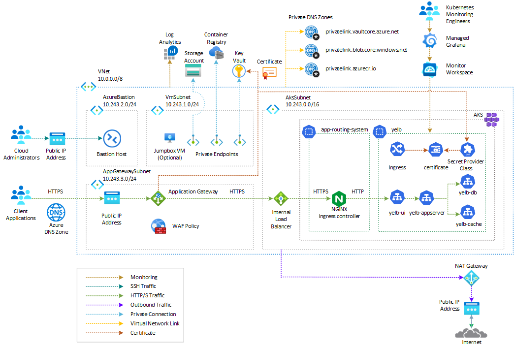
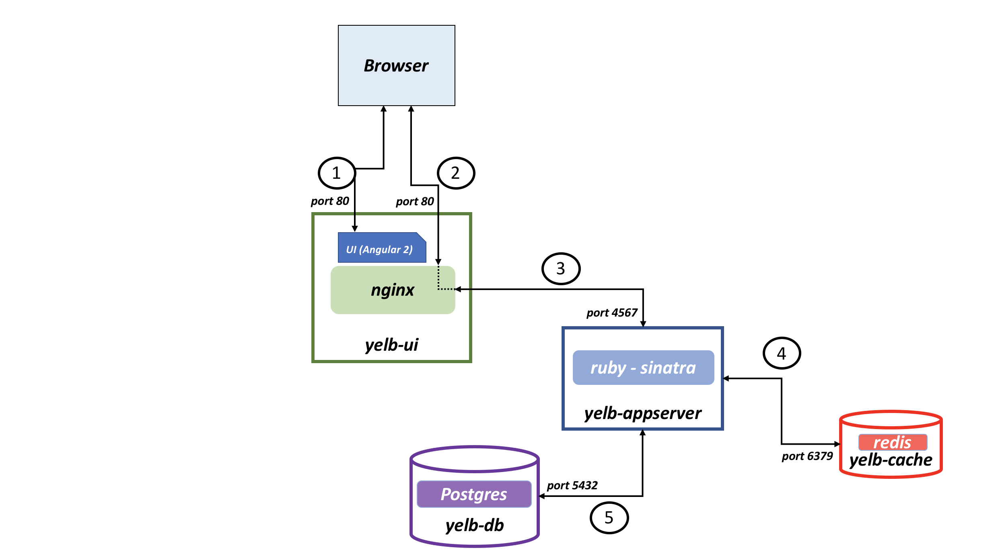

# Yelb on AKS with Azure Application Gateway and Azure WAF

In this solution, the [Yelb](https://github.com/mreferre/yelb/) application is deployed on an [Azure Kubernetes Service (AKS)](https://docs.microsoft.com/en-us/azure/aks/intro-kubernetes) cluster and exposed through an ingress controller like the [NGINX ingress controller](https://github.com/kubernetes/ingress-nginx). The ingress controller service is accessible via an [internal (or private) load balancer](https://learn.microsoft.com/en-us/azure/load-balancer/load-balancer-overview), which is used to balance traffic within the virtual network housing the AKS cluster. This load balancer frontend can also be accessed from an on-premises network in a hybrid scenario. To learn more about utilizing an internal load balancer to restrict access to your applications in Azure Kubernetes Service (AKS), refer to the guide [Use an internal load balancer with Azure Kubernetes Service (AKS)](https://learn.microsoft.com/en-us/azure/aks/internal-lb?tabs=set-service-annotations).

This sample supports installing the a [managed NGINX ingress controller with the application routing add-on](https://learn.microsoft.com/en-us/azure/aks/app-routing) or an unmanaged [NGINX ingress controller](https://github.com/kubernetes/ingress-nginx) using the [Helm chart](https://kubernetes.github.io/ingress-nginx). The application routing add-on with NGINX ingress controller provides the following features:

- Easy configuration of managed NGINX Ingress controllers based on [Kubernetes NGINX Ingress controller](https://kubernetes.github.io/ingress-nginx/).
- Integration with [Azure DNS](https://learn.microsoft.com/en-us/azure/dns/dns-overview) for public and private zone management.
- SSL termination with certificates stored in [Azure Key Vault](https://learn.microsoft.com/en-us/azure/key-vault/general/overview).

For other configurations, see:

- [DNS and SSL configuration](https://learn.microsoft.com/en-us/azure/aks/app-routing-dns-ssl)
- [Application routing add-on configuration](https://learn.microsoft.com/en-us/azure/aks/app-routing-nginx-configuration)
- [Configure internal NGIX ingress controller for Azure private DNS zone](https://learn.microsoft.com/en-us/azure/aks/create-nginx-ingress-private-controller).

To enhance security, the [Yelb](https://github.com/mreferre/yelb/) application is protected by an [Azure Application Gateway](https://learn.microsoft.com/en-us/azure/application-gateway/overview) resource, which is deployed in a dedicated subnet within the same virtual network as the AKS cluster or in a peered virtual network. Access to the Yelb application hosted on Azure Kubernetes Service (AKS) and exposed via the [Azure Application Gateway](https://learn.microsoft.com/en-us/azure/application-gateway/overview) is secured by the [Azure Web Application Firewall (WAF)](https://learn.microsoft.com/en-us/azure/web-application-firewall/overview). The WAF provides centralized protection for web applications against common exploits and vulnerabilities.

## Prerequisites

- An active [Azure subscription](https://docs.microsoft.com/en-us/azure/guides/developer/azure-developer-guide#understanding-accounts-subscriptions-and-billing). If you don't have one, create a [free Azure account](https://azure.microsoft.com/free/) before you begin.
- The **Owner** [Azure built-in role](https://learn.microsoft.com/en-us/azure/role-based-access-control/built-in-roles), or the **User Access Administrator** and **Contributor** built-in roles, on a subscription in your Azure account.
- [Azure CLI](https://learn.microsoft.com/en-us/cli/azure/install-azure-cli) version 2.61.0 or later. For more information, see [Install Azure CLI](https://learn.microsoft.com/en-us/cli/azure/install-azure-cli).
- [Azure Kubernetes Service (AKS) preview extension](https://learn.microsoft.com/en-us/azure/aks/draft#install-the-aks-preview-azure-cli-extension).
- [jq](https://jqlang.github.io/jq/) version 1.5 or later.
- [Python 3](https://www.python.org/downloads/) or later.
- [kubectl](https://kubernetes.io/docs/tasks/tools/install-kubectl/) version 1.21.0 or later
- [Helm](https://helm.sh/docs/intro/install/) version 3.0.0 or later
- [Visual Studio Code](https://code.visualstudio.com/) installed on one of the [supported platforms](https://code.visualstudio.com/docs/supporting/requirements#_platforms) along with the [Bicep extension](https://marketplace.visualstudio.com/items?itemName=ms-azuretools.vscode-bicep).
- An existing [Azure Key Vault](https://learn.microsoft.com/en-us/azure/key-vault/general/overview) resource with a valid TLS certificate for the Yelb web application.
- An existing [Azure DNS Zone](https://learn.microsoft.com/en-us/azure/dns/dns-zones-records) or equivalent DNS server for the name resolution of the [Yelb](https://github.com/mreferre/yelb/) application.

## Architecture

This sample provides a collection of Bicep modules, Bash scripts, and YAML manifests for building an [Azure Kubernetes Service (AKS)](https://docs.microsoft.com/en-us/azure/aks/intro-kubernetes) cluster, deploying the [Yelb](https://github.com/mreferre/yelb/) application, exposing the UI service using the [NGINX ingress controller](https://docs.nginx.com/nginx-ingress-controller/intro/overview/), and protecting it with the [Azure Application Gateway](https://learn.microsoft.com/en-us/azure/application-gateway/overview) and [Azure Web Application Firewall (WAF)](https://learn.microsoft.com/en-us/azure/web-application-firewall/overview).

The [Yelb](https://github.com/mreferre/yelb/) application is deployed on an [Azure Kubernetes Service (AKS)](https://docs.microsoft.com/en-us/azure/aks/intro-kubernetes) cluster and exposed through the [NGINX ingress controller](https://github.com/kubernetes/ingress-nginx). The NGINX ingress controller service is accessible via an [internal (or private) load balancer](https://learn.microsoft.com/en-us/azure/load-balancer/load-balancer-overview), which is used to balance traffic within the virtual network hosting the AKS cluster.

To enhance security, the [Yelb](https://github.com/mreferre/yelb/) application is protected by an [Azure Application Gateway](https://learn.microsoft.com/en-us/azure/application-gateway/overview) resource, which is deployed in a dedicated subnet within the same virtual network as the AKS cluster. Access to the Yelb application hosted on [Azure Kubernetes Service (AKS)](https://docs.microsoft.com/en-us/azure/aks/intro-kubernetes) and exposed via the [Azure Application Gateway](https://learn.microsoft.com/en-us/azure/application-gateway/overview) is secured by the [Azure Web Application Firewall (WAF)](https://learn.microsoft.com/en-us/azure/web-application-firewall/overview). The WAF provides centralized protection for web applications against common exploits and vulnerabilities.

The sample includes two separate Bicep parameter files and two sets of Bash scripts and YAML manifests, each geared towards deploying two different solution options.

## TLS Termination at Application Gateway and Yelb Invocation via HTTP

In this solution, the [Azure Web Application Firewall (WAF)](https://learn.microsoft.com/en-us/azure/web-application-firewall/overview) ensures the security of the system by blocking malicious attacks. The [Azure Application Gateway](https://learn.microsoft.com/en-us/azure/application-gateway/overview) plays a crucial role in the architecture by receiving incoming calls from client applications, performing TLS termination, and forwarding the requests to the AKS-hosted `yelb-ui` service. This communication is achieved through the internal load balancer and NGINX Ingress controller, using the HTTP transport protocol. The following diagram illustrates the architecture:


The message flow can be described as follows:

- The [Azure Application Gateway](https://learn.microsoft.com/en-us/azure/application-gateway/overview) takes care of TLS termination and sends incoming calls to to the AKS-hosted `yelb-ui` service over HTTP.
- To ensure secure communication, the Application Gateway Listener makes use of an SSL certificate obtained from [Azure Key Vault](https://learn.microsoft.com/en-us/azure/key-vault/general/overview).
- The Azure WAF Policy associated with the Listener applies OWASP rules and custom rules to incoming requests, effectively preventing malicious attacks.
- The Application Gateway Backend HTTP Settings are configured to invoke the Yelb application via HTTP, utilizing port 80.
- To manage traffic, the Application Gateway Backend Pool and Health Probe are set to call the [NGINX ingress controller](https://docs.nginx.com/nginx-ingress-controller/intro/overview/) through the AKS internal load balancer using the HTTP protocol.
- The [NGINX ingress controller](https://docs.nginx.com/nginx-ingress-controller/intro/overview/) is deployed to utilize the AKS internal load balancer instead of the public one, ensuring secure communication within the cluster.
- To expose the application via HTTP through the AKS internal load balancer, a [Kubernetes ingress](https://kubernetes.io/docs/concepts/services-networking/ingress/) object makes use of the [NGINX ingress controller](https://docs.nginx.com/nginx-ingress-controller/intro/overview/).
- The `yelb-ui` service has a ClusterIP type, which restricts its invocation to within the cluster or through the [NGINX ingress controller](https://docs.nginx.com/nginx-ingress-controller/intro/overview/).

The following diagram illustrates the message flow in further detail:


## Implementing End-to-End TLS Using Azure Application Gateway

Before diving into the solution, let's quickly go over [TLS termination and end-to-end TLS with Application Gateway](https://learn.microsoft.com/en-us/azure/application-gateway/ssl-overview).

### TLS termination with Application Gateway

[Azure Application Gateway](https://azure.microsoft.com/en-us/services/application-gateway/) supports the termination of Transport Layer Security (TLS) at the gateway level, which means that traffic is decrypted at the gateway before being sent to the backend servers. This approach offers several benefits:

- **Improved performance**: The initial handshake for TLS decryption can be resource-intensive. By caching TLS session IDs and managing TLS session tickets at the application gateway, multiple requests from the same client can utilize cached values, improving performance. If TLS decryption is performed on the backend servers, the client needs to reauthenticate with each server change.
- **Better utilization of backend servers**: SSL/TLS processing requires significant CPU resources, especially with increasing key sizes. By offloading this work from the backend servers to the application gateway, the servers can focus more efficiently on delivering content.
- **Intelligent routing**: Decrypting traffic at the application gateway allows access to request content such as headers and URIs. This data can be utilized to intelligently route requests.
- **Certificate management**: By adding TLS termination at the application gateway, certificates only need to be purchased and installed on the gateway rather than on every backend server. This saves time and money.

To configure TLS termination, you need to add a TLS/SSL certificate to the listener. The certificate should be in Personal Information Exchange (PFX) format, which contains both the private and public keys. You can import the certificate from Azure Key Vault to the Application Gateway. For more information on TLS termination with Key Vault certificates, refer to the [TLS termination with Key Vault certificates](https://learn.microsoft.com/en-us/azure/application-gateway/key-vault-certs) documentation.

### Zero Trust Security Model

If you adopt a [Zero Trust](https://www.microsoft.com/en-us/security/business/zero-trust) security model, you should prevent unencrypted communication between a service proxy like Azure Application Gateway and the backend servers. The zero trust security model is a concept wherein trust is not automatically granted to any user or device trying to access resources within a network. Instead, it requires continuous verification of identity and authorization for each request, regardless of the user's location or network.

In our scenario, implementing the zero trust security model involves utilizing the Azure Application Gateway as a service proxy, which acts as a front-end for incoming requests. These requests then travel down to the NGINX Ingress controller on Azure Kubernetes Service (AKS) in an encrypted format.

By employing the zero trust security model, several advantages can be gained concerning the privacy and security of communications:

1. **Enhanced Access Control:** With zero trust, access control is based on continuous verification. This ensures that only authorized users or devices are granted access to specific resources, thereby reducing the risk of unauthorized access and potential data breaches.
2. **Stronger Data Protection:** The encryption of requests ensures that sensitive information is transmitted securely. This mitigates the risk of unauthorized interception and protects the privacy of communications.
3. **Reduction in Lateral Movement:** Zero trust restricts the movement of threats within the network by enforcing strict access controls. Even if one part of the network is compromised, the attacker's ability to move laterally and access other resources is significantly limited.
4. **Improved Visibility and Monitoring:** The zero trust security model typically employs advanced monitoring and analytics tools. These tools offer better insight into the network's behavior, allowing for quick detection and response to any potential security incidents.

In summary, the zero trust security model, when implemented as described in the scenario, enhances privacy and security by enforcing continuous verification, encrypting communications, and limiting lateral movement of threats within the network. 

### End-to-End TLS with Application Gateway

You can implement a zero trust approach by configuring Azure Application Gateway for end-to-end TLS encryption with the backend servers. [End-to-end TLS encryption](https://learn.microsoft.com/en-us/azure/application-gateway/ssl-overview#end-to-end-tls-encryption) allows you to securely transmit sensitive data to the backend while also utilizing Application Gateway's Layer-7 load-balancing features. These features include cookie-based session affinity, URL-based routing, routing based on sites, and the ability to rewrite or inject X-Forwarded-* headers.

When Application Gateway is configured with end-to-end TLS communication mode, it terminates the TLS sessions at the gateway and decrypts user traffic. It then applies the configured rules to select the appropriate backend pool instance to route the traffic to. Next, Application Gateway initiates a new TLS connection to the backend server and re-encrypts the data using the backend server's public key certificate before transmitting the request to the backend. The response from the web server follows the same process before reaching the end user. To enable end-to-end TLS, you need to set the protocol setting in the Backend HTTP Setting to HTTPS and apply it to a backend pool. This ensures that your communication with the backend servers is secured and compliant with your requirements. For more information, you can refer to the documentation on [Application Gateway end-to-end TLS encryption](https://docs.microsoft.com/azure/application-gateway/end-to-end-ssl-portal). Additionally, you may find it useful to review [best practices for securing your Application Gateway](https://docs.microsoft.com/azure/application-gateway/securing-application-gateway).

### Solution

In this solution, the [Azure Web Application Firewall (WAF)](https://learn.microsoft.com/en-us/azure/web-application-firewall/overview) ensures the security of the system by blocking malicious attacks. The [Azure Application Gateway](https://learn.microsoft.com/en-us/azure/application-gateway/overview) handles incoming calls from client applications and performs TLS termination. It also implements [end-to-end TLS](https://learn.microsoft.com/en-us/azure/application-gateway/ssl-overview#end-to-end-tls-encryption) by invoking the underlying AKS-hosted `yelb-ui` service using the HTTPS transport protocol via the internal load balancer and NGINX Ingress controller. The following diagram illustrates the architecture:



The message flow can be described as follows:

- The [Azure Application Gateway](https://learn.microsoft.com/en-us/azure/application-gateway/overview) handles TLS termination and communicates with the backend application over HTTPS.
- The Application Gateway Listener utilizes an SSL certificate obtained from [Azure Key Vault](https://learn.microsoft.com/en-us/azure/key-vault/general/overview).
- The Azure WAF Policy associated with the Listener runs OWASP rules and custom rules against incoming requests to block malicious attacks.
- The Application Gateway Backend HTTP Settings are configured to invoke the AKS-hosted `yelb-ui` service via HTTPS on port 443.
- The Application Gateway Backend Pool and Health Probe call the [NGINX ingress controller](https://docs.nginx.com/nginx-ingress-controller/intro/overview/) through the AKS internal load balancer using HTTPS.
- The [NGINX ingress controller](https://docs.nginx.com/nginx-ingress-controller/intro/overview/) is deployed to use the AKS internal load balancer.
- The Azure Kubernetes Service (AKS) cluster is configured with the [Azure Key Vault provider for Secrets Store CSI Driver](https://learn.microsoft.com/en-us/azure/aks/csi-secrets-store-driver) addon to retrieve secrets, certificates, and keys from Azure Key Vault via a [CSI volume](https://kubernetes-csi.github.io/docs/).
- A [SecretProviderClass](https://learn.microsoft.com/en-us/azure/aks/hybrid/secrets-store-csi-driver) is used to retrieve the certificate used by the Application Gateway from Key Vault.
- A [Kubernetes ingress](https://kubernetes.io/docs/concepts/services-networking/ingress/) object utilizes the [NGINX ingress controller](https://docs.nginx.com/nginx-ingress-controller/intro/overview/) to expose the application via HTTPS through the AKS internal load balancer.
- The `yelb-ui` service has a ClusterIP type, which restricts its invocation to within the cluster or through the [NGINX ingress controller](https://docs.nginx.com/nginx-ingress-controller/intro/overview/).

In order to ensure the security and stability of the system, it is important to consider the following recommendations:

- It is crucial to regularly update the Azure WAF Policy with the latest rules to ensure optimal security.
- Monitoring and logging mechanisms should be implemented to track and analyze incoming requests and potential attacks.
- Regular maintenance and updates of the AKS cluster, NGINX ingress controller, and Application Gateway are necessary to address any security vulnerabilities and maintain a secure infrastructure.

### Hostname

The Application Gateway Listener and the [Kubernetes ingress](https://kubernetes.io/docs/concepts/services-networking/ingress/) are configured to use the same hostname. Here are the reasons why it is important to use the same hostname for a service proxy and a backend web application:

- **Preservation of Session State**: When a different hostname is used between the proxy and the backend application, session state can get lost. This means that user sessions may not persist properly, resulting in a poor user experience and potential loss of data.
- **Authentication Failure**: If the hostname differs between the proxy and the backend application, authentication mechanisms may fail. This can lead to users being unable to login or access secure resources within the application.
- **Inadvertent Exposure of URLs**: If the hostname is not preserved, there is a risk that backend URLs may be exposed to end users. This can lead to potential security vulnerabilities and unauthorized access to sensitive information.
- **Cookie Issues**: Cookies play a crucial role in maintaining user sessions and passing information between the client and the server. When the hostname differs, cookies may not work as expected, leading to issues such as failed authentication, improper session handling, and incorrect redirection.
- **End-to-End TLS/SSL Requirements**: If end-to-end TLS/SSL is required for secure communication between the proxy and the backend service, a matching TLS certificate for the original hostname is necessary. Using the same hostname simplifies the certificate management process and ensures that secure communication is established seamlessly.

By using the same hostname for the service proxy and the backend web application, these potential problems can be avoided. The backend application will see the same domain as the web browser, ensuring that session state, authentication, and URL handling are all functioning correctly. This is especially important in platform as a service (PaaS) offerings, where the complexity of certificate management can be reduced by utilizing the managed TLS certificates provided by the PaaS service. 

### Message Flow

The following diagram shows the steps for the message flow during deployment and runtime.


#### Deployment workflow

The following steps describe the deployment process. This workflow corresponds to the green numbers in the preceding diagram.

1. A security engineer generates a certificate for the custom domain that the workload uses, and saves it in an Azure key vault. You can obtain a valid certificate from a well-known [certification authority (CA)](https://en.wikipedia.org/wiki/Certificate_authority).
2. A platform engineer specifies the necessary information in the *main.bicepparams* Bicep parameters file and deploys the Bicep modules to create the Azure resources. The necessary information includes:
   - A prefix for the Azure resources.
   - The name and resource group of the existing Azure Key Vault that holds the TLS certificate for the workload hostname and the Azure Front Door custom domain.
   - The name of the certificate in the key vault.
   - The name and resource group of the DNS zone that's used to resolve the Azure Front Door custom domain.
3. You can configure the [deployment script](/azure/azure-resource-manager/bicep/deployment-script-bicep) to install the following packages to your AKS cluster. For more information, check the parameters section of the Bicep module:
   - [Prometheus](https://prometheus.io/) and [Grafana](https://grafana.com/) using the [Prometheus Community Kubernetes Helm Charts](https://prometheus-community.github.io/helm-charts/). By default, this sample configuration does not install Prometheus and Grafana to the AKS cluster, and rather installs [Azure Managed Prometheus](https://learn.microsoft.com/en-us/azure/azure-monitor/essentials/azure-monitor-workspace-overview) and [Azure Managed Grafana](https://learn.microsoft.com/en-us/azure/managed-grafana/overview).
   - [cert-manager](https://cert-manager.io/docs/). Certificate Manager is not necessary in this sample as both the Application Gateway and NGINX Ingress Controller will use a TLS certificate that has been uploaded to Azure Key Vault in advance.
   - [NGINX Ingress Controller](https://docs.nginx.com/nginx-ingress-controller/intro/overview/) via an Helm chart. If you use the [managed NGINX ingress controller with the application routing add-on](https://learn.microsoft.com/en-us/azure/aks/app-routing), you don't need to install another instance of the NGINX Ingress Controller via Helm.
4. The Application Gateway Listener retrieves the TLS certificate from Azure key Vault.
5. When a DevOps engineer deploys the Yelb application, the [Kubernetes ingress](https://kubernetes.io/docs/concepts/services-networking/ingress/) object uses the certificate retrieved by the [Azure Key Vault provider for Secrets Store CSI Driver](/azure/aks/csi-secrets-store-driver) from Key Vault to expose the Yelb UI service via HTTPS.

#### Runtime workflow

The following steps describe the message flow for a request that an external client application initiates during runtime. This workflow corresponds to the orange numbers in the preceding diagram.

1. The client application calls the Yelb application using its hostname. The DNS zone that's associated with the custom domain of the Application Gateway Listener uses an A record to resolve the DNS query with the addres of the Azure Public IP used by the Frontend IP Configuration of the Application Gateway.
2. The request is sent to the Azure Public IP used by the Frontend IP Configuration of the Application Gateway.
3. The Application Gateway performs thw following actions.
   - The Application Gateway handles TLS termination and communicates with the backend application over HTTPS.
   - The Application Gateway Listener utilizes an SSL certificate obtained from [Azure Key Vault](https://learn.microsoft.com/en-us/azure/key-vault/general/overview).
   - The Azure WAF Policy associated to the Listener is used to run OWASP rules and custom rules against the incoming request and block malicous attacks.
   - The Application Gateway Backend HTTP Settings are configured to invoke the Yelb application via HTTPS on port 443.
4. The Application Gateway Backend Pool calls the NGINX ingress controller through the AKS internal load balancer using HTTPS.
5. The request is sent to one of the agent nodes that hosts a pod of the NGINX ingress controller.
6. One of the NGINX ingress controller replicas handles the request and sends the request to one of the service endpoints of the `yelb-ui` service.
7. The `yelb-ui` calls the `yelb-appserver` service.
8. The `yelb-appserver` calls the `yelb-db` and `yelb-cache` services.

## Deployment

You can configure the [deployment script](/azure/azure-resource-manager/bicep/deployment-script-bicep) to install the following packages to your AKS cluster. For more information, check the parameters section of the Bicep module:

- [Prometheus](https://prometheus.io/) and [Grafana](https://grafana.com/) using the [Prometheus Community Kubernetes Helm Charts](https://prometheus-community.github.io/helm-charts/). By default, this sample configuration does not install Prometheus and Grafana to the AKS cluster, and rather installs [Azure Managed Prometheus](https://learn.microsoft.com/en-us/azure/azure-monitor/essentials/azure-monitor-workspace-overview) and [Azure Managed Grafana](https://learn.microsoft.com/en-us/azure/managed-grafana/overview).
- [cert-manager](https://cert-manager.io/docs/). Certificate Manager is not necessary in this sample as both the Application Gateway and NGINX Ingress Controller will use a TLS certificate that has been uploaded to Azure Key Vault in advance.
- [NGINX Ingress Controller](https://docs.nginx.com/nginx-ingress-controller/intro/overview/) via an Helm chart. If you use the [managed NGINX ingress controller with the application routing add-on](https://learn.microsoft.com/en-us/azure/aks/app-routing), you don't need to install another instance of the NGINX Ingress Controller via Helm. You can configure the NGINX ingress controller configured to utilize a public IP over the `kubernetes` public load balancer of the AKS cluster or a private IP address of the `kubernetes-internal` internal load balancer as its external IP. By default, Bicep modules install the [managed NGINX ingress controller with the application routing add-on](https://learn.microsoft.com/en-us/azure/aks/app-routing) and does not install another instance of the NGINX Ingress Controller via Helm.

By default, Bicep modules install the AKS cluster with the [Azure CNI Overlay](https://learn.microsoft.com/en-us/azure/aks/azure-cni-overlay) network plugin and the [Cilium](https://learn.microsoft.com/en-us/azure/aks/azure-cni-powered-by-cilium) data plane. However, Bicep modules are parametric, so you can choose any network plugin.

- [Azure CNI with static IP allocation](https://learn.microsoft.com/en-us/azure/aks/configure-azure-cni)
- [Azure CNI with dynamic IP allocation](https://learn.microsoft.com/en-us/azure/aks/configure-azure-cni-dynamic-ip-allocation)
- [Azure CNI Powered by Cilium](https://learn.microsoft.com/en-us/azure/aks/azure-cni-powered-by-cilium)
- [Azure CNI Overlay](https://learn.microsoft.com/en-us/azure/aks/azure-cni-overlay)
- [BYO CNI](https://learn.microsoft.com/en-us/azure/aks/use-byo-cni?tabs=azure-cli)
- [Kubenet](https://learn.microsoft.com/en-us/azure/aks/configure-kubenet)

In addition, the project shows how to deploy an [Azure Kubernetes Service](https://docs.microsoft.com/en-us/azure/aks/intro-kubernetes) cluster with the following extensions and features:

- [Istio-based service mesh add-on for Azure Kubernetes Service](https://learn.microsoft.com/en-us/azure/aks/istio-about) provides an officially supported and tested [Istio](https://istio.io/v1.1/docs/concepts/what-is-istio/) integration for Azure Kubernetes Service (AKS).
- [API Server VNET Integration](https://learn.microsoft.com/en-us/azure/aks/api-server-vnet-integration) allows you to enable network communication between the API server and the cluster nodes without requiring a private link or tunnel. AKS clusters with API Server VNET integration provide a series of advantages, for example, they can have public network access or private cluster mode enabled or disabled without redeploying the cluster. For more information, see [Create an Azure Kubernetes Service cluster with API Server VNet Integration](https://learn.microsoft.com/en-us/azure/aks/api-server-vnet-integration).
- [Azure NAT Gateway](https://learn.microsoft.com/en-us/azure/virtual-network/nat-gateway/nat-overview) to manage outbound connections initiated by AKS-hosted workloads.
- [Event-driven Autoscaling (KEDA) add-on](https://learn.microsoft.com/en-us/azure/aks/keda-about) is a single-purpose and lightweight component that strives to make application autoscaling simple and is a CNCF Incubation project.
- [Dapr extension for Azure Kubernetes Service (AKS)](https://learn.microsoft.com/en-us/azure/aks/dapr) allows you to install [Dapr](https://dapr.io/), a portable, event-driven runtime that simplifies building resilient, stateless, and stateful applications that run on the cloud and edge and embrace the diversity of languages and developer frameworks. With its sidecar architecture, Dapr helps you tackle the challenges that come with building microservices and keeps your code platform agnostic.
- [Flux V2 extension](https://learn.microsoft.com/en-us/azure/azure-arc/kubernetes/tutorial-use-gitops-flux2?tabs=azure-cli) allows to deploy workloads to an Azure Kubernetes Service (AKS) cluster via [GitOps](https://www.weave.works/technologies/gitops/). For more information, see [GitOps Flux v2 configurations with AKS and Azure Arc-enabled Kubernetes](https://learn.microsoft.com/en-us/azure/azure-arc/kubernetes/conceptual-gitops-flux2)
- [Vertical Pod Autoscaling](https://learn.microsoft.com/en-us/azure/aks/vertical-pod-autoscaler) allows you to automatically sets resource requests and limits on containers per workload based on past usage. VPA makes certain pods are scheduled onto nodes that have the required CPU and memory resources. For more information, see [Kubernetes Vertical Pod Autoscaling](https://itnext.io/k8s-vertical-pod-autoscaling-fd9e602cbf81).
- [Azure Key Vault Provider for Secrets Store CSI Driver](https://learn.microsoft.com/en-us/azure/aks/csi-secrets-store-identity-access) provides a variety of methods of identity-based access to your [Azure Key Vault](https://learn.microsoft.com/en-us/azure/key-vault/general/overview). The `keyVault.bicep` module [Key Vault Administrator](https://learn.microsoft.com/en-us/azure/key-vault/general/rbac-guide?tabs=azure-cli#azure-built-in-roles-for-key-vault-data-plane-operations) role to the user-assigned managed identity of the addon to let it retrieve the certificate used by [Kubernetes Ingress](https://kubernetes.io/docs/concepts/services-networking/ingress/) used to expose the `yelb-ui` service via the [NGINX ingress controller](https://docs.nginx.com/nginx-ingress-controller/intro/overview/).
- [Image Cleaner](https://learn.microsoft.com/en-us/azure/aks/image-cleaner?tabs=azure-cli) to clean up stale images on your Azure Kubernetes Service cluster.
- [Azure Kubernetes Service (AKS) Network Observability](https://learn.microsoft.com/en-us/azure/aks/network-observability-overview) is an important part of maintaining a healthy and performant Kubernetes cluster. By collecting and analyzing data about network traffic, you can gain insights into how your cluster is operating and identify potential problems before they cause outages or performance degradation.
- [Managed NGINX ingress with the application routing add-on](https://learn.microsoft.com/en-us/azure/aks/app-routing).

In a production environment, we strongly recommend deploying a [private AKS cluster](https://docs.microsoft.com/en-us/azure/aks/private-clusters) with [Uptime SLA](https://docs.microsoft.com/en-us/azure/aks/uptime-sla). For more information, see [private AKS cluster with a Public DNS address](https://docs.microsoft.com/en-us/azure/aks/private-clusters#create-a-private-aks-cluster-with-a-public-dns-address). Alternatively, you can deploy a public AKS cluster and secure access to the API server using [authorized IP address ranges](https://learn.microsoft.com/en-us/azure/aks/api-server-authorized-ip-ranges).

### Azure Resources

The Bicep modules deploy or use the following Azure resources:

| Resource | Type | Description |
|----------|------|-------------|
| [Azure Kubernetes Service(AKS)](https://docs.microsoft.com/en-us/azure/aks/intro-kubernetes) | [Microsoft.ContainerService/managedClusters](https://learn.microsoft.com/en-us/azure/templates/microsoft.containerservice/managedclusters?pivots=deployment-language-bicep) | A public or private AKS cluster composed of a `system` node pool in a dedicated subnet that hosts only critical system pods and services, and a `user` node pool hosting user workloads and artifacts in a dedicated subnet. |
| [Azure Application Gateway](https://learn.microsoft.com/en-us/azure/application-gateway/overview) | [Microsoft.Network/applicationGateways](https://learn.microsoft.com/en-us/azure/templates/microsoft.network/applicationgateways?pivots=deployment-language-bicep) | A fully managed regional layer 7 load balancer and service proxy used to expose AKS-hosted workloads such as the Yelb application. |
|[Azure Web Application Firewall (WAF)](https://learn.microsoft.com/en-us/azure/web-application-firewall/ag/ag-overview)|[Microsoft.Network/ApplicationGatewayWebApplicationFirewallPolicies](https://learn.microsoft.com/en-us/azure/templates/microsoft.network/applicationgatewaywebapplicationfirewallpolicies?pivots=deployment-language-bicep)| A fully-managed web access firewall used to provide centralized protection for AKS-hosted web applications exposed via the Azure Application Gateway. |
| [Grafana Admin Role Assignment](https://learn.microsoft.com/en-us/azure/managed-grafana/how-to-share-grafana-workspace?tabs=azure-portal) | [Microsoft.Authorization/roleDefinitions](https://learn.microsoft.com/en-us/azure/templates/microsoft.authorization/roleassignments?pivots=deployment-language-bicep) | A `Grafana Admin` role assignment on the Azure Managed Grafana for the Microsoft Entra ID user whose objectID is defined in the `userId` parameter. |
| [Key Vault Administrator Role Assignment](https://learn.microsoft.com/en-us/azure/aks/csi-secrets-store-driver) | [Microsoft.Authorization/roleDefinitions](https://learn.microsoft.com/en-us/azure/templates/microsoft.authorization/roleassignments?pivots=deployment-language-bicep) | A `Key Vault Administrator` role assignment on the existing Azure Key Vault resource which contains the TLS certificate for the user-defined managed identity used by the Azure Key Vault provider for Secrets Store CSI Driver. |
| [Azure DNS Zone](https://learn.microsoft.com/en-us/azure/dns/private-dns-overview) | [Microsoft.Network/dnsZones](https://learn.microsoft.com/en-us/azure/templates/microsoft.network/dnszones?pivots=deployment-language-bicep) | An existing Azure DNS zone used for the name resolution of AKS-hosted workloads. This resource is optional. |
| [Virtual Network](https://docs.microsoft.com/en-us/azure/virtual-network/virtual-networks-overview) | [Microsoft.Network/virtualNetworks](https://docs.microsoft.com/en-us/azure/templates/microsoft.network/virtualnetworks) | A new virtual network with multiple subnets for different purposes: `SystemSubnet`is used for the agent nodes of the `system` node pool, `UserSubnet` is used for the agent nodes of the `user` node pool, `ApiServerSubnet` is used by API Server VNET Integration, `AzureBastionSubnet` is used by Azure Bastion Host, `VmSubnet` is used for a jump-box virtual machine used to connect to the (private) AKS cluster and for Azure Private Endpoints, `AppGatewaySubnet` hosts the Application Gateway. |
| [User-Assigned Managed Identity](https://docs.microsoft.com/en-us/azure/active-directory/managed-identities-azure-resources/overview) | [Microsoft.ManagedIdentity/userAssignedIdentities](https://learn.microsoft.com/en-us/azure/templates/microsoft.managedidentity/2018-11-30/userassignedidentities?pivots=deployment-language-bicep) | A user-defined managed identity used by the AKS cluster to create additional resources in Azure. |
| [Virtual Machine](https://docs.microsoft.com/en-us/azure/virtual-machines/windows/) | [Microsoft.Compute/virtualMachines](https://docs.microsoft.com/en-us/azure/templates/microsoft.compute/virtualmachines) | A jump-box virtual machine used to manage the private AKS cluster. |
| [Azure Bastion](https://docs.microsoft.com/en-us/azure/bastion/bastion-overview) | [Microsoft.Network/bastionHosts](https://docs.microsoft.com/en-us/azure/templates/microsoft.network/bastionhosts) | An Azure Bastion deployed in the AKS cluster virtual network to provide SSH connectivity to agent nodes and virtual machines. |
| [Storage Account](https://docs.microsoft.com/en-us/azure/storage/common/storage-account-overview) | [Microsoft.Storage/storageAccounts](https://docs.microsoft.com/en-us/azure/templates/microsoft.storage/storageaccounts) | A storage account used to store the boot diagnostics logs of the jumpbox virtual machine. |
| [Azure Container Registry](https://docs.microsoft.com/en-us/azure/container-registry/container-registry-intro) | [Microsoft.ContainerRegistry/registries](https://learn.microsoft.com/en-us/azure/templates/microsoft.containerregistry/registries?pivots=deployment-language-bicep) | An Azure Container Registry to build, store, and manage container images and artifacts in a private registry. This is not required to deploy the `Yelb` application as the sample uses public container images. |
| [Azure Key Vault](https://docs.microsoft.com/en-us/azure/key-vault/general/basic-concepts) | [Microsoft.KeyVault/vaults](https://learn.microsoft.com/en-us/azure/templates/microsoft.keyvault/vaults?pivots=deployment-language-bicep) | An existing Azure Key Vault used to store secrets, certificates, and keys. |
| [Azure Private Endpoint](https://learn.microsoft.com/en-us/azure/private-link/private-endpoint-overview)| [Microsoft.Network/privateEndpoints](https://docs.microsoft.com/en-us/azure/templates/microsoft.network/privateendpoints) | Azure Private Endpoints for Azure Container Registry, Azure Key Vault, and Azure Storage Account. |
| [Azure Private DNS Zone](https://docs.microsoft.com/en-us/azure/dns/private-dns-overview) | [Microsoft.Network/privateDnsZones](https://docs.microsoft.com/en-us/azure/templates/microsoft.network/privatednszones) |  Azure Private DNS Zones are used for the DNS resolution of the Azure Private Endpoints for Azure Container Registry, Azure Key Vault, Azure Storage Account, API Server when deploying a private AKS cluster. |
| [Azure Network Security Group](https://docs.microsoft.com/en-us/azure/virtual-network/network-security-groups-overview) | [Microsoft.Network/networkSecurityGroups](https://docs.microsoft.com/en-us/azure/templates/microsoft.network/networksecuritygroups?tabs=bicep) | Azure Network Security Groups used to filter inbound and outbound traffic for subnets hosting virtual machines. |
| [Azure Monitor Workspace](https://learn.microsoft.com/en-us/azure/azure-monitor/essentials/azure-monitor-workspace-overview) | [Microsoft.Monitor/accounts](https://learn.microsoft.com/en-us/azure/azure-monitor/essentials/azure-monitor-workspace-overview) | An [Azure Monitor workspace](https://learn.microsoft.com/en-us/azure/azure-monitor/essentials/azure-monitor-workspace-overview) to store Prometheus metrics generated by the AKS cluster and workloads.You can [Prometheus query language (PromQL)](https://aka.ms/azureprometheus-promio-promql) to analyze and alert on the performance of monitored infrastructure and workloads without having to operate the underlying infrastructure. The primary method for visualizing Prometheus metrics is [Azure Managed Grafana](https://learn.microsoft.com/en-us/azure/managed-grafana/overview). |
| [Azure Managed Grafana](https://learn.microsoft.com/en-us/azure/managed-grafana/overview) | [Microsoft.Dashboard/grafana](https://learn.microsoft.com/en-us/azure/templates/microsoft.dashboard/grafana?pivots=deployment-language-bicep) | an [Azure Managed Grafana](https://learn.microsoft.com/en-us/azure/managed-grafana/overview) instance used to visualize the [Prometheus metrics](https://learn.microsoft.com/en-us/azure/azure-monitor/containers/prometheus-metrics-enable?tabs=azure-portal) generated by the [Azure Kubernetes Service(AKS)](https://docs.microsoft.com/en-us/azure/aks/intro-kubernetes) cluster. [Azure Managed Grafana](https://learn.microsoft.com/en-us/azure/managed-grafana/overview) provides a set of built-in dashboards to visualize Prometheus metrics generated by your AKS cluster and workloads. |
| [Azure Log Analytics Workspace](https://docs.microsoft.com/en-us/azure/azure-monitor/logs/log-analytics-workspace-overview) | [Microsoft.OperationalInsights/workspaces](https://docs.microsoft.com/en-us/azure/templates/microsoft.operationalinsights/workspaces) | A centralized Azure Log Analytics workspace used to collect diagnostics logs and metrics from various Azure resources. |
| [Deployment Script](https://learn.microsoft.com/en-us/azure/azure-resource-manager/bicep/deployment-script-bicep) | [Microsoft.Resources/deploymentScripts](https://learn.microsoft.com/en-us/azure/templates/microsoft.resources/deploymentscripts?pivots=deployment-language-bicep) | A deployment script is utilized to run the `install-packages.sh` Bash script, which can optionally install the [NGINX Ingress Controller](https://docs.nginx.com/nginx-ingress-controller/), [Cert-Manager](https://cert-manager.io/docs/), [Prometheus](https://prometheus.io/), and [Grafana](https://grafana.com) to the AKS cluster using [Helm](https://helm.sh/). However, the in-cluster Prometheus and Grafana instances are not necessary as the Bicep modules install [Azure Managed Prometheus](https://learn.microsoft.com/en-us/azure/azure-monitor/essentials/azure-monitor-workspace-overview) and [Azure Managed Grafana](https://learn.microsoft.com/en-us/azure/managed-grafana/overview) to collect and monitor AKS Prometheus metrics. For more details on deployment scripts, refer to the [Use deployment scripts in Bicep](https://learn.microsoft.com/en-us/azure/azure-resource-manager/bicep/deployment-script-bicep) documentation.|

## Deploy the Bicep modules

You can deploy the Bicep modules in the [bicep](./bicep/) folder using the [deploy.sh](./bicep/deploy.sh) Bash script. Specify a value for the following parameters in the `deploy.sh` script and `main.parameters.json` parameters file before deploying the Bicep modules.

- `prefix`: specifies a prefix for all the Azure resources.
- `authenticationType`: specifies the type of authentication when accessing the Virtual Machine. `sshPublicKey` is the recommended value. Allowed values: `sshPublicKey` and `password`.
- `vmAdminUsername`: specifies the name of the administrator account of the virtual machine.
- `vmAdminPasswordOrKey`: specifies the SSH Key or password for the virtual machine.
- `aksClusterSshPublicKey`:  specifies the SSH Key or password for AKS cluster agent nodes.
- `aadProfileAdminGroupObjectIDs`: when deploying an AKS cluster with Azure AD and Azure RBAC integration, this array parameter contains the list of Azure AD group object IDs that will have the admin role of the cluster.

This is the full list of the parameters.

| Name                                      | Type                   | Description      |
|-------------------------------------------|------------------------|----------------------------------------------------------------------------------------------------------------------------------------------------------------------------------------------------------------------------------------------|
| `prefix`                                  | `string`                 | Specifies the name prefix for all the Azure resources.                 |
| `location`                                | `string`                 | Specifies the location for all the Azure resources.                    |
| `userId`                                  | `string`                 | Specifies the object id of an Azure Active Directory user.             |
| `letterCaseType`                          | `string`                 | Specifies whether name resources are in CamelCase, UpperCamelCase, or KebabCase.            |
| `createMetricAlerts`                      | `bool`                   | Specifies whether creating metric alerts or not.                       |
| `metricAlertsEnabled`                     | `bool`                   | Specifies whether metric alerts as either enabled or disabled.         |
| `metricAlertsEvalFrequency`               | `string`                 | Specifies metric alerts eval frequency.                               |
| `metricAlertsWindowsSize`                 | `string`                 | Specifies metric alerts window size.                                  |
| `aksClusterDnsPrefix`                     | `string`                 | Specifies the DNS prefix specified when creating the managed cluster. |
| `aksClusterNetworkPlugin`                 | `string`                 | Specifies the network plugin used for building Kubernetes network. - azure or kubenet.      |
| `aksClusterNetworkPluginMode`             | `string`                 | Specifies the Network plugin mode used for building the Kubernetes network.                 |
| `aksClusterNetworkPolicy`                 | `string`                 | Specifies the network policy used for building Kubernetes network. - calico or azure       |
| `aksClusterNetworkDataplane`              | `string`                 | Specifies the network dataplane used in the Kubernetes cluster..      |
| `aksClusterNetworkMode`                   | `string`                 | Specifies the network mode. This cannot be specified if networkPlugin is anything other than azure.|
| `aksClusterPodCidr`                       | `string`                 | Specifies the CIDR notation IP range from which to assign pod IPs when kubenet is used.     |
| `aksClusterServiceCidr`                   | `string`                 | A CIDR notation IP range from which to assign service cluster IPs. It must not overlap with any Subnet IP ranges.                                       |
| `aksClusterDnsServiceIP`                  | `string`                 | Specifies the IP address assigned to the Kubernetes DNS service. It must be within the Kubernetes service address range specified in serviceCidr.       |
| `aksClusterLoadBalancerSku`               | `string`                 | Specifies the sku of the load balancer used by the virtual machine scale sets used by nodepools.   |
| `loadBalancerBackendPoolType`             | `string`                 | Specifies the type of the managed inbound Load Balancer BackendPool.  |
| `advancedNetworking`                      | `object`                 | Specifies Advanced Networking profile for enabling observability on a cluster. Note that enabling advanced networking features may incur additional costs. |
| `aksClusterIpFamilies`                    | `array`                  | Specifies the IP families are used to determine single-stack or dual-stack clusters. For single-stack, the expected value is IPv4. For dual-stack, the expected values are IPv4 and IPv6. |
| `aksClusterOutboundType`                  | `string`                 | Specifies outbound (egress) routing method. - loadBalancer or userDefinedRouting.           |
| `aksClusterSkuTier`                       | `string`                 | Specifies the tier of a managed cluster SKU: Paid or Free              |
| `aksClusterKubernetesVersion`             | `string`                 | Specifies the version of Kubernetes specified when creating the managed cluster.           |
| `aksClusterAdminUsername`                 | `string`                 | Specifies the administrator username of Linux virtual machines.        |
| `aksClusterSshPublicKey`                  | `string`                 | Specifies the SSH RSA public key string for the Linux nodes.           |
| `aadProfileTenantId`                      | `string`                 | Specifies the tenant id of the Azure Active Directory used by the AKS cluster for authentication.  |
| `aadProfileAdminGroupObjectIDs`           | `array`                  | Specifies the AAD group object IDs that will have admin role of the cluster.                |
| `aksClusterNodeOSUpgradeChannel`          | `string`                 | Specifies the node OS upgrade channel. The default is Unmanaged, but may change to either NodeImage or SecurityPatch at GA. .                             |
| `aksClusterUpgradeChannel`                | `string`                 | Specifies the upgrade channel for auto upgrade. Allowed values include rapid, stable, patch, node-image, none.                                          |
| `aksClusterEnablePrivateCluster`          | `bool`                   | Specifies whether to create the cluster as a private cluster or not.  |
| `aksClusterWebAppRoutingEnabled`          | `bool`                   | Specifies whether the managed NGINX Ingress Controller application routing addon is enabled.|
| `aksClusterNginxDefaultIngressControllerType` | `string`             | Specifies the ingress type for the default NginxIngressController custom resource for the managed NGINX ingress controller. |
| `aksPrivateDNSZone`                       | `string`                 | Specifies the Private DNS Zone mode for private cluster. When the value is equal to None, a Public DNS Zone is used in place of a Private DNS Zone       |
| `aksEnablePrivateClusterPublicFQDN`       | `bool`                   | Specifies whether to create additional public FQDN for private cluster or not.            |
| `aadProfileManaged`                       | `bool`                   | Specifies whether to enable managed AAD integration.                  |
| `aadProfileEnableAzureRBAC`               | `bool`                   | Specifies whether to enable Azure RBAC for Kubernetes authorization.  |
| `systemAgentPoolName`                     | `string`                 | Specifies the unique name of of the system node pool profile in the context of the subscription and resource group.                                     |
| `systemAgentPoolVmSize`                   | `string`                 | Specifies the vm size of nodes in the system node pool.               |
| `systemAgentPoolOsDiskSizeGB`             | `int`                    | Specifies the OS Disk Size in GB to be used to specify the disk size for every machine in the system agent pool. |
| `systemAgentPoolOsDiskType`               | `string`                 | Specifies the OS disk type to be used for machines in a given agent pool. |
| `systemAgentPoolAgentCount`               | `int`                    | Specifies the number of agents (VMs) to host docker containers in the system node pool. Allowed values must be in the range of 1 to 100 (inclusive). The default value is 1.  |
| `systemAgentPoolOsType`                   | `string`                 | Specifies the OS type for the vms in the system node pool. Choose from Linux and Windows. Default to Linux.                                             |
| `systemAgentPoolOsSKU`                    | `string`                 | Specifies the OS SKU used by the system agent pool. If not specified, the default is Ubuntu if OSType=Linux or Windows2019 if OSType=Windows. |
| `systemAgentPoolMaxPods`                  | `int`                    | Specifies the maximum number of pods that can run on a node in the system node pool. The maximum number of pods per node in an AKS cluster is 250. |
| `systemAgentPoolMaxCount`                 | `int`                    | Specifies the maximum number of nodes for auto-scaling for the system node pool.            |
| `systemAgentPoolMinCount`                 | `int`                    | Specifies the minimum number of nodes for auto-scaling for the system node pool.            |
| `systemAgentPoolEnableAutoScaling`        | `bool`                   | Specifies whether to enable auto-scaling for the system node pool.    |
| `systemAgentPoolScaleSetPriority`         | `string`                 | Specifies the virtual machine scale set priority in the system node pool: Spot or Regular. |
| `systemAgentPoolScaleSetEvictionPolicy`   | `string`                 | Specifies the ScaleSetEvictionPolicy to be used to specify eviction policy for spot virtual machine scale set. Default to Delete. Allowed values are Delete or Deallocate.      |
| `systemAgentPoolNodeLabels`               | `object`                 | Specifies the Agent pool node labels to be persisted across all nodes in the system node pool.     |
| `systemAgentPoolNodeTaints`               | `array`                  | Specifies the taints added to new nodes during node pool create and scale. For example, key=value:NoSchedule.                                           |
| `systemAgentPoolKubeletDiskType`          | `string`                 | Determines the placement of emptyDir volumes, container runtime data root, and Kubelet ephemeral storage.                                              |
| `systemAgentPoolType`                     | `string`                 | Specifies the type for the system node pool: VirtualMachineScaleSets or AvailabilitySet    |
| `systemAgentPoolAvailabilityZones`        | `array`                  | Specifies the availability zones for the agent nodes in the system node pool. Requirese the use of VirtualMachineScaleSets as node pool type.           |
| `userAgentPoolName`                       | `string`                 | Specifies the unique name of of the user node pool profile in the context of the subscription and resource group.                                       |
| `userAgentPoolVmSize`                     | `string`                 | Specifies the vm size of nodes in the user node pool.                 |
| `userAgentPoolOsDiskSizeGB`               | `int`                    | Specifies the OS Disk Size in GB to be used to specify the disk size for every machine in the system agent pool.                                |
| `userAgentPoolOsDiskType`                 | `string`                 | Specifies the OS disk type to be used for machines in a given agent pool. |
| `userAgentPoolAgentCount`                 | `int`                    | Specifies the number of agents (VMs) to host docker containers in the user node pool. Allowed values must be in the range of 1 to 100 (inclusive). The default value is 1.     |
| `userAgentPoolOsType`                     | `string`                 | Specifies the OS type for the vms in the user node pool. Choose from Linux and Windows. Default to Linux.                                                |
| `userAgentPoolOsSKU`                      | `string`                 | Specifies the OS SKU used by the system agent pool. If not specified, the default is Ubuntu if OSType=Linux or Windows2019 if OSType=Windows. |
| `userAgentPoolMaxPods`                    | `int`                    | Specifies the maximum number of pods that can run on a node in the user node pool. |
| `userAgentPoolMaxCount`                   | `int`                    | Specifies the maximum number of nodes for auto-scaling for the user node pool.              |
| `userAgentPoolMinCount`                   | `int`                    | Specifies the minimum number of nodes for auto-scaling for the user node pool.              |
| `userAgentPoolEnableAutoScaling`          | `bool`                   | Specifies whether to enable auto-scaling for the user node pool.      |
| `userAgentPoolScaleSetPriority`           | `string`                 | Specifies the virtual machine scale set priority in the user node pool: Spot or Regular.   |
| `userAgentPoolScaleSetEvictionPolicy`     | `string`                 | Specifies the ScaleSetEvictionPolicy to be used to specify eviction policy for spot virtual machine scale set. Default to Delete. Allowed values are Delete or Deallocate.      |
| `userAgentPoolNodeLabels`                 | `object`                 | Specifies the Agent pool node labels to be persisted across all nodes in the user node pool.|
| `userAgentPoolNodeTaints`                 | `array`                  | Specifies the taints added to new nodes during node pool create and scale. For example, key=value:NoSchedule.                                           |
| `userAgentPoolKubeletDiskType`            | `string`                 | Determines the placement of emptyDir volumes, container runtime data root, and Kubelet ephemeral storage.                                              |
| `userAgentPoolType`                       | `string`                 | Specifies the type for the user node pool: VirtualMachineScaleSets or AvailabilitySet      |
| `userAgentPoolAvailabilityZones`          | `array`                  | Specifies the availability zones for the agent nodes in the user node pool. Requirese the use of VirtualMachineScaleSets as node pool type.             |
| `httpApplicationRoutingEnabled`           | `bool`                   | Specifies whether the httpApplicationRouting add-on is enabled or not.                     |
| `istioServiceMeshEnabled`                 | `bool`                   | Specifies whether the Istio Service Mesh add-on is enabled or not.   |
| `istioIngressGatewayEnabled`              | `bool`                   | Specifies whether the Istio Ingress Gateway is enabled or not.        |
| `istioIngressGatewayType`                 | `string`                 | Specifies the type of the Istio Ingress Gateway.                      |
| `kedaEnabled`                             | `bool`                   | Specifies whether the Kubernetes Event-Driven Autoscaler (KEDA) add-on is enabled or not.  |
| `daprEnabled`                             | `bool`                   | Specifies whether the Dapr extension is enabled or not.              |
| `daprHaEnabled`                           | `bool`                   | Enable high availability (HA) mode for the Dapr control plane         |
| `fluxGitOpsEnabled`                       | `bool`                   | Specifies whether the Flux V2 extension is enabled or not.            |
| `verticalPodAutoscalerEnabled`            | `bool`                   | Specifies whether the Vertical Pod Autoscaler is enabled or not.     |
| `aciConnectorLinuxEnabled`                | `bool`                   | Specifies whether the aciConnectorLinux add-on is enabled or not.     |
| `azurePolicyEnabled`                      | `bool`                   | Specifies whether the azurepolicy add-on is enabled or not.           |
| `azureKeyvaultSecretsProviderEnabled`     | `bool`                   | Specifies whether the Azure Key Vault Provider for Secrets Store CSI Driver addon is enabled or not.                                                    |
| `kubeDashboardEnabled`                    | `bool`                   | Specifies whether the kubeDashboard add-on is enabled or not.         |
| `podIdentityProfileEnabled`               | `bool`                   | Specifies whether the pod identity addon is enabled..                 |
| `autoScalerProfileScanInterval`           | `string`                 | Specifies the scan interval of the auto-scaler of the AKS cluster.   |
| `autoScalerProfileScaleDownDelayAfterAdd` | `string`                 | Specifies the scale down delay after add of the auto-scaler of the AKS cluster.            |
| `autoScalerProfileScaleDownDelayAfterDelete` | `string`               | Specifies the scale down delay after delete of the auto-scaler of the AKS cluster.         |
| `autoScalerProfileScaleDownDelayAfterFailure` | `string`               | Specifies scale down delay after failure of the auto-scaler of the AKS cluster.           |
| `autoScalerProfileScaleDownUnneededTime`  | `string`                 | Specifies the scale down unneeded time of the auto-scaler of the AKS cluster.              |
| `autoScalerProfileScaleDownUnreadyTime`   | `string`                 | Specifies the scale down unready time of the auto-scaler of the AKS cluster.               |
| `autoScalerProfileUtilizationThreshold`   | `string`                 | Specifies the utilization threshold of the auto-scaler of the AKS cluster.                 |
| `autoScalerProfileMaxGracefulTerminationSec` | `string` | Specifies the max graceful termination time interval in seconds for the auto-scaler of the AKS cluster.       |
| `enableVnetIntegration`                    | `bool`    | Specifies whether to enable API server VNET integration for the cluster or not.                                |
| `virtualNetworkName`                       | `string` | Specifies the name of the virtual network.            |
| `virtualNetworkAddressPrefixes`            | `string` | Specifies the address prefixes of the virtual network.                                                         |
| `systemAgentPoolSubnetName`                | `string` | Specifies the name of the subnet hosting the worker nodes of the default system agent pool of the AKS cluster. |
| `systemAgentPoolSubnetAddressPrefix`       | `string` | Specifies the address prefix of the subnet hosting the worker nodes of the default system agent pool of the AKS cluster. |
| `userAgentPoolSubnetName`                  | `string` | Specifies the name of the subnet hosting the worker nodes of the user agent pool of the AKS cluster.           |
| `userAgentPoolSubnetAddressPrefix`         | `string` | Specifies the address prefix of the subnet hosting the worker nodes of the user agent pool of the AKS cluster.  |
| `applicationGatewaySubnetName`             | `string` | Specifies the name of the subnet which contains the Application Gateway.                                       |
| `applicationGatewaySubnetAddressPrefix`    | `string` | Specifies the address prefix of the subnet which contains the Application Gateway.                              |
| `blobCSIDriverEnabled`                     | `bool`    | Specifies whether to enable the Azure Blob CSI Driver. The default value is false.                              |
| `diskCSIDriverEnabled`                     | `bool`    | Specifies whether to enable the Azure Disk CSI Driver. The default value is true.                               |
| `fileCSIDriverEnabled`                     | `bool`    | Specifies whether to enable the Azure File CSI Driver. The default value is true.                               |
| `snapshotControllerEnabled`                | `bool`    | Specifies whether to enable the Snapshot Controller. The default value is true.                                 |
| `defenderSecurityMonitoringEnabled`        | `bool`    | Specifies whether to enable Defender threat detection. The default value is false.                              |
| `imageCleanerEnabled`                      | `bool`    | Specifies whether to enable ImageCleaner on AKS cluster. The default value is false.                           |
| `imageCleanerIntervalHours`                | `int`     | Specifies whether ImageCleaner scanning interval in hours.                                                     |
| `nodeRestrictionEnabled`                   | `bool`    | Specifies whether to enable Node Restriction. The default value is false.                                       |
| `workloadIdentityEnabled`                  | `bool`    | Specifies whether to enable Workload Identity. The default value is false.                                      |
| `oidcIssuerProfileEnabled`                 | `bool`    | Specifies whether the OIDC issuer is enabled.        |
| `podSubnetName`                            | `string` | Specifies the name of the subnet hosting the pods running in the AKS cluster.                                  |
| `podSubnetAddressPrefix`                   | `string` | Specifies the address prefix of the subnet hosting the pods running in the AKS cluster.                         |
| `apiServerSubnetName`                      | `string` | Specifies the name of the subnet delegated to the API server when configuring the AKS cluster to use API server VNET integration. |
| `apiServerSubnetAddressPrefix`             | `string` | Specifies the address prefix of the subnet delegated to the API server when configuring the AKS cluster to use API server VNET integration. |
| `vmSubnetName`                             | `string` | Specifies the name of the subnet which contains the virtual machine.                                            |
| `vmSubnetAddressPrefix`                    | `string` | Specifies the address prefix of the subnet which contains the virtual machine.                                   |
| `bastionSubnetAddressPrefix`               | `string` | Specifies the Bastion subnet IP prefix. This prefix must be within vnet IP prefix address space.                |
| `logAnalyticsWorkspaceName`                | `string` | Specifies the name of the Log Analytics Workspace.   |
| `logAnalyticsSku`                          | `string` | Specifies the service tier of the workspace: Free, Standalone, PerNode, Per-GB.                                |
| `logAnalyticsRetentionInDays`              | `int`     | Specifies the workspace data retention in days. -1 means Unlimited retention for the Unlimited Sku. 730 days is the maximum allowed for all other Skus. |
| `vmEnabled`                                | `bool`    | Specifies whether creating or not a jumpbox virtual machine in the AKS cluster virtual network.                |
| `vmName`                                   | `string` | Specifies the name of the virtual machine.           |
| `vmSize`                                   | `string` | Specifies the size of the virtual machine.           |
| `imagePublisher`                           | `string` | Specifies the image publisher of the disk image used to create the virtual machine.                             |
| `imageOffer`                               | `string` | Specifies the offer of the platform image or marketplace image used to create the virtual machine.              |
| `imageSku`                                 | `string` | Specifies the Ubuntu version for the VM. This will pick a fully patched image of this given Ubuntu version.    |
| `authenticationType`                       | `string` | Specifies the type of authentication when accessing the Virtual Machine. SSH key is recommended.               |
| `vmAdminUsername`                          | `string` | Specifies the name of the administrator account of the virtual machine.                                         |
| `vmAdminPasswordOrKey`                     | `string` | Specifies the SSH Key or password for the virtual machine. SSH key is recommended.                              |
| `diskStorageAccountType`                   | `string` | Specifies the storage account type for OS and data disk.                                                       |
| `numDataDisks`                             | `int`     | Specifies the number of data disks of the virtual machine.                                                     |
| `osDiskSize`                               | `int`     | Specifies the size in GB of the OS disk of the VM.   |
| `dataDiskSize`                             | `int`     | Specifies the size in GB of the OS disk of the virtual machine.                                                |
| `dataDiskCaching`                          | `string` | Specifies the caching requirements for the data disks.                                                         |
| `blobStorageAccountName`                   | `string` | Specifies the globally unique name for the storage account used to store the boot diagnostics logs of the virtual machine. |
| `blobStorageAccountPrivateEndpointName`     | `string` | Specifies the name of the private link to the boot diagnostics storage account.                                |
| `acrPrivateEndpointName`                   | `string` | Specifies the name of the private link to the Azure Container Registry.                                        |
| `acrName`                                  | `string` | Name of your Azure Container Registry                 |
| `acrAdminUserEnabled`                      | `bool`    | Enable admin user that have push / pull permission to the registry.                                             |
| `acrSku`                                   | `string` | Tier of your Azure Container Registry.               |
| `acrPublicNetworkAccess`                   | `string` | Whether to allow public network access. Defaults to Enabled.                                                   |
| `acrAnonymousPullEnabled`                  | `bool`    | Specifies whether or not registry-wide pull is enabled from unauthenticated clients.                           |
| `acrDataEndpointEnabled`                   | `bool`    | Specifies whether or not a single data endpoint is enabled per region for serving data.                         |
| `acrNetworkRuleSet`                        | `object`  | Specifies the network rule set for the container registry.                                                     |
| `acrNetworkRuleBypassOptions`              | `string` | Specifies ehether to allow trusted Azure services to access a network restricted registry.                     |
| `acrZoneRedundancy`                        | `string` | Specifies whether or not zone redundancy is enabled for this container registry.                               |
| `bastionHostEnabled`                       | `bool`    | Specifies whether Azure Bastion should be created.   |
| `bastionHostName`                          | `string` | Specifies the name of the Azure Bastion resource.    |
| `applicationGatewayName`                   | `string` | Specifies the name of the Application Gateway.       |
| `applicationGatewaySkuName`                | `string` | Specifies the sku of the Application Gateway.        |
| `applicationGatewayPrivateIpAddress`        | `string` | Specifies the private IP address of the Application Gateway.                                                   |
| `applicationGatewayFrontendIpConfigurationType` | `string` | Specifies the frontend IP configuration type.        |
| `applicationGatewayPublicIpAddressName`     | `string` | Specifies the name of the public IP adddress used by the Application Gateway.                                  |
| `applicationGatewayAvailabilityZones`      | `array`   | Specifies the availability zones of the Application Gateway.                                                   |
| `applicationGatewayMinCapacity`            | `int`     | Specifies the lower bound on number of Application Gateway capacity.                                           |
| `applicationGatewayMaxCapacity`            | `int`     | Specifies the upper bound on number of Application Gateway capacity.                                           |
| `backendAddressPoolName`                   | `string` | Specifies the backend address pool name of the Application Gateway                                             |
| `trustedRootCertificates`                  | `array`   | Specifies an array containing trusted root certificates.                                                       |
| `probes`                                  | `array`   | Specifies an array containing custom probes.         |
| `requestRoutingRules`                       | `array`   | Specifies an array containing request routing rules.                                                           |
| `redirectConfigurations`                    | `array`   | Specifies an array containing redirect configurations.                                                         |
| `httpListeners`                            | `array`   | Specifies an array containing http listeners.        |
| `backendHttpSettings`                      | `array`   | `array` containing backend http settings               |
| `frontendPorts`                            | `array`   | Specifies an array containing frontend ports.        |
| `wafPolicyName`                            | `string` | Specifies the name of the WAF policy                 |
| `wafPolicyMode`                            | `string` | Specifies the mode of the WAF policy.                |
| `wafPolicyState`                           | `string` | Specifies the state of the WAF policy.               |
| `wafPolicyFileUploadLimitInMb`             | `int`     | Specifies the maximum file upload size in Mb for the WAF policy.                                               |
| `wafPolicyMaxRequestBodySizeInKb`          | `int`     | Specifies the maximum request body size in Kb for the WAF policy.                                              |
| `wafPolicyRequestBodyCheck`                | `bool`    | Specifies the whether to allow WAF to check request Body.                                                      |
| `wafPolicyRuleSetType`                     | `string` | Specifies the rule set type.                          |
| `wafPolicyRuleSetVersion`                  | `string` | Specifies the rule set version.                       |
| `natGatewayName`                            | `string` | Specifies the name of the Azure NAT Gateway.         |
| `natGatewayZones`                           | `array`   | Specifies a list of availability zones denoting the zone in which Nat Gateway should be deployed.              |
| `natGatewayPublicIps`                       | `int`     | Specifies the number of Public IPs to create for the Azure NAT Gateway.                                        |
| `natGatewayIdleTimeoutMins`                 | `int`     | Specifies the idle timeout in minutes for the Azure NAT Gateway.                                               |
| `keyVaultPrivateEndpointName`               | `string` | Specifies the name of the private link to the Key Vault.                                                       |
| `keyVaultName`                             | `string` | Specifies the name of an existing Key Vault resource holding the TLS certificate.                              |
| `keyVaultResourceGroupName`                 | `string` | Specifies the name of the resource group that contains the existing Key Vault resource.                        |
| `tags`                                     | `object`  | Specifies the resource tags.                          |
| `clusterTags`                              | `object`  | Specifies the resource tags.                          |
| `actionGroupName`                          | `string` | Specifies the name of the Action Group.               |
| `actionGroupShortName`                     | `string` | Specifies the short name of the action group.        |
| `actionGroupEnabled`                        | `bool`    | Specifies whether this action group is enabled. If an action group is not enabled, then none of its receivers will receive communications.|
| `actionGroupEmailAddress`                    | `string` | Specifies the email address of the receiver.         |
| `actionGroupUseCommonAlertSchema`            | `bool`    | Specifies whether to use common alert schema.        |
| `actionGroupCountryCode`                   | `string` | Specifies the country code of the SMS receiver.      |
| `actionGroupPhoneNumber`                   | `string` | Specifies the phone number of the SMS receiver.      |
| `metricAnnotationsAllowList`               | `string` | Specifies a comma-separated list of additional Kubernetes label keys that will be used in the resource labels metric. |
| `metricLabelsAllowlist`                     | `string` | Specifies a comma-separated list of Kubernetes annotations keys that will be used in the resource labels metric. |
| `prometheusName`                           | `string` | Specifies the name of the Azure Monitor managed service for Prometheus resource.                                |
| `prometheusPublicNetworkAccess`            | `string` | Specifies whether or not public endpoint access is allowed for the Azure Monitor managed service for Prometheus resource.  |
| `grafanaName`                              | `string` | Specifies the name of the Azure Managed Grafana resource.                                                      |
| `grafanaSkuName`                           | `string` | Specifies the sku of the Azure Managed Grafana resource.                                                       |
| `grafanaApiKey`                            | `string` | Specifies the api key setting of the Azure Managed Grafana resource.                                           |
| `grafanaAutoGeneratedDomainNameLabelScope` | `string` | Specifies the scope for dns deterministic name hash calculation.                                               |
| `grafanaDeterministicOutboundIP`           | `string` | Specifies whether the Azure Managed Grafana resource uses deterministic outbound IPs.                          |
| `grafanaPublicNetworkAccess`               | `string` | The state for enable or disable traffic over the public interface for the Azure Managed Grafana resource.      |
| `grafanaZoneRedundancy`                    | `string` | The zone redundancy setting of the Azure Managed Grafana resource.                                            |
| `email`                                    | `string` | Specifies the email address for the cert-manager cluster issuer.                                               |
| `deploymentScripName`                      | `string` | Specifies the name of the deployment script uri.     |
| `deploymentScriptUri`                      | `string` | Specifies the uri of the deployment script.          |
| `deployPrometheusAndGrafanaViaHelm`        | `bool` | Specifies whether to deploy Prometheus and Grafana to the AKS cluster using a Helm chart. |
| `deployCertificateManagerViaHelm`          | `bool` | Specifies whether to whether to deploy the Certificate Manager to the AKS cluster using a Helm chart. |
| `ingressClassNames`                        | `array` | Specifies the list of ingress classes for which a cert-manager cluster issuer should be created. |
| `clusterIssuerNames`                       | `array` | Specifies the list of the names for the cert-manager cluster issuers. |
| `deployNginxIngressControllerViaHelm`      | `string` | Specifies whether and how to deploy the NGINX Ingress Controller to the AKS cluster using a Helm chart. Possible values are None, Internal, and External. |
| `azCliVersion`                             | `string` | Specifies the Azure CLI module version. |
| `timeout`                                  | `string` | Specifies the maximum allowed script execution time specified in ISO 8601 format. Default value is P1D. |
| `cleanupPreference`                        | `string` | Specifies the clean up preference when the script execution gets in a terminal state. Default setting is Always. |
| `retentionInterval`                        | `string` | Specifies the interval for which the service retains the script resource after it reaches a terminal state. Resource will be deleted when this duration expires. |
| `dnsZoneName`                              | `string` | Specifies the name of an existing public DNS zone.   |
| `dnsZoneResourceGroupName`                 | `string` | Specifies the name of the resource group which contains the public DNS zone.  |
| `keyVaultCertificateName`                  | `string` | Specifies the name of the Key Vault certificate.     |

We suggest reading sensitive configuration data such as passwords or SSH keys from a pre-existing Azure Key Vault resource. For more information, see [Create parameters files for Bicep deployment](https://learn.microsoft.com/en-us/azure/azure-resource-manager/bicep/parameter-files?tabs=Bicep).

The sample includes four distinct Bicep parameter files that allow you to deploy four different variations of the solution:

- [main.http.nginxviaaddon.bicepparam](./bicep/main.http.nginxviaaddon.bicepparam): the Application Gateway communicates via HTTP with a managed NGINX Ingress Controller instance installed via the application routing add-on.
- [main.http.nginxviahelm.bicepparam](./bicep/main.http.nginxviahelm.bicepparam): the Application Gateway communicates via HTTP an unmanaged NGINX Ingress Controller instance installed via Helm.
- [main.https.nginxviaaddon.bicepparam](./bicep/main.https.nginxviaaddon.bicepparam): the Application Gateway communicates via HTTPS with the managed NGINX Ingress Controller installed via the application routing add-on.
- [main.https.nginxviahelm.bicepparam](./bicep/main.https.nginxviahelm.bicepparam): the Application Gateway communicates via HTTPS an unmanaged NGINX Ingress Controller instance installed via Helm.

The [deploy.sh](./bicep/deploy.sh) Bash script allows to choose one of these solutions.

```bash
#!/bin/bash

# Template
template="main.bicep"

# Print the menu
echo "==============================================================================================="
echo "Choose an Option to expose the Yelb UI via managed or unmanaged NGINX Ingress Controller (1-5): "
echo "==============================================================================================="
options=(
  "HTTP with NGINX Ingress Controller deployed via application routing add-on"
  "HTTP with NGINX Ingress Controller deployed via Helm chart"
  "HTTPS with NGINX Ingress Controller deployed via application routing add-on"
  "HTTPS with NGINX Ingress Controller deployed via Helm chart"
  "Quit"
)

# Select an option
COLUMNS=1
select option in "${options[@]}"; do
  case $option in
    "HTTP with NGINX Ingress Controller deployed via application routing add-on")
      parameters="main.http.nginxviaaddon.bicepparam"
      break
    ;;
    "HTTP with NGINX Ingress Controller deployed via Helm chart")
      parameters="main.http.nginxviahelm.bicepparam"
      break
    ;;
    "HTTPS with NGINX Ingress Controller deployed via application routing add-on")
      parameters="main.https.nginxviaaddon.bicepparam"
      break
    ;;
    "HTTPS with NGINX Ingress Controller deployed via Helm chart")
      parameters="main.https.nginxviahelm.bicepparam"
      break
    ;;
    "Quit")
      exit
    ;;
    *) echo "Invalid option $REPLY" ;;
  esac
done

# AKS cluster name
prefix="<your-azure-resource-prefix>"
aksName="${prefix}Aks"
userPrincipalName="<your-azure-account>"
validateTemplate=0
useWhatIf=0
update=1
deploy=1
installExtensions=0

# Name and location of the resource group for the Azure Kubernetes Service (AKS) cluster
resourceGroupName="${prefix}RG"
location="EastUS2"
deploymentName="main"

# Subscription id, subscription name, and tenant id of the current subscription
subscriptionId=$(az account show --query id --output tsv)
subscriptionName=$(az account show --query name --output tsv)
tenantId=$(az account show --query tenantId --output tsv)

# Install aks-preview Azure extension
if [[ $installExtensions == 1 ]]; then
  echo "Checking if [aks-preview] extension is already installed..."
  az extension show --name aks-preview &>/dev/null

  if [[ $? == 0 ]]; then
    echo "[aks-preview] extension is already installed"

    # Update the extension to make sure you have the latest version installed
    echo "Updating [aks-preview] extension..."
    az extension update --name aks-preview &>/dev/null
  else
    echo "[aks-preview] extension is not installed. Installing..."

    # Install aks-preview extension
    az extension add --name aks-preview 1>/dev/null

    if [[ $? == 0 ]]; then
      echo "[aks-preview] extension successfully installed"
    else
      echo "Failed to install [aks-preview] extension"
      exit
    fi
  fi

  # Registering AKS feature extensions
  aksExtensions=(
    "AdvancedNetworkingPreview"
    "AKS-KedaPreview"
    "RunCommandPreview"
    "EnableAPIServerVnetIntegrationPreview"
    "EnableImageCleanerPreview"
    "AKS-VPAPreview"
  )
  ok=0
  registeringExtensions=()
  for aksExtension in ${aksExtensions[@]}; do
    echo "Checking if [$aksExtension] extension is already registered..."
    extension=$(az feature list -o table --query "[?contains(name, 'Microsoft.ContainerService/$aksExtension') && @.properties.state == 'Registered'].{Name:name}" --output tsv)
    if [[ -z $extension ]]; then
      echo "[$aksExtension] extension is not registered."
      echo "Registering [$aksExtension] extension..."
      az feature register \
        --name $aksExtension \
        --namespace Microsoft.ContainerService \
        --only-show-errors
      registeringExtensions+=("$aksExtension")
      ok=1
    else
      echo "[$aksExtension] extension is already registered."
    fi
  done
  echo $registeringExtensions
  delay=1
  for aksExtension in ${registeringExtensions[@]}; do
    echo -n "Checking if [$aksExtension] extension is already registered..."
    while true; do
      extension=$(az feature list -o table --query "[?contains(name, 'Microsoft.ContainerService/$aksExtension') && @.properties.state == 'Registered'].{Name:name}" --output tsv)
      if [[ -z $extension ]]; then
        echo -n "."
        sleep $delay
      else
        echo "."
        break
      fi
    done
  done

  if [[ $ok == 1 ]]; then
    echo "Refreshing the registration of the Microsoft.ContainerService resource provider..."
    az provider register \
      --namespace Microsoft.ContainerService \
      --only-show-errors
    echo "Microsoft.ContainerService resource provider registration successfully refreshed"
  fi
fi

# Get the last Kubernetes version available in the region
kubernetesVersion=$(az aks get-versions \
  --location $location \
  --query "values[?isPreview==null].version | sort(@) | [-1]" \
  --output tsv \
  --only-show-errors)

if [[ -n $kubernetesVersion ]]; then
  echo "Successfully retrieved the last Kubernetes version [$kubernetesVersion] supported by AKS in [$location] Azure region"
else
  echo "Failed to retrieve the last Kubernetes version supported by AKS in [$location] Azure region"
  exit
fi

# Check if the resource group already exists
echo "Checking if [$resourceGroupName] resource group actually exists in the [$subscriptionName] subscription..."

az group show \
  --name $resourceGroupName \
  --only-show-errors &>/dev/null

if [[ $? != 0 ]]; then
  echo "No [$resourceGroupName] resource group actually exists in the [$subscriptionName] subscription"
  echo "Creating [$resourceGroupName] resource group in the [$subscriptionName] subscription..."

  # Create the resource group
  az group create \
    --name $resourceGroupName \
    --location $location \
    --only-show-errors 1>/dev/null

  if [[ $? == 0 ]]; then
    echo "[$resourceGroupName] resource group successfully created in the [$subscriptionName] subscription"
  else
    echo "Failed to create [$resourceGroupName] resource group in the [$subscriptionName] subscription"
    exit
  fi
else
  echo "[$resourceGroupName] resource group already exists in the [$subscriptionName] subscription"
fi

# Get the user principal name of the current user
if [ -z $userPrincipalName ]; then
  echo "Retrieving the user principal name of the current user from the [$tenantId] Azure AD tenant..."
  userPrincipalName=$(az account show \
    --query user.name \
    --output tsv \
    --only-show-errors)
  if [[ -n $userPrincipalName ]]; then
    echo "[$userPrincipalName] user principal name successfully retrieved from the [$tenantId] Azure AD tenant"
  else
    echo "Failed to retrieve the user principal name of the current user from the [$tenantId] Azure AD tenant"
    exit
  fi
fi

# Retrieve the objectId of the user in the Azure AD tenant used by AKS for user authentication
echo "Retrieving the objectId of the [$userPrincipalName] user principal name from the [$tenantId] Azure AD tenant..."
userObjectId=$(az ad user show \
  --id $userPrincipalName \
  --query id \
  --output tsv \
  --only-show-errors 2>/dev/null)

if [[ -n $userObjectId ]]; then
  echo "[$userObjectId] objectId successfully retrieved for the [$userPrincipalName] user principal name"
else
  echo "Failed to retrieve the objectId of the [$userPrincipalName] user principal name"
  exit
fi

# Create AKS cluster if does not exist
echo "Checking if [$aksName] aks cluster actually exists in the [$resourceGroupName] resource group..."

az aks show \
  --name $aksName \
  --resource-group $resourceGroupName \
  --only-show-errors &>/dev/null

notExists=$?

if [[ $notExists != 0 || $update == 1 ]]; then

  if [[ $notExists != 0 ]]; then
    echo "No [$aksName] aks cluster actually exists in the [$resourceGroupName] resource group"
  else
    echo "[$aksName] aks cluster already exists in the [$resourceGroupName] resource group. Updating the cluster..."
  fi

  # Validate the Bicep template
  if [[ $validateTemplate == 1 ]]; then
    if [[ $useWhatIf == 1 ]]; then
      # Execute a deployment What-If operation at resource group scope.
      echo "Previewing changes deployed by [$template] Bicep template..."
      az deployment group what-if \
        --only-show-errors \
        --resource-group $resourceGroupName \
        --template-file $template \
        --parameters $parameters \
        --parameters prefix=$prefix \
        location=$location \
        userId=$userObjectId \
        aksClusterKubernetesVersion=$kubernetesVersion

      if [[ $? == 0 ]]; then
        echo "[$template] Bicep template validation succeeded"
      else
        echo "Failed to validate [$template] Bicep template"
        exit
      fi
    else
      # Validate the Bicep template
      echo "Validating [$template] Bicep template..."
      output=$(az deployment group validate \
        --only-show-errors \
        --resource-group $resourceGroupName \
        --template-file $template \
        --parameters $parameters \
        --parameters prefix=$prefix \
        location=$location \
        userId=$userObjectId \
        aksClusterKubernetesVersion=$kubernetesVersion)

      if [[ $? == 0 ]]; then
        echo "[$template] Bicep template validation succeeded"
      else
        echo "Failed to validate [$template] Bicep template"
        echo $output
        exit
      fi
    fi
  fi

  if [[ $deploy == 1 ]]; then
    # Deploy the Bicep template
    echo "Deploying [$template] Bicep template..."
    az deployment group create \
      --only-show-errors \
      --resource-group $resourceGroupName \
      --only-show-errors \
      --template-file $template \
      --parameters $parameters \
      --parameters prefix=$prefix \
      location=$location \
      userId=$userObjectId \
      aksClusterKubernetesVersion=$kubernetesVersion 1>/dev/null

    if [[ $? == 0 ]]; then
      echo "[$template] Bicep template successfully provisioned"
    else
      echo "Failed to provision the [$template] Bicep template"
      exit
    fi
  else
    echo "Skipping the deployment of the [$template] Bicep template"
    exit
  fi
else
  echo "[$aksName] aks cluster already exists in the [$resourceGroupName] resource group"
fi
```

## Deployment Script

The sample makes use of a [Deployment Script](https://learn.microsoft.com/en-us/azure/azure-resource-manager/bicep/deployment-script-bicep) to run the [install-packages.sh](./bicep/install-packages.sh) Bash script, which can optionally install the following packages:

- [Prometheus](https://prometheus.io/) and [Grafana](https://grafana.com/) using the [Prometheus Community Kubernetes Helm Charts](https://prometheus-community.github.io/helm-charts/). By default, this sample configuration does not install Prometheus and Grafana to the AKS cluster, and rather installs [Azure Managed Prometheus](https://learn.microsoft.com/en-us/azure/azure-monitor/essentials/azure-monitor-workspace-overview) and [Azure Managed Grafana](https://learn.microsoft.com/en-us/azure/managed-grafana/overview).
- [cert-manager](https://cert-manager.io/docs/). Certificate Manager is not necessary in this sample as both the Application Gateway and NGINX Ingress Controller will use a TLS certificate that has been uploaded to Azure Key Vault in advance.
- [NGINX Ingress Controller](https://docs.nginx.com/nginx-ingress-controller/intro/overview/) via an Helm chart. By default, this sample configuration installs the [managed NGINX ingress controller with the application routing add-on](https://learn.microsoft.com/en-us/azure/aks/app-routing) and does not install the NGINX Ingress Controller via Helm.

For more details on deployment scripts, refer to the [Use deployment scripts in Bicep](https://learn.microsoft.com/en-us/azure/azure-resource-manager/bicep/deployment-script-bicep) documentation.

```bash
# Install kubectl
az aks install-cli --only-show-errors

# Get AKS credentials
az aks get-credentials \
  --admin \
  --name $clusterName \
  --resource-group $resourceGroupName \
  --subscription $subscriptionId \
  --only-show-errors

# Check if the cluster is private or not
private=$(az aks show --name $clusterName \
  --resource-group $resourceGroupName \
  --subscription $subscriptionId \
  --query apiServerAccessProfile.enablePrivateCluster \
  --output tsv)

# Install openssl
apk add --no-cache --quiet openssl

# Install Helm
wget -O get_helm.sh https://raw.githubusercontent.com/helm/helm/main/scripts/get-helm-3
chmod 700 get_helm.sh
./get_helm.sh

# Add Helm repos
if [[ $deployPrometheusAndGrafanaViaHelm == 'true' ]]; then
  echo "Adding Prometheus Helm repository..."
  helm repo add prometheus-community https://prometheus-community.github.io/helm-charts
fi

if [[ $deployCertificateManagerViaHelm == 'true' ]]; then
  echo "Adding cert-manager Helm repository..."
  helm repo add jetstack https://charts.jetstack.io
fi

if [[ $deployNginxIngressControllerViaHelm != 'None' ]]; then
  echo "Adding NGINX ingress controller Helm repository..."
  helm repo add ingress-nginx https://kubernetes.github.io/ingress-nginx
fi

# Update Helm repos
echo "Updating Helm repositories..."
helm repo update

# Install Prometheus
if [[ $deployPrometheusAndGrafanaViaHelm == 'true' ]]; then
  echo "Installing Prometheus and Grafana..."
  helm install prometheus prometheus-community/kube-prometheus-stack \
    --create-namespace \
    --namespace prometheus \
    --set prometheus.prometheusSpec.podMonitorSelectorNilUsesHelmValues=false \
    --set prometheus.prometheusSpec.serviceMonitorSelectorNilUsesHelmValues=false
fi

# Install certificate manager
if [[ $deployCertificateManagerViaHelm == 'true' ]]; then
  echo "Installing cert-manager..."
  helm install cert-manager jetstack/cert-manager \
    --create-namespace \
    --namespace cert-manager \
    --set crds.enabled=true \
    --set prometheus.enabled=true \
    --set nodeSelector."kubernetes\.io/os"=linux

# Create arrays from the comma-separated strings
  IFS=',' read -ra ingressClassArray <<<"$ingressClassNames"   # Split the string into an array
  IFS=',' read -ra clusterIssuerArray <<<"$clusterIssuerNames" # Split the string into an array

  # Check if the two arrays have the same length and are not empty
  # Check if the two arrays have the same length and are not empty
  if [[ ${#ingressClassArray[@]} > 0 && ${#ingressClassArray[@]} == ${#clusterIssuerArray[@]} ]]; then
    for i in ${!ingressClassArray[@]}; do
      echo "Creating cluster issuer ${clusterIssuerArray[$i]} for the ${ingressClassArray[$i]} ingress class..."
      # Create cluster issuer
      cat <<EOF | kubectl apply -f -
apiVersion: cert-manager.io/v1
kind: ClusterIssuer
metadata:
  name: ${clusterIssuerArray[$i]}
spec:
  acme:
    server: https://acme-v02.api.letsencrypt.org/directory
    email: $email
    privateKeySecretRef:
      name: letsencrypt
    solvers:
    - http01:
        ingress:
          class: ${ingressClassArray[$i]}
          podTemplate:
            spec:
              nodeSelector:
                "kubernetes.io/os": linux
EOF
    done
  fi
fi

if [[ $deployNginxIngressControllerViaHelm == 'External' ]]; then
  # Install NGINX ingress controller using the internal load balancer
  echo "Installing NGINX ingress controller using the public load balancer..."
  helm install nginx-ingress ingress-nginx/ingress-nginx \
    --create-namespace \
    --namespace ingress-basic \
    --set controller.replicaCount=3 \
    --set controller.nodeSelector."kubernetes\.io/os"=linux \
    --set defaultBackend.nodeSelector."kubernetes\.io/os"=linux \
    --set controller.metrics.enabled=true \
    --set controller.metrics.serviceMonitor.enabled=true \
    --set controller.metrics.serviceMonitor.additionalLabels.release="prometheus" \
    --set controller.service.annotations."service\.beta\.kubernetes\.io/azure-load-balancer-health-probe-request-path"=/healthz
fi

if [[ $deployNginxIngressControllerViaHelm == 'Internal' ]]; then
  # Install NGINX ingress controller using the internal load balancer
  echo "Installing NGINX ingress controller using the internal load balancer..."
  helm install nginx-ingress ingress-nginx/ingress-nginx \
    --create-namespace \
    --namespace ingress-basic \
    --set controller.replicaCount=3 \
    --set controller.nodeSelector."kubernetes\.io/os"=linux \
    --set defaultBackend.nodeSelector."kubernetes\.io/os"=linux \
    --set controller.metrics.enabled=true \
    --set controller.metrics.serviceMonitor.enabled=true \
    --set controller.metrics.serviceMonitor.additionalLabels.release="prometheus" \
    --set controller.service.annotations."service\.beta\.kubernetes\.io/azure-load-balancer-health-probe-request-path"=/healthz \
    --set controller.service.annotations."service\.beta\.kubernetes\.io/azure-load-balancer-internal"=true
fi

# Create output as JSON file
echo '{}' |
  jq --arg x 'prometheus' '.prometheus=$x' |
  jq --arg x 'cert-manager' '.certManager=$x' |
  jq --arg x 'ingress-basic' '.nginxIngressController=$x' >$AZ_SCRIPTS_OUTPUT_PATH
```

As you can note, when `$deployNginxIngressControllerViaHelm == 'Internal'`, the script deploys the [NGINX Ingress Controller](https://docs.nginx.com/nginx-ingress-controller/intro/overview/) via Helm and sets the [service.beta.kubernetes.io/azure-load-balancer-internal](https://learn.microsoft.com/en-us/azure/aks/internal-lb#create-an-internal-load-balancer) annotation to `true`. This creates the `kubernetes-internal` internal load balancer in the node resource group of the AKS cluster and exposes the ingress controller service via a private IP address.

The script creates a [ClusterIssuer](https://cert-manager.io/docs/concepts/issuer/) for the `Let's Encrypt` ACME certificate authority for each cluster issuer and ingress class specified, respectively, in the `ingressClassNames` and `clusterIssuerNames` environment variables. However, in this sample, the [Kubernetes Ingress](https://kubernetes.io/docs/concepts/services-networking/ingress/) object uses the same certificate as the one used by the Application Gateway from Key Vault.

## Yelb Application

The current architecture layout of the sample is straightforward. It consists of a front-end component called `yelb-ui` and an application component called `yelb-appserver`.



The `yelb-ui` is responsible for serving the JavaScript code to the browser. This code is compiled from an Angular 2 application. Depending on the deployment model, the code can be served from an EC2 instance, a container (Docker, Kubernetes, ECS), or an S3 bucket (serverless). The `yelb-ui` component may also include an `nginx` proxy, depending on the deployment model. The `yelb-appserver` is a Sinatra application that interacts with a cache server (`redis-server`) and a Postgres backend database (`yelb-db`). Redis is used to store the number of page views, while Postgres is used to persist the votes. In the serverless deployment model, DynamoDB is used as a replacement for both redis and postgres.

Yelb allows users to vote on a set of alternatives (restaurants) and dynamically updates pie charts based on the number of votes received. 


The Yelb application also keeps track of the number of page views and displays the hostname of the `yelb-appserver` instance serving the API request upon a vote or a page refresh. This allows individuals to demo the application solo or involve others in interacting with the application.

## Check the Environment

Before deploying the application, check your AKS cluster to make sure it's properly configured. Start by listing the namespaces in your Kubernetes cluster by running the following command:

```bash
 kubectl get namespace
```

If you installed the NGINX Ingress Controller using the application routing add-on, you should see the `app-routing-system` namespace.

```bash
NAME                 STATUS   AGE
app-routing-system   Active   4h28m
cert-manager         Active   109s
dapr-system          Active   4h18m
default              Active   4h29m
gatekeeper-system    Active   4h28m
kube-node-lease      Active   4h29m
kube-public          Active   4h29m
kube-system          Active   4h29m
```

If you run the following command:

```bash
kubectl get service --namespace app-routing-system -o wide
```

you can see that the `EXTERNAL-IP` of the `nginx` service is a private IP address. This is the private IP addres of a frontend IP configuration in the `kubernetes-internal` private load balancer of your AKS cluster.

```bash
NAME    TYPE           CLUSTER-IP      EXTERNAL-IP   PORT(S)                                      AGE     SELECTOR
nginx   LoadBalancer   172.16.55.104   10.240.0.7    80:31447/TCP,443:31772/TCP,10254:30459/TCP   4h28m   app=nginx
```

Instead, if you installed the NGINX Ingress Controller via Helm, you should see the `ingress-basic` namespace.

```bash
NAME                STATUS   AGE
cert-manager        Active   7m42s
dapr-system         Active   11m
default             Active   21m
gatekeeper-system   Active   20m
ingress-basic       Active   7m19s
kube-node-lease     Active   21m
kube-public         Active   21m
kube-system         Active   21m
prometheus          Active   8m9s
```

If you run the following command:

```bash
kubectl get service --namespace ingress-basic
```

you can see that the `EXTERNAL-IP` of the `nginx-ingress-ingress-nginx-controller` service is a private IP address. This is the private IP addres of a frontend IP configuration in the `kubernetes-internal` private load balancer of your AKS cluster.

```bash
NAME                                               TYPE           CLUSTER-IP       EXTERNAL-IP   PORT(S)                      AGE
nginx-ingress-ingress-nginx-controller             LoadBalancer   172.16.42.152    10.240.0.7    80:32117/TCP,443:32513/TCP   7m31s
nginx-ingress-ingress-nginx-controller-admission   ClusterIP      172.16.78.85     <none>        443/TCP                      7m31s
nginx-ingress-ingress-nginx-controller-metrics     ClusterIP      172.16.109.138   <none>        10254/TCP                    7m31s
```

## Deploy the Yelb application

If you choose to deploy the sample using the [TLS Termination at Application Gateway and Yelb Invocation via HTTP](#tls-termination-at-application-gateway-and-yelb-invocation-via-http) approach, you can find the Bash scripts and YAML templates to deploy the [Yelb](https://github.com/mreferre/yelb/) application in the [http](./scripts/http/) folder. Instead, if you want to deploy the sample using the [Implementing End-to-End TLS Using Azure Application Gateway](#implementing-end-to-end-tls-using-azure-application-gateway) architecture, you can find the Bash scripts and YAML templates to deploy the [Yelb](https://github.com/mreferre/yelb/) application in the [https](./scripts/https/) folder.

In the remaining part of this article, we will guide you through the deployment process of the Yelb application using the end-to-end TLS approach. Before running any script, make sure to customize the values of the variables within the [00-variables.sh](./scripts/https/00-variables.sh) file. This file is included in all scripts and contains the following variables:

```bash
# Azure Subscription and Tenant
RESOURCE_GROUP_NAME="<aks-resource-group>"
SUBSCRIPTION_ID=$(az account show --query id --output tsv)
SUBSCRIPTION_NAME=$(az account show --query name --output tsv)
TENANT_ID=$(az account show --query tenantId --output tsv)
AKS_CLUSTER_NAME="<aks-name>"
AGW_NAME="<application-gateway-name>"
AGW_PUBLIC_IP_NAME="<application-gateway-public-ip-name>"
DNS_ZONE_NAME="<your-azure-dns-zone-name-eg-contoso.com>"
DNS_ZONE_RESOURCE_GROUP_NAME="<your-azure-dns-zone-resource-group-name>"
DNS_ZONE_SUBSCRIPTION_ID='<your-azure-dns-zone-subscription-id>'

# NGINX Ingress Controller installed via Helm
NGINX_NAMESPACE="ingress-basic"
NGINX_REPO_NAME="ingress-nginx"
NGINX_REPO_URL="https://kubernetes.github.io/ingress-nginx"
NGINX_CHART_NAME="ingress-nginx"
NGINX_RELEASE_NAME="ingress-nginx"
NGINX_REPLICA_COUNT=3

# Specify the ingress class name for the ingress controller.
# - nginx: unmanaged NGINX ingress controller installed via Helm
# - webapprouting.kubernetes.azure.com: managed NGINX ingress controller installed via AKS application routing add-on
INGRESS_CLASS_NAME="webapprouting.kubernetes.azure.com"

# Subdomain of the Yelb UI service
SUBDOMAIN="<yelb-application-subdomain>"

# URL of the Yelb UI service
URL="https://$SUBDOMAIN.$DNS_ZONE_NAME"

# Secret Provider Class
KEY_VAULT_NAME="<key-vault-name>"
KEY_VAULT_CERTIFICATE_NAME="<key-vault-resource-group-name>"
KEY_VAULT_SECRET_PROVIDER_IDENTITY_CLIENT_ID="<key-vault-secret-provider-identity-client-id>"
TLS_SECRET_NAME="yelb-tls-secret"
NAMESPACE="yelb"
```

Make sure to properly set a value for each variable, and in particular to set `INGRESS_CLASS_NAME` to one of the following values:

- `webapprouting.kubernetes.azure.com` if you installed the NGINX Ingress Controller via the [application routing add-on for AKS](https://docs.microsoft.com/en-us/azure/application-gateway/ingress-controller-add-on-for-aks).
- `nginx` if you installed the NGINX Ingress Controller via [Helm](https://helm.sh/).

You can run the following [az aks show](https://learn.microsoft.com/en-us/cli/azure/aks?view=azure-cli-latest#az-aks-show) command to retrieve the `clientId` of the [user-assigned managed identity](https://learn.microsoft.com/en-us/entra/identity/managed-identities-azure-resources/how-manage-user-assigned-managed-identities) used by the [Azure Key Vault Provider for Secrets Store CSI Driver](https://learn.microsoft.com/en-us/azure/aks/csi-secrets-store-identity-access). The `keyVault.bicep` module [Key Vault Administrator](https://learn.microsoft.com/en-us/azure/key-vault/general/rbac-guide?tabs=azure-cli#azure-built-in-roles-for-key-vault-data-plane-operations) role to the user-assigned managed identity of the addon to let it retrieve the certificate used by [Kubernetes Ingress](https://kubernetes.io/docs/concepts/services-networking/ingress/) used to expose the `yelb-ui` service via the [NGINX ingress controller](https://docs.nginx.com/nginx-ingress-controller/intro/overview/).

```bash
az aks show \
  --name <aks-name> \
  --resource-group <aks-resource-group-name> \
  --query addonProfiles.azureKeyvaultSecretsProvider.identity.clientId \
  --output tsv \
  --only-show-errors
```

If you deployed the Azure infrastructure using the Bicep modules provided with this sample, you can proceed to deploy the Yelb application. If you instead want to deploy the application in your AKS cluster, you can use the following scripts to configure your environment. You can use the [02-create-nginx-ingress-controller.sh](./scripts/https/02-create-nginx-ingress-controller.sh) to install the [NGINX ingress controller](https://docs.nginx.com/nginx-ingress-controller/intro/overview/) with the [ModSecurity](https://github.com/SpiderLabs/ModSecurity) open-source web application firewall (WAF) enabled.

```bash
#!/bin/bash

# Variables
source ./00-variables.sh

# Check if the NGINX ingress controller Helm chart is already installed
result=$(helm list -n $NGINX_NAMESPACE | grep $NGINX_RELEASE_NAME | awk '{print $1}')

if [[ -n $result ]]; then
  echo "[$NGINX_RELEASE_NAME] NGINX ingress controller release already exists in the [$NGINX_NAMESPACE] namespace"
else
  # Check if the NGINX ingress controller repository is not already added
  result=$(helm repo list | grep $NGINX_REPO_NAME | awk '{print $1}')

  if [[ -n $result ]]; then
    echo "[$NGINX_REPO_NAME] Helm repo already exists"
  else
    # Add the NGINX ingress controller repository
    echo "Adding [$NGINX_REPO_NAME] Helm repo..."
    helm repo add $NGINX_REPO_NAME $NGINX_REPO_URL
  fi

  # Update your local Helm chart repository cache
  echo 'Updating Helm repos...'
  helm repo update

  # Deploy NGINX ingress controller
  echo "Deploying [$NGINX_RELEASE_NAME] NGINX ingress controller to the [$NGINX_NAMESPACE] namespace..."
  helm install $NGINX_RELEASE_NAME $NGINX_REPO_NAME/$nginxChartName \
    --create-namespace \
    --namespace $NGINX_NAMESPACE \
    --set controller.nodeSelector."kubernetes\.io/os"=linux \
    --set controller.replicaCount=$NGINX_REPLICA_COUNT \
    --set defaultBackend.nodeSelector."kubernetes\.io/os"=linux \
    --set controller.service.annotations."service\.beta\.kubernetes\.io/azure-load-balancer-health-probe-request-path"=/healthz
fi

# Get values
helm get values $NGINX_RELEASE_NAME --namespace $NGINX_NAMESPACE
```

You are now ready to deploy the [Yelb](https://github.com/mreferre/yelb/) application. You can run the [03-deploy-yelb.sh](./scripts/https/03-deploy-yelb.sh) to deploy the Yelb application and a [Kubernetes Ingress](https://kubernetes.io/docs/concepts/services-networking/ingress/) object to make the `yelb-ui`service accessible to the public internet.

```bash
#!/bin/bash

# Variables
source ./00-variables.sh

# Check if namespace exists in the cluster
result=$(kubectl get namespace -o jsonpath="{.items[?(@.metadata.name=='$NAMESPACE')].metadata.name}")

if [[ -n $result ]]; then
  echo "$NAMESPACE namespace already exists in the cluster"
else
  echo "$NAMESPACE namespace does not exist in the cluster"
  echo "creating $NAMESPACE namespace in the cluster..."
  kubectl create namespace $NAMESPACE
fi

# Create the Secret Provider Class object
echo "Creating the secret provider class object..."
cat <<EOF | kubectl apply -f -
apiVersion: secrets-store.csi.x-k8s.io/v1
kind: SecretProviderClass
metadata:
  namespace: $NAMESPACE
  name: yelb
spec:
  provider: azure
  secretObjects:
    - secretName: $TLS_SECRET_NAME
      type: kubernetes.io/tls
      data: 
        - objectName: $KEY_VAULT_CERTIFICATE_NAME
          key: tls.key
        - objectName: $KEY_VAULT_CERTIFICATE_NAME
          key: tls.crt
  parameters:
    usePodIdentity: "false"
    useVMManagedIdentity: "true"
    userAssignedIdentityID: $KEY_VAULT_SECRET_PROVIDER_IDENTITY_CLIENT_ID
    keyvaultName: $KEY_VAULT_NAME
    objects: |
      array:
        - |
          objectName: $KEY_VAULT_CERTIFICATE_NAME
          objectType: secret
    tenantId: $TENANT_ID
EOF

# Apply the YAML configuration
kubectl apply -f yelb.yml

echo "waiting for secret $TLS_SECRET_NAME in namespace $namespace..."

while true; do
  if kubectl get secret -n $NAMESPACE $TLS_SECRET_NAME >/dev/null 2>&1; then
    echo "secret $TLS_SECRET_NAME found!"
    break
  else
    printf "."
    sleep 3
  fi
done

# Create chat-ingress
cat ingress.yml |
  yq "(.spec.ingressClassName)|="\""$INGRESS_CLASS_NAME"\" |
  yq "(.spec.tls[0].hosts[0])|="\""$SUBDOMAIN.$DNS_ZONE_NAME"\" |
  yq "(.spec.tls[0].secretName)|="\""$TLS_SECRET_NAME"\" |
  yq "(.spec.rules[0].host)|="\""$SUBDOMAIN.$DNS_ZONE_NAME"\" |
  kubectl apply -f -

# Check the deployed resources within the yelb namespace:
kubectl get all -n yelb
```

Before deploying the Yelb application and creating the `ingress` object, the script generates a `SecretProviderClass` to retrieve the TLS certificate from Azure Key Vault and generate the Kubernetes secret for the `ingress` object. It is important to note that the [Secrets Store CSI Driver for Key Vault](https://learn.microsoft.com/en-us/azure/aks/csi-secrets-store-identity-access) only creates the Kubernetes secret containing the TLS certificate when the `deployment` with the `SecretProviderClass` and volume definition is created. To accommodate this, the YAML manifest of the `yelb-ui` deployment has been modified as follows:

- A `csi volume` definition is added, utilizing the `secrets-store.csi.k8s.io` driver, which references the `SecretProviderClass` object responsible for retrieving the TLS certificate from Azure Key Vault.
- A `volume mount` is included to read the certificate as a secret from Azure Key Vault.

These modifications ensure that the TLS certificate is properly retrieved from Azure Key Vault and stored in Kubernetes secret used by the `ingress` object. For more information, see [Set up Secrets Store CSI Driver to enable NGINX Ingress Controller with TLS](https://learn.microsoft.com/en-us/azure/aks/csi-secrets-store-nginx-tls#deploy-a-secretproviderclass).

```yaml
apiVersion: apps/v1
kind: Deployment
metadata:
  namespace: yelb
  name: yelb-ui
spec:
  replicas: 1
  selector:
    matchLabels:
      app: yelb-ui
      tier: frontend
  template:
    metadata:
      labels:
        app: yelb-ui
        tier: frontend
    spec:
      containers:
        - name: yelb-ui
          image: mreferre/yelb-ui:0.7
          ports:
            - containerPort: 80
          volumeMounts:
            - name: secrets-store-inline
              mountPath: "/mnt/secrets-store"
              readOnly: true
      volumes:
        - name: secrets-store-inline
          csi:
            driver: secrets-store.csi.k8s.io
            readOnly: true
            volumeAttributes:
              secretProviderClass: yelb
```

The script utilizes the [yelb.yml](./scripts/https/yelb.yml) YAML manifest for deploying the application, and the [ingress.yml](./scripts/https/ingress.yml) for creating the ingress object. If you are using an [Azure Public DNS Zone](https://learn.microsoft.com/en-us/azure/dns/public-dns-overview) for domain name resolution, you can employ the [04-configure-dns.sh](./scripts/https/04-configure-dns.sh) script. This script associates the public IP address of the NGINX ingress controller with the domain used by the ingress object, which exposes the `yelb-ui` service. In detail, the script does the following:

1. Retrieves the public address of the Azure Public IP used by the frontend IP configuration of the Application Gateway.
2. Checks if an A record exists for the subdomain used by the `yelb-ui` service.
3. If the A record does not exist, the script creates it.

```bash
#!/bin/bash

# Variables
source ./00-variables.sh

# Get the address of the Application Gateway Public IP
echo "Retrieving the address of the [$AGW_PUBLIC_IP_NAME] public IP address of the [$AGW_NAME] Application Gateway..."

PUBLIC_IP_ADDRESS=$(az network public-ip show \
    --resource-group $RESOURCE_GROUP_NAME \
    --name $AGW_PUBLIC_IP_NAME \
    --query ipAddress \
    --output tsv \
    --only-show-errors)

if [[ -n $PUBLIC_IP_ADDRESS ]]; then
    echo "[$PUBLIC_IP_ADDRESS] public IP address successfully retrieved for the [$AGW_NAME] Application Gateway"
else
    echo "Failed to retrieve the public IP address of the [$AGW_NAME] Application Gateway"
    exit
fi

# Check if an A record for todolist subdomain exists in the DNS Zone
echo "Retrieving the A record for the [$SUBDOMAIN] subdomain from the [$DNS_ZONE_NAME] DNS zone..."
IPV4_ADDRESS=$(az network dns record-set a list \
    --zone-name $DNS_ZONE_NAME \
    --resource-group $DNS_ZONE_RESOURCE_GROUP_NAME \
    --subscription $DNS_ZONE_SUBSCRIPTION_ID \
    --query "[?name=='$SUBDOMAIN'].ARecords[].IPV4_ADDRESS" \
    --output tsv \
    --only-show-errors)

if [[ -n $IPV4_ADDRESS ]]; then
    echo "An A record already exists in [$DNS_ZONE_NAME] DNS zone for the [$SUBDOMAIN] subdomain with [$IPV4_ADDRESS] IP address"

    if [[ $IPV4_ADDRESS == $PUBLIC_IP_ADDRESS ]]; then
        echo "The [$IPV4_ADDRESS] ip address of the existing A record is equal to the ip address of the ingress"
        echo "No additional step is required"
        continue
    else
        echo "The [$IPV4_ADDRESS] ip address of the existing A record is different than the ip address of the ingress"
    fi
    # Retrieving name of the record set relative to the zone
    echo "Retrieving the name of the record set relative to the [$DNS_ZONE_NAME] zone..."

    RECORDSET_NAME=$(az network dns record-set a list \
        --zone-name $DNS_ZONE_NAME \
        --resource-group $DNS_ZONE_RESOURCE_GROUP_NAME \
        --subscription $DNS_ZONE_SUBSCRIPTION_ID \
        --query "[?name=='$SUBDOMAIN'].name" \
        --output tsv \
        --only-show-errors 2>/dev/null)

    if [[ -n $RECORDSET_NAME ]]; then
        echo "[$RECORDSET_NAME] record set name successfully retrieved"
    else
        echo "Failed to retrieve the name of the record set relative to the [$DNS_ZONE_NAME] zone"
        exit
    fi

    # Remove the A record
    echo "Removing the A record from the record set relative to the [$DNS_ZONE_NAME] zone..."

    az network dns record-set a remove-record \
        --ipv4-address $IPV4_ADDRESS \
        --record-set-name $RECORDSET_NAME \
        --zone-name $DNS_ZONE_NAME \
        --resource-group $DNS_ZONE_RESOURCE_GROUP_NAME \
        --subscription $DNS_ZONE_SUBSCRIPTION_ID \
        --only-show-errors 1>/dev/null

    if [[ $? == 0 ]]; then
        echo "[$IPV4_ADDRESS] ip address successfully removed from the [$RECORDSET_NAME] record set"
    else
        echo "Failed to remove the [$IPV4_ADDRESS] ip address from the [$RECORDSET_NAME] record set"
        exit
    fi
fi

# Create the A record
echo "Creating an A record in [$DNS_ZONE_NAME] DNS zone for the [$SUBDOMAIN] subdomain with [$PUBLIC_IP_ADDRESS] IP address..."
az network dns record-set a add-record \
    --zone-name $DNS_ZONE_NAME \
    --resource-group $DNS_ZONE_RESOURCE_GROUP_NAME \
    --subscription $DNS_ZONE_SUBSCRIPTION_ID \
    --record-set-name $SUBDOMAIN \
    --ipv4-address $PUBLIC_IP_ADDRESS \
    --only-show-errors 1>/dev/null

if [[ $? == 0 ]]; then
    echo "A record for the [$SUBDOMAIN] subdomain with [$PUBLIC_IP_ADDRESS] IP address successfully created in [$DNS_ZONE_NAME] DNS zone"
else
    echo "Failed to create an A record for the $SUBDOMAIN subdomain with [$PUBLIC_IP_ADDRESS] IP address in [$DNS_ZONE_NAME] DNS zone"
fi
```

## Test the application

You can use the [05-call-yelb-ui.sh](./scripts/https/05-call-yelb-ui.sh) script to invoke the `yelb-ui` service, simulate SQL injection, XSS attacks, and observe how the managed rule set of ModSecurity blocks malicious requests.

```bash
#!/bin/bash

# Variables
source ./00-variables.sh

# Call REST API
echo "Calling Yelb UI service at $URL..."
curl -w 'HTTP Status: %{http_code}\n' -s -o /dev/null $URL

# Simulate SQL injection
echo "Simulating SQL injection when calling $URL..."
curl -w 'HTTP Status: %{http_code}\n' -s -o /dev/null $URL/?users=ExampleSQLInjection%27%20--

# Simulate XSS
echo "Simulating XSS when calling $URL..."
curl -w 'HTTP Status: %{http_code}\n' -s -o /dev/null $URL/?users=ExampleXSS%3Cscript%3Ealert%28%27XSS%27%29%3C%2Fscript%3E

# A custom rule blocks any request with the word blockme in the querystring.
echo "Simulating query string manipulation with the 'blockme' word in the query string..."
curl -w 'HTTP Status: %{http_code}\n' -s -o /dev/null $URL/?users?task=blockme
```

The Bash script should produce the following output, where the first call succeeds, while the following two calls are blocked by ModSecurity rules.

```Bash
Calling Yelb UI service at https://yelb.contoso.com...
HTTP Status: 200
Simulating SQL injection when calling https://yelb.contoso.com...
HTTP Status: 403
Simulating XSS when calling https://yelb.contoso.com...
HTTP Status: 403
Simulating query string manipulation with the 'blockme' word in the query string...
HTTP Status: 403
```

## Review deployed resources

You can use the Azure portal or the Azure CLI to list the deployed resources in the resource group:

```azurecli
az resource list --resource-group <resource-group-name>
```

You can also use the following PowerShell cmdlet to list the deployed resources in the resource group:

```azurepowershell
Get-AzResource -ResourceGroupName <resource-group-name>
```

## Clean up resources

You can delete the resource group using the following Azure CLI command when you no longer need the resources you created. This will remove all the Azure resources.

```azurecli
az group delete --name <resource-group-name>
```

Alternatively, you can use the following PowerShell cmdlet to delete the resource group and all the Azure resources.

```azurepowershell
Remove-AzResourceGroup -Name <resource-group-name>
## CI/CD and GitOps Considerations
