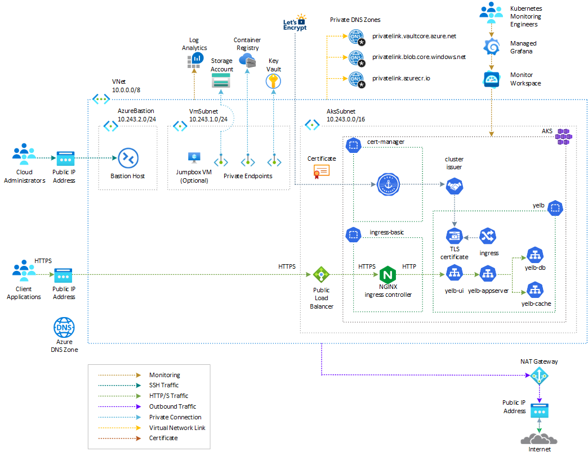
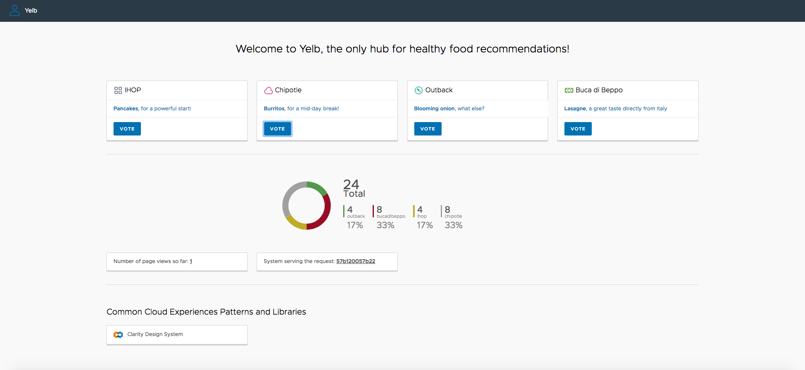

# Yelb on AKS with NGINX Ingress Controller and ModSecurity

The following solution makes use of [NGINX ingress controller](https://docs.nginx.com/nginx-ingress-controller/intro/overview/) to expose the [Yelb](https://github.com/mreferre/yelb/) application and ModSecurity to block any malicious or suspicious traffic based on predefined OWASP or custom rules. [ModSecurity](https://github.com/SpiderLabs/ModSecurity) is an open-source web application firewall (WAF) that is compatible with popular web servers such as Apache, NGINX, and ISS. It provides protection from a wide range of attacks by using a powerful rule-definition language.

## Prerequisites

- An active [Azure subscription](https://docs.microsoft.com/en-us/azure/guides/developer/azure-developer-guide#understanding-accounts-subscriptions-and-billing). If you don't have one, create a [free Azure account](https://azure.microsoft.com/free/) before you begin.
- The **Owner** [Azure built-in role](https://learn.microsoft.com/en-us/azure/role-based-access-control/built-in-roles), or the **User Access Administrator** and **Contributor** built-in roles, on a subscription in your Azure account.
- [Azure CLI](https://learn.microsoft.com/en-us/cli/azure/install-azure-cli) version 2.64.0 or later. For more information, see [Install Azure CLI](https://learn.microsoft.com/en-us/cli/azure/install-azure-cli).
- [Azure Kubernetes Service (AKS) preview extension](https://learn.microsoft.com/en-us/azure/aks/draft#install-the-aks-preview-azure-cli-extension).
- [jq](https://jqlang.github.io/jq/) version 1.5 or later.
- [Python 3](https://www.python.org/downloads/) or later.
- [kubectl](https://kubernetes.io/docs/tasks/tools/install-kubectl/) version 1.21.0 or later
- [Helm](https://helm.sh/docs/intro/install/) version 3.0.0 or later
- [Visual Studio Code](https://code.visualstudio.com/) installed on one of the [supported platforms](https://code.visualstudio.com/docs/supporting/requirements#_platforms) along with the [Bicep extension](https://marketplace.visualstudio.com/items?itemName=ms-azuretools.vscode-bicep).

## Architecture

This sample provides a collection of Bicep modules, Bash scripts, and YAML manifests for building an [Azure Kubernetes Service (AKS)](https://docs.microsoft.com/en-us/azure/aks/intro-kubernetes) cluster, deploying the [Yelb](https://github.com/mreferre/yelb/) application, exposing the UI service using the [NGINX ingress controller](https://docs.nginx.com/nginx-ingress-controller/intro/overview/), and protecting it with the [ModSecurity](https://github.com/SpiderLabs/ModSecurity) open-source web application firewall (WAF). The following diagram shows the architecture and network topology of the solution:



ModSecurity can be used with the NGINX Ingress controller to provide an extra layer of security to web applications exposed via Kubernetes. The NGINX Ingress controller acts as a reverse proxy, forwarding traffic to the web application, while ModSecurity inspects the incoming requests and blocks any malicious or suspicious traffic based on the defined rules.

Using ModSecurity with NGINX Ingress controllers in Kubernetes provides a cloud-agnostic solution that can be deployed on any managed Kubernetes cluster on any cloud platform. This means the solution can be deployed "as is" on various cloud platforms, including:

- [Amazon Elastic Kubernetes Service (EKS)](https://aws.amazon.com/eks/) on AWS
- [Azure Kubernetes Service (AKS)](https://docs.microsoft.com/en-us/azure/aks/intro-kubernetes)
- [Google Kubernetes Engine (GKE)](https://cloud.google.com/kubernetes-engine)

The cloud-agnostic nature of this solution allows multi-cloud customers to deploy and configure their web applications, such as Yelb, consistently across different cloud platforms without significant modifications. It provides flexibility and portability, enabling you to switch between cloud providers or have a multi-cloud setup while maintaining consistent security measures. [Here](./nginx-with-modsecurity-waf/README.md) you can find Bicep templates, Bash scripts, and YAML manifests to create this architecture and deploy the Yelb application.

For more information, see the following resources:

- [Kubernetes NGINX Ingress WAF with ModSecurity. From zero to hero!](https://systemweakness.com/nginx-ingress-waf-with-modsecurity-from-zero-to-hero-fa284cb6f54a).
- [Kubernetes Ingresses, NGINX, ModSecurity and the Core Rule Set 101](https://systemweakness.com/nginx-ingress-waf-with-modsecurity-from-zero-to-hero-fa284cb6f54a#7f54)
- [A note on ModSecurity’s future](https://systemweakness.com/nginx-ingress-waf-with-modsecurity-from-zero-to-hero-fa284cb6f54a#b056)
- [Enabling ModSecurity and CRS in the NGINX Ingress](https://systemweakness.com/nginx-ingress-waf-with-modsecurity-from-zero-to-hero-fa284cb6f54a#6f5a)
- [Configuring ModSecurity and CRS in the NGINX Ingress](https://systemweakness.com/nginx-ingress-waf-with-modsecurity-from-zero-to-hero-fa284cb6f54a#6815)
- [Fine tuning and dealing with false positives](https://systemweakness.com/nginx-ingress-waf-with-modsecurity-from-zero-to-hero-fa284cb6f54a#86d1)
- [Closing note on Performance](https://systemweakness.com/nginx-ingress-waf-with-modsecurity-from-zero-to-hero-fa284cb6f54a#6e79)
- [Coraza - Web Application Firewall](https://github.com/corazawaf/coraza)
- [Kubernetes NGINX WAF (Part 1) — Ingress Hardening with Mod_Security and OWASP CRS](https://medium.com/opensight-ch/kubernetes-nginx-waf-part-1-ingress-hardening-with-mod-security-and-owasp-crs-3cb1215cddfd)
- [NGINX Ingress WAF (Part 2) — mod_security Kibana Dashboard](https://medium.com/opensight-ch/nginx-ingress-waf-part-2-mod-security-kibana-dashboard-2fd863180d47)
- [Enabling ModSecurity in the Kubernetes Ingress-NGINX Controller](https://awkwardferny.medium.com/enabling-modsecurity-in-the-kubernetes-ingress-nginx-controller-111f9c877998)

A [Deployment Script](https://learn.microsoft.com/en-us/azure/azure-resource-manager/bicep/deployment-script-bicep) is used to create the [NGINX Ingress Controller](https://docs.nginx.com/nginx-ingress-controller/intro/overview/) via a Helm chart. However, the Bicep modules install also a [managed NGINX ingress controller with the application routing add-on](https://learn.microsoft.com/en-us/azure/aks/app-routing). You can easily modify the Bash scripts and YAML manifestds in the [scripts](./scripts/) folder to use the managed NGINX ingress controller in place of the NGINX ingress controller installed by the deployment script. 

By default, Bicep modules install the AKS cluster with the [Azure CNI Overlay](https://learn.microsoft.com/en-us/azure/aks/azure-cni-overlay) network plugin and the [Cilium](https://learn.microsoft.com/en-us/azure/aks/azure-cni-powered-by-cilium) data plane. However, Bicep modules are parametric, so you can choose any network plugin:

- [Azure CNI with static IP allocation](https://learn.microsoft.com/en-us/azure/aks/configure-azure-cni)
- [Azure CNI with dynamic IP allocation](https://learn.microsoft.com/en-us/azure/aks/configure-azure-cni-dynamic-ip-allocation)
- [Azure CNI Powered by Cilium](https://learn.microsoft.com/en-us/azure/aks/azure-cni-powered-by-cilium)
- [Azure CNI Overlay](https://learn.microsoft.com/en-us/azure/aks/azure-cni-overlay)
- [BYO CNI](https://learn.microsoft.com/en-us/azure/aks/use-byo-cni?tabs=azure-cli)
- [Kubenet](https://learn.microsoft.com/en-us/azure/aks/configure-kubenet)

In addition, the project shows how to deploy an [Azure Kubernetes Service](https://docs.microsoft.com/en-us/azure/aks/intro-kubernetes) cluster with the following extensions and features:

- [Istio-based service mesh add-on for Azure Kubernetes Service](https://learn.microsoft.com/en-us/azure/aks/istio-about) provides an officially supported and tested [Istio](https://istio.io/v1.1/docs/concepts/what-is-istio/) integration for Azure Kubernetes Service (AKS).
- [API Server VNET Integration](https://learn.microsoft.com/en-us/azure/aks/api-server-vnet-integration) allows you to enable network communication between the API server and the cluster nodes without requiring a private link or tunnel. AKS clusters with API Server VNET integration provide a series of advantages, for example, they can have public network access or private cluster mode enabled or disabled without redeploying the cluster. For more information, see [Create an Azure Kubernetes Service cluster with API Server VNet Integration](https://learn.microsoft.com/en-us/azure/aks/api-server-vnet-integration).
- [Azure NAT Gateway](https://learn.microsoft.com/en-us/azure/virtual-network/nat-gateway/nat-overview) to manage outbound connections initiated by AKS-hosted workloads.
- [Event-driven Autoscaling (KEDA) add-on](https://learn.microsoft.com/en-us/azure/aks/keda-about) is a single-purpose and lightweight component that strives to make application autoscaling simple and is a CNCF Incubation project.
- [Dapr extension for Azure Kubernetes Service (AKS)](https://learn.microsoft.com/en-us/azure/aks/dapr) allows you to install [Dapr](https://dapr.io/), a portable, event-driven runtime that simplifies building resilient, stateless, and stateful applications that run on the cloud and edge and embrace the diversity of languages and developer frameworks. With its sidecar architecture, Dapr helps you tackle the challenges that come with building microservices and keeps your code platform agnostic.
- [Flux V2 extension](https://learn.microsoft.com/en-us/azure/azure-arc/kubernetes/tutorial-use-gitops-flux2?tabs=azure-cli) allows to deploy workloads to an Azure Kubernetes Service (AKS) cluster via [GitOps](https://www.weave.works/technologies/gitops/). For more information, see [GitOps Flux v2 configurations with AKS and Azure Arc-enabled Kubernetes](https://learn.microsoft.com/en-us/azure/azure-arc/kubernetes/conceptual-gitops-flux2)
- [Vertical Pod Autoscaling](https://learn.microsoft.com/en-us/azure/aks/vertical-pod-autoscaler) allows you to automatically sets resource requests and limits on containers per workload based on past usage. VPA makes certain pods are scheduled onto nodes that have the required CPU and memory resources. For more information, see [Kubernetes Vertical Pod Autoscaling](https://itnext.io/k8s-vertical-pod-autoscaling-fd9e602cbf81).
- [Azure Key Vault Provider for Secrets Store CSI Driver](https://learn.microsoft.com/en-us/azure/aks/csi-secrets-store-identity-access) provides a variety of methods of identity-based access to your [Azure Key Vault](https://learn.microsoft.com/en-us/azure/key-vault/general/overview).
- [Image Cleaner](https://learn.microsoft.com/en-us/azure/aks/image-cleaner?tabs=azure-cli) to clean up stale images on your Azure Kubernetes Service cluster.
- [Azure Kubernetes Service (AKS) Network Observability](https://learn.microsoft.com/en-us/azure/aks/network-observability-overview) is an important part of maintaining a healthy and performant Kubernetes cluster. By collecting and analyzing data about network traffic, you can gain insights into how your cluster is operating and identify potential problems before they cause outages or performance degradation.
- [Managed NGINX ingress with the application routing add-on](https://learn.microsoft.com/en-us/azure/aks/app-routing).

In a production environment, we strongly recommend deploying a [private AKS cluster](https://docs.microsoft.com/en-us/azure/aks/private-clusters) with [Uptime SLA](https://docs.microsoft.com/en-us/azure/aks/uptime-sla). For more information, see [private AKS cluster with a Public DNS address](https://docs.microsoft.com/en-us/azure/aks/private-clusters#create-a-private-aks-cluster-with-a-public-dns-address). Alternatively, you can deploy a public AKS cluster and secure access to the API server using [authorized IP address ranges](https://learn.microsoft.com/en-us/azure/aks/api-server-authorized-ip-ranges).

### Azure Resources

The Bicep modules deploy or use the following Azure resources:

| Resource | Type | Description |
|----------|------|-------------|
| [Azure Kubernetes Service(AKS)](https://docs.microsoft.com/en-us/azure/aks/intro-kubernetes) | [Microsoft.ContainerService/managedClusters](https://learn.microsoft.com/en-us/azure/templates/microsoft.containerservice/managedclusters?pivots=deployment-language-bicep) | A public or private AKS cluster composed of a `system` node pool in a dedicated subnet that hosts only critical system pods and services, and a `user` node pool hosting user workloads and artifacts in a dedicated subnet. |
| [Grafana Admin Role Assignment](https://learn.microsoft.com/en-us/azure/managed-grafana/how-to-share-grafana-workspace?tabs=azure-portal) | [Microsoft.Authorization/roleDefinitions](https://learn.microsoft.com/en-us/azure/templates/microsoft.authorization/roleassignments?pivots=deployment-language-bicep) | A `Grafana Admin` role assignment on the Azure Managed Grafana for the Microsoft Entra ID user whose objectID is defined in the `userId` parameter. |
| [Key Vault Administrator Role Assignment](https://learn.microsoft.com/en-us/azure/aks/csi-secrets-store-driver) | [Microsoft.Authorization/roleDefinitions](https://learn.microsoft.com/en-us/azure/templates/microsoft.authorization/roleassignments?pivots=deployment-language-bicep) | A `Key Vault Administrator` role assignment on the existing Azure Key Vault resource which contains the TLS certificate for the user-defined managed identity used by the Azure Key Vault provider for Secrets Store CSI Driver. |
| [Azure DNS Zone](https://learn.microsoft.com/en-us/azure/dns/private-dns-overview) | [Microsoft.Network/dnsZones](https://learn.microsoft.com/en-us/azure/templates/microsoft.network/dnszones?pivots=deployment-language-bicep) | An existing Azure DNS zone used for the name resolution of AKS-hosted workloads. This resource is optional. |
| [Virtual Network](https://docs.microsoft.com/en-us/azure/virtual-network/virtual-networks-overview) | [Microsoft.Network/virtualNetworks](https://docs.microsoft.com/en-us/azure/templates/microsoft.network/virtualnetworks) | A new virtual network with multiple subnets for different purposes: `SystemSubnet`is used for the agent nodes of the `system` node pool, `UserSubnet` is used for the agent nodes of the `user` node pool, `ApiServerSubnet` is used by API Server VNET Integration, `AzureBastionSubnet` is used by Azure Bastion Host, `VmSubnet` is used for a jump-box virtual machine used to connect to the (private) AKS cluster and for Azure Private Endpoints. |
| [User-Assigned Managed Identity](https://docs.microsoft.com/en-us/azure/active-directory/managed-identities-azure-resources/overview) | [Microsoft.ManagedIdentity/userAssignedIdentities](https://learn.microsoft.com/en-us/azure/templates/microsoft.managedidentity/2018-11-30/userassignedidentities?pivots=deployment-language-bicep) | A user-defined managed identity used by the AKS cluster to create additional resources in Azure. |
| [Virtual Machine](https://docs.microsoft.com/en-us/azure/virtual-machines/windows/) | [Microsoft.Compute/virtualMachines](https://docs.microsoft.com/en-us/azure/templates/microsoft.compute/virtualmachines) | A jump-box virtual machine used to manage the private AKS cluster. |
| [Azure Bastion](https://docs.microsoft.com/en-us/azure/bastion/bastion-overview) | [Microsoft.Network/bastionHosts](https://docs.microsoft.com/en-us/azure/templates/microsoft.network/bastionhosts) | An Azure Bastion deployed in the AKS cluster virtual network to provide SSH connectivity to agent nodes and virtual machines. |
| [Storage Account](https://docs.microsoft.com/en-us/azure/storage/common/storage-account-overview) | [Microsoft.Storage/storageAccounts](https://docs.microsoft.com/en-us/azure/templates/microsoft.storage/storageaccounts) | A storage account used to store the boot diagnostics logs of the jumpbox virtual machine. |
| [Azure Container Registry](https://docs.microsoft.com/en-us/azure/container-registry/container-registry-intro) | [Microsoft.ContainerRegistry/registries](https://learn.microsoft.com/en-us/azure/templates/microsoft.containerregistry/registries?pivots=deployment-language-bicep) | An Azure Container Registry to build, store, and manage container images and artifacts in a private registry. This is not required to deploy the `Yelb` application as the sample uses public container images. |
| [Azure Key Vault](https://docs.microsoft.com/en-us/azure/key-vault/general/basic-concepts) | [Microsoft.KeyVault/vaults](https://learn.microsoft.com/en-us/azure/templates/microsoft.keyvault/vaults?pivots=deployment-language-bicep) | An existing Azure Key Vault used to store secrets, certificates, and keys. |
| [Azure Private Endpoint](https://learn.microsoft.com/en-us/azure/private-link/private-endpoint-overview)| [Microsoft.Network/privateEndpoints](https://docs.microsoft.com/en-us/azure/templates/microsoft.network/privateendpoints) | Azure Private Endpoints for Azure Container Registry, Azure Key Vault, and Azure Storage Account. |
| [Azure Private DNS Zone](https://docs.microsoft.com/en-us/azure/dns/private-dns-overview) | [Microsoft.Network/privateDnsZones](https://docs.microsoft.com/en-us/azure/templates/microsoft.network/privatednszones) |  Azure Private DNS Zones are used for the DNS resolution of the Azure Private Endpoints for Azure Container Registry, Azure Key Vault, Azure Storage Account, API Server when deploying a private AKS cluster. |
| [Azure Network Security Group](https://docs.microsoft.com/en-us/azure/virtual-network/network-security-groups-overview) | [Microsoft.Network/networkSecurityGroups](https://docs.microsoft.com/en-us/azure/templates/microsoft.network/networksecuritygroups?tabs=bicep) | Azure Network Security Groups used to filter inbound and outbound traffic for subnets hosting virtual machines. |
| [Azure Monitor Workspace](https://learn.microsoft.com/en-us/azure/azure-monitor/essentials/azure-monitor-workspace-overview) | [Microsoft.Monitor/accounts](https://learn.microsoft.com/en-us/azure/azure-monitor/essentials/azure-monitor-workspace-overview) | An [Azure Monitor workspace](https://learn.microsoft.com/en-us/azure/azure-monitor/essentials/azure-monitor-workspace-overview) to store Prometheus metrics generated by the AKS cluster and workloads.You can [Prometheus query language (PromQL)](https://aka.ms/azureprometheus-promio-promql) to analyze and alert on the performance of monitored infrastructure and workloads without having to operate the underlying infrastructure. The primary method for visualizing Prometheus metrics is [Azure Managed Grafana](https://learn.microsoft.com/en-us/azure/managed-grafana/overview). |
| [Azure Managed Grafana](https://learn.microsoft.com/en-us/azure/managed-grafana/overview) | [Microsoft.Dashboard/grafana](https://learn.microsoft.com/en-us/azure/templates/microsoft.dashboard/grafana?pivots=deployment-language-bicep) | an [Azure Managed Grafana](https://learn.microsoft.com/en-us/azure/managed-grafana/overview) instance used to visualize the [Prometheus metrics](https://learn.microsoft.com/en-us/azure/azure-monitor/containers/prometheus-metrics-enable?tabs=azure-portal) generated by the [Azure Kubernetes Service(AKS)](https://docs.microsoft.com/en-us/azure/aks/intro-kubernetes) cluster. [Azure Managed Grafana](https://learn.microsoft.com/en-us/azure/managed-grafana/overview) provides a set of built-in dashboards to visualize Prometheus metrics generated by your AKS cluster and workloads. |
| [Azure Log Analytics Workspace](https://docs.microsoft.com/en-us/azure/azure-monitor/logs/log-analytics-workspace-overview) | [Microsoft.OperationalInsights/workspaces](https://docs.microsoft.com/en-us/azure/templates/microsoft.operationalinsights/workspaces) | A centralized Azure Log Analytics workspace used to collect diagnostics logs and metrics from various Azure resources. |
| [Deployment Script](https://learn.microsoft.com/en-us/azure/azure-resource-manager/bicep/deployment-script-bicep) | [Microsoft.Resources/deploymentScripts](https://learn.microsoft.com/en-us/azure/templates/microsoft.resources/deploymentscripts?pivots=deployment-language-bicep) | A deployment script is utilized to run the `install-nginx-ingress-controller-with-modsecurity.sh` Bash script, which installs the [NGINX Ingress Controller](https://docs.nginx.com/nginx-ingress-controller/), [Cert-Manager](https://cert-manager.io/docs/), and [Prometheus](https://prometheus.io/) to the AKS cluster using [Helm](https://helm.sh/). However, the in-cluster Prometheus instance is not necessary as the Bicep modules install [Azure Managed Prometheus](https://learn.microsoft.com/en-us/azure/azure-monitor/essentials/azure-monitor-workspace-overview) and [Azure Managed Grafana](https://learn.microsoft.com/en-us/azure/managed-grafana/overview) to collect and monitor AKS Prometheus metrics. If needed, you can modify the `install-nginx-ingress-controller-with-modsecurity.sh` script to exclude the installation of the in-cluster Prometheus. For more details on deployment scripts, refer to the [Use deployment scripts in Bicep](https://learn.microsoft.com/en-us/azure/azure-resource-manager/bicep/deployment-script-bicep) documentation.|

## Deploy the Bicep modules

You can deploy the Bicep modules in the [bicep](./bicep/) folder using the [deploy.sh](./bicep/deploy.sh) Bash script. Specify a value for the following parameters in the `deploy.sh` script and `main.parameters.json` parameters file before deploying the Bicep modules.

- `prefix`: specifies a prefix for all the Azure resources.
- `authenticationType`: specifies the type of authentication when accessing the Virtual Machine. `sshPublicKey` is the recommended value. Allowed values: `sshPublicKey` and `password`.
- `vmAdminUsername`: specifies the name of the administrator account of the virtual machine.
- `vmAdminPasswordOrKey`: specifies the SSH Key or password for the virtual machine.
- `aksClusterSshPublicKey`:  specifies the SSH Key or password for AKS cluster agent nodes.
- `aadProfileAdminGroupObjectIDs`: when deploying an AKS cluster with Azure AD and Azure RBAC integration, this array parameter contains the list of Azure AD group object IDs that will have the admin role of the cluster.

This is the full list of the parameters.

Here is the markdown table extrapolated from the Bicep code:

| Name                                      | Type    | Description                                                                                                                                   |
| ----------------------------------------- | ------- | --------------------------------------------------------------------------------------------------------------------------------------------- |
| `prefix`                                  | string  | Specifies the name prefix for all the Azure resources.                                                                                         |
| `location`                                | string  | Specifies the location for all the Azure resources.                                                                                            |
| `userId`                                  | string  | Specifies the object id of an Azure Active Directory user.                                                                                     |
| `letterCaseType`                          | string  | Specifies whether name resources are in CamelCase, UpperCamelCase, or KebabCase.                                                               |
| `aksClusterName`                          | string  | Specifies the name of the AKS cluster.                                                                                                         |
| `createMetricAlerts`                      | bool    | Specifies whether creating metric alerts or not.                                                                                               |
| `metricAlertsEnabled`                     | bool    | Specifies whether metric alerts are enabled or disabled.                                                                                       |
| `metricAlertsEvalFrequency`               | string  | Specifies metric alerts eval frequency.                                                                                                        |
| `metricAlertsWindowsSize`                 | string  | Specifies metric alerts window size.                                                                                                           |
| `aksClusterDnsPrefix`                     | string  | Specifies the DNS prefix specified when creating the managed cluster.                                                                          |
| `aksClusterNetworkPlugin`                 | string  | Specifies the network plugin used for building Kubernetes network.                                                                             |
| `aksClusterNetworkPluginMode`             | string  | Specifies the Network plugin mode used for building the Kubernetes network.                                                                    |
| `aksClusterNetworkPolicy`                 | string  | Specifies the network policy used for building the Kubernetes network.                                                                         |
| `aksClusterNetworkDataplane`              | string  | Specifies the network dataplane used in the Kubernetes cluster.                                                                                |
| `aksClusterNetworkMode`                   | string  | Specifies the network mode. This cannot be specified if networkPlugin is anything other than azure.                                            |
| `aksClusterPodCidr`                       | string  | Specifies the CIDR notation IP range from which to assign pod IPs when kubenet is used.                                                        |
| `aksClusterServiceCidr`                   | string  | Specifies a CIDR notation IP range from which to assign service cluster IPs.                                                                    |
| `aksClusterDnsServiceIP`                  | string  | Specifies the IP address assigned to the Kubernetes DNS service.                                                                                |
| `aksClusterLoadBalancerSku`               | string  | Specifies the SKU of the load balancer used by the virtual machine scale sets used by nodepools.                                               |
| `loadBalancerBackendPoolType`             | string  | Specifies the type of the managed inbound Load Balancer BackendPool.                                                                            |
| `advancedNetworking`                      | object  | Specifies Advanced Networking profile for enabling observability on a cluster.                                                                 |
| `aksClusterIpFamilies`                     | array   | Specifies the IP families used to determine single-stack or dual-stack clusters.                                                               |
| `aksClusterOutboundType`                  | string  | Specifies the outbound (egress) routing method.                                                                                                |
| `aksClusterSkuTier`                       | string  | Specifies the tier of a managed cluster SKU: Paid or Free.                                                                                     |
| `aksClusterKubernetesVersion`             | string  | Specifies the version of Kubernetes specified when creating the managed cluster.                                                              |
| `aksClusterAdminUsername`                 | string  | Specifies the administrator username of Linux virtual machines.                                                                                |
| `aksClusterSshPublicKey`                  | string  | Specifies the SSH RSA public key string for the Linux nodes.                                                                                    |
| `aadProfileTenantId`                      | string  | Specifies the tenant id of the Azure Active Directory used by the AKS cluster for authentication.                                              |
| `aadProfileAdminGroupObjectIDs`           | array   | Specifies the AAD group object IDs that will have admin role of the cluster.                                                                    |
| `aksClusterNodeOSUpgradeChannel`          | string  | Specifies the node OS upgrade channel.                                                                                                         |
| `aksClusterUpgradeChannel`                | string  | Specifies the upgrade channel for auto upgrade.                                                                                                |
| `aksClusterEnablePrivateCluster`          | bool    | Specifies whether to create the cluster as a private cluster or not.                                                                            |
| `aksClusterWebAppRoutingEnabled`          | bool    | Specifies whether the managed NGINX Ingress Controller application routing addon is enabled.                                                    |
| `aksPrivateDNSZone`                       | string  | Specifies the Private DNS Zone mode for private cluster.                                                                                       |
| `aksEnablePrivateClusterPublicFQDN`       | bool    | Specifies whether to create additional public FQDN for private cluster or not.                                                                 |
| `aadProfileManaged`                       | bool    | Specifies whether to enable managed AAD integration.                                                                                           |
| `aadProfileEnableAzureRBAC`               | bool    | Specifies whether to enable Azure RBAC for Kubernetes authorization.                                                                            |
| `systemAgentPoolName`                     | string  | Specifies the unique name of the system node pool profile.                                                                                     |
| `systemAgentPoolVmSize`                   | string  | Specifies the vm size of nodes in the system node pool.                                                                                        |
| `systemAgentPoolOsDiskSizeGB`             | int     | Specifies the OS Disk Size in GB for every machine in the system agent pool.                                                                    |
| `systemAgentPoolOsDiskType`               | string  | Specifies the OS disk type for machines in a given agent pool.                                                                                  |
| `systemAgentPoolAgentCount`                | int     | Specifies the number of agents (VMs) to host docker containers in the system node pool.                                                        |
| `systemAgentPoolOsType`                   | string  | Specifies the OS type for the VMs in the system node pool.                                                                                     |
| `systemAgentPoolOsSKU`                    | string  | Specifies the OS SKU used by the system agent pool.                                                                                            |
| `systemAgentPoolMaxPods`                   | int     | Specifies the maximum number of pods that can run on a node in the system node pool.                                                           |
| `systemAgentPoolMaxCount`                  | int     | Specifies the maximum number of nodes for auto-scaling for the system node pool.                                                               |
| `systemAgentPoolMinCount`                  | int     | Specifies the minimum number of nodes for auto-scaling for the system node pool.                                                               |
| `systemAgentPoolEnableAutoScaling`         | bool    | Specifies whether to enable auto-scaling for the system node pool.                                                                             |
| `systemAgentPoolScaleSetPriority`          | string  | Specifies the virtual machine scale set priority in the system node pool.                                                                      |
| `systemAgentPoolScaleSetEvictionPolicy`    | string  | Specifies the ScaleSetEvictionPolicy for spot virtual machine scale set.                                                                       |
| `systemAgentPoolNodeLabels`               | object  | Specifies the Agent pool node labels to be persisted across all nodes in the system node pool.                                                 |
| `systemAgentPoolNodeTaints`               | array   | Specifies the taints added to new nodes during node pool create and scale.                                                                      |
| `systemAgentPoolKubeletDiskType`           | string  | Determines the placement of emptyDir volumes, container runtime data root, and Kubelet ephemeral storage.                                     |
| `systemAgentPoolType`                      | string  | Specifies the type for the system node pool.                                                                                                   |
| `systemAgentPoolAvailabilityZones`         | array   | Specifies the availability zones for the agent nodes in the system node pool.                                                                  |
| `userAgentPoolName`                       | string  | Specifies the unique name of the user node pool profile.                                                                                       |
| `userAgentPoolVmSize`                     | string  | Specifies the vm size of nodes in the user node pool.                                                                                          |
| `userAgentPoolOsDiskSizeGB`               | int     | Specifies the OS Disk Size in GB for every machine in the user agent pool.                                                                      |
| `userAgentPoolOsDiskType`                 | string  | Specifies the OS disk type for machines in a given agent pool.                                                                                  |
| `userAgentPoolAgentCount`                  | int     | Specifies the number of agents (VMs) to host docker containers in the user node pool.                                                          |
| `userAgentPoolOsType`                     | string  | Specifies the OS type for the VMs in the user node pool.                                                                                       |
| `userAgentPoolOsSKU`                      | string  | Specifies the OS SKU used by the user agent pool.                                                                                              |
| `userAgentPoolMaxPods`                     | int     | Specifies the maximum number of pods that can run on a node in the user node pool.                                                             |
| `userAgentPoolMaxCount`                    | int     | Specifies the maximum number of nodes for auto-scaling for the user node pool.                                                                 |
| `userAgentPoolMinCount`                    | int     | Specifies the minimum number of nodes for auto-scaling for the user node pool.                                                                 |
| `userAgentPoolEnableAutoScaling`           | bool    | Specifies whether to enable auto-scaling for the user node pool.                                                                               |
| `userAgentPoolScaleSetPriority`            | string  | Specifies the virtual machine scale set priority in the user node pool.                                                                        |
| `userAgentPoolScaleSetEvictionPolicy`      | string  | Specifies the ScaleSetEvictionPolicy for spot virtual machine scale set.                                                                       |
| `userAgentPoolNodeLabels`                 | object  | Specifies the Agent pool node labels to be persisted across all nodes in the user node pool.                                                   |
| `userAgentPoolNodeTaints`                 | array   | Specifies the taints added to new nodes during node pool create and scale.                                                                      |
| `userAgentPoolKubeletDiskType`             | string  | Determines the placement of emptyDir volumes, container runtime data root, and Kubelet ephemeral storage.                                     |
| `userAgentPoolType`                        | string  | Specifies the type for the user node pool.                                                                                                     |
| `userAgentPoolAvailabilityZones`           | array   | Specifies the availability zones for the agent nodes in the user node pool.                                                                    |
| `httpApplicationRoutingEnabled`           | bool    | Specifies whether the httpApplicationRouting add-on is enabled or not.                                                                         |
| `istioServiceMeshEnabled`                  | bool    | Specifies whether the Istio Service Mesh add-on is enabled or not.                                                                             |
| `istioIngressGatewayEnabled`               | bool    | Specifies whether the Istio Ingress Gateway is enabled or not.                                                                                 |
| `istioIngressGatewayType`                  | string  | Specifies the type of the Istio Ingress Gateway.                                                                                               |
| `kedaEnabled`                             | bool    | Specifies whether the Kubernetes Event-Driven Autoscaler (KEDA) add-on is enabled or not.                                                      |
| `daprEnabled`                             | bool    | Specifies whether the Dapr extension is enabled or not.                                                                                        |
| `daprHaEnabled`                           | bool    | Enable high availability (HA) mode for the Dapr control plane.                                                                                  |
| `fluxGitOpsEnabled`                       | bool    | Specifies whether the Flux V2 extension is enabled or not.                                                                                      |
| `verticalPodAutoscalerEnabled`            | bool    | Specifies whether the Vertical Pod Autoscaler is enabled or not.                                                                                |
| `aciConnectorLinuxEnabled`                | bool    | Specifies whether the aciConnectorLinux add-on is enabled or not.                                                                              |
| `azurePolicyEnabled`                      | bool    | Specifies whether the azurepolicy add-on is enabled or not.                                                                                    |
| `azureKeyvaultSecretsProviderEnabled`     | bool    | Specifies whether the Azure Key Vault Provider for Secrets Store CSI Driver addon is enabled or not.                                            |
| `kubeDashboardEnabled`                    | bool    | Specifies whether the kubeDashboard add-on is enabled or not.                                                                                  |
| `podIdentityProfileEnabled`               | bool    | Specifies whether the pod identity addon is enabled.                                                                                           |
| `autoScalerProfileScanInterval`            | string  | Specifies the scan interval of the auto-scaler of the AKS cluster.                                                                             |
| `autoScalerProfileScaleDownDelayAfterAdd`  | string  | Specifies the scale down delay after add of the auto-scaler of the AKS cluster.                                                                |
| `autoScalerProfileScaleDownDelayAfterDelete` | string | Specifies the scale down delay after delete of the auto-scaler of the AKS cluster.                                                             |
| `autoScalerProfileScaleDownDelayAfterFailure` | string | Specifies scale down delay after failure of the auto-scaler of the AKS cluster.                                                               |
| `autoScalerProfileScaleDownUnneededTime`   | string  | Specifies the scale down unneeded time of the auto-scaler of the AKS cluster.                                                                  |
| `autoScalerProfileScaleDownUnreadyTime`    | string  | Specifies the scale down unready time of the auto-scaler of the AKS cluster.                                                                   |
| `autoScalerProfileUtilizationThreshold`    | string  | Specifies the utilization threshold of the auto-scaler of the AKS cluster.                                                                     |
| `autoScalerProfileMaxGracefulTerminationSec` | string | Specifies the max graceful termination time interval in seconds for the auto-scaler of the AKS cluster.                                        |
| `enableVnetIntegration`                   | bool    | Specifies whether to enable API server VNET integration for the cluster or not.                                                                |
| `virtualNetworkName`                      | string  | Specifies the name of the virtual network.                                                                                                     |
| `virtualNetworkAddressPrefixes`           | string  | Specifies the address prefixes of the virtual network.                                                                                         |
| `systemAgentPoolSubnetName`                | string  | Specifies the name of the subnet hosting the worker nodes of the default system agent pool of the AKS cluster.                                 |
| `systemAgentPoolSubnetAddressPrefix`       | string  | Specifies the address prefix of the subnet hosting the worker nodes of the default system agent pool of the AKS cluster.                       |
| `userAgentPoolSubnetName`                  | string  | Specifies the name of the subnet hosting the worker nodes of the user agent pool of the AKS cluster.                                           |
| `userAgentPoolSubnetAddressPrefix`         | string  | Specifies the address prefix of the subnet hosting the worker nodes of the user agent pool of the AKS cluster.                                 |
| `blobCSIDriverEnabled`                    | bool    | Specifies whether to enable the Azure Blob CSI Driver.                                                                                          |
| `diskCSIDriverEnabled`                    | bool    | Specifies whether to enable the Azure Disk CSI Driver.                                                                                          |
| `fileCSIDriverEnabled`                    | bool    | Specifies whether to enable the Azure File CSI Driver.                                                                                          |
| `snapshotControllerEnabled`               | bool    | Specifies whether to enable the Snapshot Controller.                                                                                            |
| `defenderSecurityMonitoringEnabled`       | bool    | Specifies whether to enable Defender threat detection.                                                                                          |
| `imageCleanerEnabled`                     | bool    | Specifies whether to enable ImageCleaner on AKS cluster.                                                                                        |
| `imageCleanerIntervalHours`              | int     | Specifies ImageCleaner scanning interval in hours.                                                                                              |
| `nodeRestrictionEnabled`                  | bool    | Specifies whether to enable Node Restriction.                                                                                                   |
| `workloadIdentityEnabled`                 | bool    | Specifies whether to enable Workload Identity.                                                                                                  |
| `oidcIssuerProfileEnabled`                | bool    | Specifies whether the OIDC issuer is enabled.                                                                                                   |
| `podSubnetName`                           | string  | Specifies the name of the subnet hosting the pods running in the AKS cluster.                                                                   |
| `podSubnetAddressPrefix`                  | string  | Specifies the address prefix of the subnet hosting the pods running in the AKS cluster.                                                        |
| `apiServerSubnetName`                      | string  | Specifies the name of the subnet delegated to the API server when configuring the AKS cluster to use API server VNET integration.               |
| `apiServerSubnetAddressPrefix`            | string  | Specifies the address prefix of the subnet delegated to the API server when configuring the AKS cluster to use API server VNET integration.     |
| `vmSubnetName`                            | string  | Specifies the name of the subnet which contains the virtual machine.                                                                            |
| `vmSubnetAddressPrefix`                   | string  | Specifies the address prefix of the subnet which contains the virtual machine.                                                                 |
| `bastionSubnetAddressPrefix`              | string  | Specifies the Bastion subnet IP prefix.                                                                                                        |
| `logAnalyticsWorkspaceName`                | string  | Specifies the name of the Log Analytics Workspace.                                                                                             |
| `logAnalyticsSku`                         | string  | Specifies the service tier of the workspace.                                                                                                   |
| `logAnalyticsRetentionInDays`             | int     | Specifies the workspace data retention in days.                                                                                                 |
| `vmEnabled`                               | bool    | Specifies whether creating or not a jumpbox virtual machine in the AKS cluster virtual network.                                                |
| `vmName`                                  | string  | Specifies the name of the virtual machine.                                                                                                     |
| `vmSize`                                  | string  | Specifies the size of the virtual machine.                                                                                                     |
| `imagePublisher`                          | string  | Specifies the image publisher of the disk image used to create the virtual machine.                                                             |
| `imageOffer`                              | string  | Specifies the offer of the platform image or marketplace image used to create the virtual machine.                                             |
| `imageSku`                                | string  | Specifies the Ubuntu version for the VM.                                                                                                       |
| `authenticationType`                      | string  | Specifies the type of authentication when accessing the Virtual Machine.                                                                        |
| `vmAdminUsername`                          | string  | Specifies the name of the administrator account of the virtual machine.                                                                         |
| `vmAdminPasswordOrKey`                    | string  | Specifies the SSH Key or password for the virtual machine.                                                                                      |
| `diskStorageAccountType`                  | string  | Specifies the storage account type for OS and data disk.                                                                                        |
| `numDataDisks`                            | int     | Specifies the number of data disks of the virtual machine.                                                                                      |
| `osDiskSize`                              | int     | Specifies the size in GB of the OS disk of the VM.                                                                                              |
| `dataDiskSize`                            | int     | Specifies the size in GB of the data disk of the virtual machine.                                                                               |
| `dataDiskCaching`                         | string  | Specifies the caching requirements for the data disks.                                                                                          |
| `blobStorageAccountName`                  | string  | Specifies the globally unique name for the storage account used to store the boot diagnostics logs of the virtual machine.                      |
| `blobStorageAccountPrivateEndpointName`    | string  | Specifies the name of the private link to the boot diagnostics storage account.                                                                 |
| `acrPrivateEndpointName`                  | string  | Specifies the name of the private link to the Azure Container Registry.                                                                         |
| `acrName`                                 | string  | Specifies the name of the Azure Container Registry.                                                                                            |
| `acrAdminUserEnabled`                     | bool    | Enable admin user that have push / pull permission to the registry.                                                                             |
| `acrSku`                                  | string  | Tier of the Azure Container Registry.                                                                                          |
| `acrPublicNetworkAccess`                  | string  | Whether to allow public network access.                                                                                          |
| `acrAnonymousPullEnabled`                 | bool    | Specifies whether or not registry-wide pull is enabled from unauthenticated clients.                                                           |
| `acrDataEndpointEnabled`                  | bool    | Specifies whether or not a single data endpoint is enabled per region for serving data.                                                        |
| `acrNetworkRuleSet`                       | object  | Specifies the network rule set for the container registry.                                                                                      |
| `acrNetworkRuleBypassOptions`             | string  | Specifies whether to allow trusted Azure services to access a network restricted registry.                                                    |
| `acrNetworkRuleBypassOptions`             | string  | Specifies whether to allow trusted Azure services to access a network restricted registry.                                                    |
| `acrZoneRedundancy`                       | string  | Specifies whether or not zone redundancy is enabled for this container registry.                                                               |
| `bastionHostEnabled`                      | bool    | Specifies whether Azure Bastion should be created.                                                                                              |
| `bastionHostName`                         | string  | Specifies the name of the Azure Bastion resource.                                                                                               |
| `natGatewayName`                          | string  | Specifies the name of the Azure NAT Gateway.                                                                                                   |
| `natGatewayZones`                         | array   | Specifies a list of availability zones denoting the zone in which Nat Gateway should be deployed.                                              |
| `natGatewayPublicIps`                     | int     | Specifies the number of Public IPs to create for the Azure NAT Gateway.                                                                         |
| `natGatewayIdleTimeoutMins`               | int     | Specifies the idle timeout in minutes for the Azure NAT Gateway.                                                                                |
| `keyVaultPrivateEndpointName`             | string  | Specifies the name of the private link to the Key Vault.                                                                                        |
| `keyVaultName`                            | string  | Specifies the name of the Azure Key Vault resource.                                                                                             |
| `keyVaultPublicNetworkAccess`             | string  | Specifies whether to allow public network access for Key Vault.                                                                                 |
| `keyVaultNetworkAclsDefaultAction`        | string  | Specifies the default action of allow or deny when no other rules match for the Azure Key Vault resource.                                       |
| `keyVaultEnabledForDeployment`            | bool    | Specifies whether the Azure Key Vault resource is enabled for deployments.                                                                      |
| `keyVaultEnabledForDiskEncryption`        | bool    | Specifies whether the Azure Key Vault resource is enabled for disk encryption.                                                                  |
| `keyVaultEnabledForTemplateDeployment`    | bool    | Specifies whether the Azure Key Vault resource is enabled for template deployment.                                                              |
| `keyVaultEnableSoftDelete`                | bool    | Specifies whether the soft delete is enabled for this Azure Key Vault resource.                                                                 |
| `keyVaultEnablePurgeProtection`           | bool    | Specifies whether purge protection is enabled for this Azure Key Vault resource.                                                                |
| `keyVaultEnableRbacAuthorization`         | bool    | Specifies whether enable the RBAC authorization for the Azure Key Vault resource.                                                              |
| `keyVaultSoftDeleteRetentionInDays`       | int     | Specifies the soft delete retention in days.                                                                                                    |
| `tags`                                    | object  | Specifies the resource tags.                                                                                                                   |
| `clusterTags`                             | object  | Specifies the resource tags.                                                                                                                   |
| `actionGroupName`                        | string  | Specifies the name of the Action Group.                                                                                                        |
| `actionGroupShortName`                    | string  | Specifies the short name of the action group.                                                                                                  |
| `actionGroupEnabled`                      | bool    | Specifies whether this action group is enabled.                                                                                                |
| `actionGroupEmailAddress`                 | string  | Specifies the email address of the receiver.                                                                                                   |
| `actionGroupUseCommonAlertSchema`         | bool    | Specifies whether to use common alert schema.                                                                                                  |
| `actionGroupCountryCode`                  | string  | Specifies the country code of the SMS receiver.                                                                                                |
| `actionGroupPhoneNumber`                  | string  | Specifies the phone number of the SMS receiver.                                                                                                |
| `metricAnnotationsAllowList`              | string  | Specifies a comma-separated list of additional Kubernetes label keys that will be used in the resource labels metric.                          |
| `metricLabelsAllowlist`                   | string  | Specifies a comma-separated list of Kubernetes annotations keys that will be used in the resource labels metric.                               |
| `prometheusName`                          | string  | Specifies the name of the Azure Monitor managed service for Prometheus resource.                                                               |
| `prometheusPublicNetworkAccess`           | string  | Specifies whether or not public endpoint access is allowed for the Azure Monitor managed service for Prometheus resource.                     |
| `grafanaName`                             | string  | Specifies the name of the Azure Managed Grafana resource.                                                                                      |
| `grafanaSkuName`                          | string  | Specifies the sku of the Azure Managed Grafana resource.                                                                                       |
| `grafanaApiKey`                           | string  | Specifies the api key setting of the Azure Managed Grafana resource.                                                                            |
| `grafanaAutoGeneratedDomainNameLabelScope` | string | Specifies the scope for dns deterministic name hash calculation.                                                                               |
| `grafanaDeterministicOutboundIP`          | string  | Specifies whether the Azure Managed Grafana resource uses deterministic outbound IPs.                                                          |
| `grafanaPublicNetworkAccess`              | string  | Specifies the the state for enable or disable traffic over the public interface for the the Azure Managed Grafana resource.                    |
| `grafanaZoneRedundancy`                   | string  | The zone redundancy setting of the Azure Managed Grafana resource.                                                                             |
| `email`                                   | string  | Specifies the email address for the cert-manager cluster issuer.                                                                                |
| `deploymentScripName`                     | string  | Specifies the name of the deployment script uri.                                                                                               |
| `deploymentScriptUri`                     | string  | Specifies the URI of the deployment script.                                                                                                    |
| `dnsZoneName`                             | string  | Specifies the name of an existing public DNS zone.                                                                                             |
| `dnsZoneResourceGroupName`                | string  | Specifies the name of the resource group which contains the public DNS zone.                                                                    |

We suggest reading sensitive configuration data such as passwords or SSH keys from a pre-existing Azure Key Vault resource. For more information, see [Create parameters files for Bicep deployment](https://learn.microsoft.com/en-us/azure/azure-resource-manager/bicep/parameter-files?tabs=Bicep).

```bash
#!/bin/bash

# Template
template="main.bicep"
parameters="main.bicepparam"

# AKS cluster name
prefix="<your-azure-resource-prefix>"
aksName="${prefix}Aks"
userPrincipalName="<your-azure-account>"
validateTemplate=0
useWhatIf=0
update=1
deploy=1
installExtensions=0

# Name and location of the resource group for the Azure Kubernetes Service (AKS) cluster
resourceGroupName="${prefix}RG"
location="<azure-region>"
deploymentName="main"

# Subscription id, subscription name, and tenant id of the current subscription
subscriptionId=$(az account show --query id --output tsv)
subscriptionName=$(az account show --query name --output tsv)
tenantId=$(az account show --query tenantId --output tsv)

# Install aks-preview Azure extension
if [[ $installExtensions == 1 ]]; then
  echo "Checking if [aks-preview] extension is already installed..."
  az extension show --name aks-preview &>/dev/null

  if [[ $? == 0 ]]; then
    echo "[aks-preview] extension is already installed"

    # Update the extension to make sure you have the latest version installed
    echo "Updating [aks-preview] extension..."
    az extension update --name aks-preview &>/dev/null
  else
    echo "[aks-preview] extension is not installed. Installing..."

    # Install aks-preview extension
    az extension add --name aks-preview 1>/dev/null

    if [[ $? == 0 ]]; then
      echo "[aks-preview] extension successfully installed"
    else
      echo "Failed to install [aks-preview] extension"
      exit
    fi
  fi

  # Registering AKS feature extensions
  aksExtensions=(
    "AdvancedNetworkingPreview"
    "AKS-KedaPreview"
    "RunCommandPreview"
    "EnableAPIServerVnetIntegrationPreview"
    "EnableImageCleanerPreview"
    "AKS-VPAPreview"
  )
  ok=0
  registeringExtensions=()
  for aksExtension in ${aksExtensions[@]}; do
    echo "Checking if [$aksExtension] extension is already registered..."
    extension=$(az feature list -o table --query "[?contains(name, 'Microsoft.ContainerService/$aksExtension') && @.properties.state == 'Registered'].{Name:name}" --output tsv)
    if [[ -z $extension ]]; then
      echo "[$aksExtension] extension is not registered."
      echo "Registering [$aksExtension] extension..."
      az feature register \
        --name $aksExtension \
        --namespace Microsoft.ContainerService \
        --only-show-errors
      registeringExtensions+=("$aksExtension")
      ok=1
    else
      echo "[$aksExtension] extension is already registered."
    fi
  done
  echo $registeringExtensions
  delay=1
  for aksExtension in ${registeringExtensions[@]}; do
    echo -n "Checking if [$aksExtension] extension is already registered..."
    while true; do
      extension=$(az feature list -o table --query "[?contains(name, 'Microsoft.ContainerService/$aksExtension') && @.properties.state == 'Registered'].{Name:name}" --output tsv)
      if [[ -z $extension ]]; then
        echo -n "."
        sleep $delay
      else
        echo "."
        break
      fi
    done
  done

  if [[ $ok == 1 ]]; then
    echo "Refreshing the registration of the Microsoft.ContainerService resource provider..."
    az provider register \
      --namespace Microsoft.ContainerService \
      --only-show-errors
    echo "Microsoft.ContainerService resource provider registration successfully refreshed"
  fi
fi

# Get the last Kubernetes version available in the region
kubernetesVersion=$(az aks get-versions \
  --location $location \
  --query "values[?isPreview==null].version | sort(@) | [-1]" \
  --output tsv \
  --only-show-errors)

if [[ -n $kubernetesVersion ]]; then
  echo "Successfully retrieved the last Kubernetes version [$kubernetesVersion] supported by AKS in [$location] Azure region"
else
  echo "Failed to retrieve the last Kubernetes version supported by AKS in [$location] Azure region"
  exit
fi

# Check if the resource group already exists
echo "Checking if [$resourceGroupName] resource group actually exists in the [$subscriptionName] subscription..."

az group show \
  --name $resourceGroupName \
  --only-show-errors &>/dev/null

if [[ $? != 0 ]]; then
  echo "No [$resourceGroupName] resource group actually exists in the [$subscriptionName] subscription"
  echo "Creating [$resourceGroupName] resource group in the [$subscriptionName] subscription..."

  # Create the resource group
  az group create \
    --name $resourceGroupName \
    --location $location \
    --only-show-errors 1>/dev/null

  if [[ $? == 0 ]]; then
    echo "[$resourceGroupName] resource group successfully created in the [$subscriptionName] subscription"
  else
    echo "Failed to create [$resourceGroupName] resource group in the [$subscriptionName] subscription"
    exit
  fi
else
  echo "[$resourceGroupName] resource group already exists in the [$subscriptionName] subscription"
fi

# Get the user principal name of the current user
if [ -z $userPrincipalName ]; then
  echo "Retrieving the user principal name of the current user from the [$tenantId] Azure AD tenant..."
  userPrincipalName=$(az account show \
    --query user.name \
    --output tsv \
    --only-show-errors)
  if [[ -n $userPrincipalName ]]; then
    echo "[$userPrincipalName] user principal name successfully retrieved from the [$tenantId] Azure AD tenant"
  else
    echo "Failed to retrieve the user principal name of the current user from the [$tenantId] Azure AD tenant"
    exit
  fi
fi

# Retrieve the objectId of the user in the Azure AD tenant used by AKS for user authentication
echo "Retrieving the objectId of the [$userPrincipalName] user principal name from the [$tenantId] Azure AD tenant..."
userObjectId=$(az ad user show \
  --id $userPrincipalName \
  --query id \
  --output tsv \
  --only-show-errors 2>/dev/null)

if [[ -n $userObjectId ]]; then
  echo "[$userObjectId] objectId successfully retrieved for the [$userPrincipalName] user principal name"
else
  echo "Failed to retrieve the objectId of the [$userPrincipalName] user principal name"
  exit
fi

# Create AKS cluster if does not exist
echo "Checking if [$aksName] aks cluster actually exists in the [$resourceGroupName] resource group..."

az aks show \
  --name $aksName \
  --resource-group $resourceGroupName \
  --only-show-errors &>/dev/null

notExists=$?

if [[ $notExists != 0 || $update == 1 ]]; then

  if [[ $notExists != 0 ]]; then
    echo "No [$aksName] aks cluster actually exists in the [$resourceGroupName] resource group"
  else
    echo "[$aksName] aks cluster already exists in the [$resourceGroupName] resource group. Updating the cluster..."
  fi

  # Validate the Bicep template
  if [[ $validateTemplate == 1 ]]; then
    if [[ $useWhatIf == 1 ]]; then
      # Execute a deployment What-If operation at resource group scope.
      echo "Previewing changes deployed by [$template] Bicep template..."
      az deployment group what-if \
        --only-show-errors \
        --resource-group $resourceGroupName \
        --template-file $template \
        --parameters $parameters \
        --parameters prefix=$prefix \
        location=$location \
        userId=$userObjectId \
        aksClusterKubernetesVersion=$kubernetesVersion

      if [[ $? == 0 ]]; then
        echo "[$template] Bicep template validation succeeded"
      else
        echo "Failed to validate [$template] Bicep template"
        exit
      fi
    else
      # Validate the Bicep template
      echo "Validating [$template] Bicep template..."
      output=$(az deployment group validate \
        --only-show-errors \
        --resource-group $resourceGroupName \
        --template-file $template \
        --parameters $parameters \
        --parameters prefix=$prefix \
        location=$location \
        userId=$userObjectId \
        aksClusterKubernetesVersion=$kubernetesVersion)

      if [[ $? == 0 ]]; then
        echo "[$template] Bicep template validation succeeded"
      else
        echo "Failed to validate [$template] Bicep template"
        echo $output
        exit
      fi
    fi
  fi

  if [[ $deploy == 1 ]]; then
    # Deploy the Bicep template
    echo "Deploying [$template] Bicep template..."
    az deployment group create \
      --only-show-errors \
      --resource-group $resourceGroupName \
      --only-show-errors \
      --template-file $template \
      --parameters $parameters \
      --parameters prefix=$prefix \
      location=$location \
      userId=$userObjectId \
      aksClusterKubernetesVersion=$kubernetesVersion 1>/dev/null

    if [[ $? == 0 ]]; then
      echo "[$template] Bicep template successfully provisioned"
    else
      echo "Failed to provision the [$template] Bicep template"
      exit
    fi
  else
    echo "Skipping the deployment of the [$template] Bicep template"
    exit
  fi
else
  echo "[$aksName] aks cluster already exists in the [$resourceGroupName] resource group"
fi
```

## Deployment Script

The sample makes use of a [Deployment Script](https://learn.microsoft.com/en-us/azure/azure-resource-manager/bicep/deployment-script-bicep) to run the [install-nginx-ingress-controller-with-modsecurity.sh](./bicep/install-nginx-ingress-controller-with-modsecurity.sh) Bash script, which installs the [NGINX Ingress Controller](https://docs.nginx.com/nginx-ingress-controller/), [Cert-Manager](https://cert-manager.io/docs/), and [Prometheus](https://prometheus.io/) to the AKS cluster using [Helm](https://helm.sh/). The in-cluster Prometheus instance is not necessary as the Bicep modules install [Azure Managed Prometheus](https://learn.microsoft.com/en-us/azure/azure-monitor/essentials/azure-monitor-workspace-overview) and [Azure Managed Grafana](https://learn.microsoft.com/en-us/azure/managed-grafana/overview) to collect and monitor AKS Prometheus metrics. If needed, you can modify the `install-nginx-ingress-controller-with-modsecurity.sh` script to remove the installation of the in-cluster Prometheus and Grafana instance. For more details on deployment scripts, refer to the [Use deployment scripts in Bicep](https://learn.microsoft.com/en-us/azure/azure-resource-manager/bicep/deployment-script-bicep) documentation.

```bash
# Install kubectl
az aks install-cli --only-show-errors

# Get AKS credentials
az aks get-credentials \
  --admin \
  --name $clusterName \
  --resource-group $resourceGroupName \
  --subscription $subscriptionId \
  --only-show-errors

# Check if the cluster is private or not
private=$(az aks show --name $clusterName \
  --resource-group $resourceGroupName \
  --subscription $subscriptionId \
  --query apiServerAccessProfile.enablePrivateCluster \
  --output tsv)

# Install Helm
curl https://raw.githubusercontent.com/helm/helm/main/scripts/get-helm-3 -o get_helm.sh -s
chmod 700 get_helm.sh
./get_helm.sh &>/dev/null

# Add Helm repos
helm repo add prometheus-community https://prometheus-community.github.io/helm-charts
helm repo add ingress-nginx https://kubernetes.github.io/ingress-nginx
helm repo add jetstack https://charts.jetstack.io

# Update Helm repos
helm repo update

# Install Prometheus
helm install prometheus prometheus-community/kube-prometheus-stack \
  --create-namespace \
  --namespace prometheus \
  --set prometheus.prometheusSpec.podMonitorSelectorNilUsesHelmValues=false \
  --set prometheus.prometheusSpec.serviceMonitorSelectorNilUsesHelmValues=false

# Install NGINX ingress controller using the internal load balancer
helm install nginx-ingress ingress-nginx/ingress-nginx \
  --create-namespace \
  --namespace ingress-basic \
  --set controller.replicaCount=3 \
  --set controller.nodeSelector."kubernetes\.io/os"=linux \
  --set defaultBackend.nodeSelector."kubernetes\.io/os"=linux \
  --set controller.metrics.enabled=true \
  --set controller.metrics.serviceMonitor.enabled=true \
  --set controller.metrics.serviceMonitor.additionalLabels.release="prometheus" \
  --set controller.service.annotations."service\.beta\.kubernetes\.io/azure-load-balancer-health-probe-request-path"=/healthz \
  --set controller.config.modsecurity-snippet=\
'SecRuleEngine On
SecRequestBodyAccess On
SecAuditLog /dev/stdout
SecAuditLogFormat JSON
SecAuditEngine RelevantOnly
SecRule REMOTE_ADDR "@ipMatch 127.0.0.1" "id:87,phase:1,pass,nolog,ctl:ruleEngine=Off"'

# Install certificate manager
helm install cert-manager jetstack/cert-manager \
  --create-namespace \
  --namespace cert-manager \
  --set crds.enabled=true \
  --set prometheus.enabled=true \
  --set nodeSelector."kubernetes\.io/os"=linux

# Create cluster issuer
cat <<EOF | kubectl apply -f -
apiVersion: cert-manager.io/v1
kind: ClusterIssuer
metadata:
  name: letsencrypt-nginx
spec:
  acme:
    server: https://acme-v02.api.letsencrypt.org/directory
    email: $email
    privateKeySecretRef:
      name: letsencrypt
    solvers:
    - http01:
        ingress:
          class: nginx
          podTemplate:
            spec:
              nodeSelector:
                "kubernetes.io/os": linux
EOF

# Create output as JSON file
echo '{}' |
  jq --arg x 'prometheus' '.prometheus=$x' |
  jq --arg x 'cert-manager' '.certManager=$x' |
  jq --arg x 'ingress-basic' '.nginxIngressController=$x' >$AZ_SCRIPTS_OUTPUT_PATH
```

As you can note, the [NGINX Ingress Controller](https://docs.nginx.com/nginx-ingress-controller/intro/overview/) Helm chart is installed with the [ModSecurity](https://github.com/SpiderLabs/ModSecurity) an open-source web application firewall (WAF) enabled.

If you want to replace the NGINX ingress controller installed via Helm by the deployment script with the managed version installed by the application routing addon, you can just replace the `nginx` `ingressClassName` in the `ingress` object with the name of the ingress controller deployed by the application routing addon, that, by default is equal to `webapprouting.kubernetes.azure.com`

## Deploy the Yelb application

You can use the scripts in the [scripts](./scripts/) folder to deploy the [Yelb](https://github.com/mreferre/yelb/) to your AKS cluster. Before running any script, make sure to customize the values of the variables within the [00-variables.sh](./scripts/00-variables.sh) file. This file is included in all scripts and contains the following variables:

```bash
# Azure Subscription and Tenant
RESOURCE_GROUP_NAME="<aks-resource-group>"
SUBSCRIPTION_ID=$(az account show --query id --output tsv)
SUBSCRIPTION_NAME=$(az account show --query name --output tsv)
TENANT_ID=$(az account show --query tenantId --output tsv)
AKS_CLUSTER_NAME="<aks-name>"
DNS_ZONE_NAME="<your-azure-dns-zone-name-eg-contoso.com>"
DNS_ZONE_RESOURCE_GROUP_NAME="<your-azure-dns-zone-resource-group-name>"
DNS_ZONE_SUBSCRIPTION_ID='<your-azure-dns-zone-subscription-id>'
SUBDOMAIN="<yelb-application-subdomain>"
URL="https://$SUBDOMAIN.$DNS_ZONE_NAME"

# NGINX Ingress Controller installed via Helm
NGINX_NAMESPACE="ingress-basic"
NGINX_REPO_NAME="ingress-nginx"
NGINX_REPO_URL="https://kubernetes.github.io/ingress-nginx"
NGINX_CHART_NAME="ingress-nginx"
NGINX_RELEASE_NAME="ingress-nginx"
NGINX_REPLICA_COUNT=3

# NGINX Ingress Controller installed via AKS application routing add-on
WEB_APP_ROUTING_NAMESPACE="app-routing-system"
WEB_APP_ROUTING_SERVICE_NAME="nginx"

# Certificate Manager
CM_NAMESPACE="cert-manager"
CM_REPO_NAME="jetstack"
CM_REPO_URL="https://charts.jetstack.io"
CM_CHART_NAME="cert-manager"
CM_RELEASE_NAME="cert-manager"

# Cluster Issuer
EMAIL="<your-email-adddress>"
CLUSTER_ISSUER_NAMES=("letsencrypt-nginx" "letsencrypt-webapprouting")
CLUSTER_ISSUER_TEMPLATES=("cluster-issuer-nginx.yml" "cluster-issuer-webapprouting.yml")

# Specify the ingress class name for the ingress controller.
# - nginx: unmanaged NGINX ingress controller installed vuia Helm
# - webapprouting.kubernetes.azure.com: managed NGINX ingress controller installed via AKS application routing add-on
INGRESS_CLASS_NAME="nginx"

if [[ $INGRESS_CLASS_NAME == "nginx" ]]; then
  # Specify the name of the ingress objects.
  INGRESS_NAME="chat-ingress-nginx"

  # Specify the cluster issuer name for the ingress controller.
  CLUSTER_ISSUER="letsencrypt-nginx"

  # Specify the name of the secret that contains the TLS certificate for the ingress controller.
  INGRESS_SECRET_NAME="chat-tls-secret-nginx"
else
  # Specify the name of the ingress objects.
  INGRESS_NAME="chat-ingress-webapprouting"

  # Specify the cluster issuer name for the ingress controller.
  CLUSTER_ISSUER="letsencrypt-webapprouting"

  # Specify the name of the secret that contains the TLS certificate for the ingress controller.
  INGRESS_SECRET_NAME="chat-tls-secret-webapprouting"
fi
```

If you deployed the Azure infrastructure using the Bicep modules provided with this sample, you can proceed to deploy the Yelb application. If you instead want to deploy the application in your AKS cluster, you can use the following scripts to configure your environment. You can use the [02-create-nginx-ingress-controller.sh](./scripts/02-create-nginx-ingress-controller.sh) to install the [NGINX ingress controller](https://docs.nginx.com/nginx-ingress-controller/intro/overview/) with the [ModSecurity](https://github.com/SpiderLabs/ModSecurity) open-source web application firewall (WAF) enabled.

```bash
#!/bin/bash

# Variables
source ./00-variables.sh

# Check if the NGINX ingress controller Helm chart is already installed
result=$(helm list -n $NGINX_NAMESPACE | grep $NGINX_RELEASE_NAME | awk '{print $1}')

if [[ -n $result ]]; then
  echo "[$NGINX_RELEASE_NAME] NGINX ingress controller release already exists in the [$NGINX_NAMESPACE] namespace"
else
  # Check if the NGINX ingress controller repository is not already added
  result=$(helm repo list | grep $NGINX_REPO_NAME | awk '{print $1}')

  if [[ -n $result ]]; then
    echo "[$NGINX_REPO_NAME] Helm repo already exists"
  else
    # Add the NGINX ingress controller repository
    echo "Adding [$NGINX_REPO_NAME] Helm repo..."
    helm repo add $NGINX_REPO_NAME $NGINX_REPO_URL
  fi

  # Update your local Helm chart repository cache
  echo 'Updating Helm repos...'
  helm repo update

  # Deploy NGINX ingress controller
  echo "Deploying [$NGINX_RELEASE_NAME] NGINX ingress controller to the [$NGINX_NAMESPACE] namespace..."
  helm install $NGINX_RELEASE_NAME $NGINX_REPO_NAME/$nginxChartName \
    --create-namespace \
    --namespace $NGINX_NAMESPACE \
    --set controller.nodeSelector."kubernetes\.io/os"=linux \
    --set controller.replicaCount=$NGINX_REPLICA_COUNT \
    --set defaultBackend.nodeSelector."kubernetes\.io/os"=linux \
    --set controller.service.annotations."service\.beta\.kubernetes\.io/azure-load-balancer-health-probe-request-path"=/healthz
fi

# Get values
helm get values $NGINX_RELEASE_NAME --namespace $NGINX_NAMESPACE
```

Then you can use the [03-install-cert-manager.sh](./scripts/03-install-cert-manager.sh) to install the [cert-manager](https://cert-manager.io/), a powerful and extensible X.509 certificate controller for Kubernetes and OpenShift workloads. It will obtain certificates from a variety of Issuers, both popular public Issuers as well as private Issuers, and ensure the certificates are valid and up-to-date, and will attempt to renew certificates at a configured time before expiry.

```bash
#/bin/bash

# Variables
source ./00-variables.sh

# Check if the certificate manager Helm chart is already installed
result=$(helm list -n $CM_NAMESPACE | grep $CM_RELEASE_NAME | awk '{print $1}')

if [[ -n $result ]]; then
  echo "[$CM_RELEASE_NAME] certificate manager release already exists in the [$CM_NAMESPACE] namespace"
else
  # Check if the certificate manager repository is not already added
  result=$(helm repo list | grep $CM_REPO_NAME | awk '{print $1}')

  if [[ -n $result ]]; then
    echo "[$CM_REPO_NAME] Helm repo already exists"
  else
    # Add the certificate manager repository
    echo "Adding [$CM_REPO_NAME] Helm repo..."
    helm repo add $CM_REPO_NAME $CM_REPO_URL
  fi

  # Update your local Helm chart repository cache
  echo 'Updating Helm repos...'
  helm repo update

  # Install the cert-manager Helm chart
  echo "Deploying [$CM_RELEASE_NAME] cert-manager to the $CM_NAMESPACE namespace..."
  helm install $CM_RELEASE_NAME $CM_REPO_NAME/$cmChartName \
    --create-namespace \
    --namespace $CM_NAMESPACE \
    --set installCRDs=true \
    --set nodeSelector."kubernetes\.io/os"=linux
fi
```

Then you can use the [04-create-cluster-issuers.sh](./scripts/04-create-cluster-issuers.sh) script to create a [ClusterIssuer](https://cert-manager.io/docs/concepts/issuer/). `Issuers`, and `ClusterIssuers`, are Kubernetes resources that represent certificate authorities (CAs) that are able to generate signed certificates by honoring certificate signing requests. All cert-manager certificates require a referenced issuer that is in a ready condition to attempt to honor the request. The script generates a [ClusterIssuer](https://cert-manager.io/docs/concepts/issuer/) for both the managed and unmanaged NGINX Ingress controllers. Both `ClusterIssuer` objects utilize `Let's Encrypt` as the ACME certificate authority for issuing certificates.

```bash
#/bin/bash

# Variables
source ./00-variables.sh

# Use a for loop to tag and push the local docker images to the Azure Container Registry
for INDEX in ${!CLUSTER_ISSUER_NAMES[@]}; do
  CLUSTER_ISSUER_NAME=${CLUSTER_ISSUER_NAMES[$INDEX]}

  # Check if the cluster issuer already exists
  RESULT=$(kubectl get clusterissuer -o jsonpath='{.items[?(@.metadata.name=="'"$CLUSTER_ISSUER_NAME"'")].metadata.name}')

  if [[ -n $RESULT ]]; then
    echo "[$CLUSTER_ISSUER_NAME] cluster issuer already exists"
    continue
  else
    # Create the cluster issuer
    echo "[$CLUSTER_ISSUER_NAME] cluster issuer does not exist"
    echo "Creating [$CLUSTER_ISSUER_NAME] cluster issuer..."

    TEMPLATE=${CLUSTER_ISSUER_TEMPLATES[$INDEX]}
    cat $TEMPLATE |
      yq "(.spec.acme.email)|="\""$EMAIL"\" |
      kubectl apply -f -
  fi
done
```

You are now ready to deploy the [Yelb](https://github.com/mreferre/yelb/) application. The current architecture layout of the sample is straightforward. It consists of a front-end component called `yelb-ui` and an application component called `yelb-appserver`.


The `yelb-ui` is responsible for serving the JavaScript code to the browser. This code is compiled from an Angular 2 application. Depending on the deployment model, the code can be served from an EC2 instance, a container (Docker, Kubernetes, ECS), or an S3 bucket (serverless). The `yelb-ui` component may also include an `nginx` proxy, depending on the deployment model. The `yelb-appserver` is a Sinatra application that interacts with a cache server (`redis-server`) and a Postgres backend database (`yelb-db`). Redis is used to store the number of page views, while Postgres is used to persist the votes. In the serverless deployment model, DynamoDB is used as a replacement for both redis and postgres.

Yelb allows users to vote on a set of alternatives (restaurants) and dynamically updates pie charts based on the number of votes received. 



The Yelb application also keeps track of the number of page views and displays the hostname of the `yelb-appserver` instance serving the API request upon a vote or a page refresh. This allows individuals to demo the application solo or involve others in interacting with the application. 

You can run the [05-deploy-yelb.sh](./scripts/05-deploy-yelb.sh) to deploy the Yelb application and a [Kubernetes Ingress](https://kubernetes.io/docs/concepts/services-networking/ingress/) object to make the `yelb-ui`service accessible to the public internet.

```bash
#!/bin/bash

# Variables
source ./00-variables.sh

# Apply the YAML configuration
kubectl apply -f yelb.yml

# Create chat-ingress
cat ingress.yml |
  yq "(.metadata.annotations.\"cert-manager.io/cluster-issuer\")|="\""$CLUSTER_ISSUER"\" |
  yq "(.spec.ingressClassName)|="\""$INGRESS_CLASS_NAME"\" |
  yq "(.spec.tls[0].hosts[0])|="\""$SUBDOMAIN.$DNS_ZONE_NAME"\" |
  yq "(.spec.tls[0].secretName)|="\""$INGRESS_SECRET_NAME"\" |
  yq "(.spec.rules[0].host)|="\""$SUBDOMAIN.$DNS_ZONE_NAME"\" |
  kubectl apply -f -

# Check the deployed resources within the yelb namespace:
kubectl get all -n yelb
```

The scripts uses the [yelb.yml](./scripts/yelb.yml) YAML manifest to deploy the application, and the [ingress.yml](./scripts/ingress.yml) to create the ingress object. If you use an [Azure Public DNS Zone](https://learn.microsoft.com/en-us/azure/dns/public-dns-overview) for the name resolution of your domain, you can use the [06-configure-dns.sh](./scripts/06-configure-dns.sh) script to associate the public IP address of the NGINX ingress controller with the domain used by the subdomain used by the ingress object used to expose the `yelb-ui`service.

```bash
#!/bin/bash

# Variables
source ./00-variables.sh

# Choose the ingress controller to use
if [[ $INGRESS_CLASS_NAME == "nginx" ]]; then
    INGRESS_NAMESPACE=$NGINX_NAMESPACE
    INGRESS_SERVICE_NAME="${NGINX_RELEASE_NAME}-controller"
else
    INGRESS_NAMESPACE=$WEB_APP_ROUTING_NAMESPACE
    INGRESS_SERVICE_NAME=$WEB_APP_ROUTING_SERVICE_NAME
fi

# Retrieve the public IP address of the NGINX ingress controller
echo "Retrieving the external IP address of the [$INGRESS_CLASS_NAME] NGINX ingress controller..."
PUBLIC_IP_ADDRESS=$(kubectl get service -o json -n $INGRESS_NAMESPACE |
    jq -r '.items[] | 
    select(.spec.type == "LoadBalancer") |
    .status.loadBalancer.ingress[0].ip')

if [ -n "$PUBLIC_IP_ADDRESS" ]; then
    echo "[$PUBLIC_IP_ADDRESS] external IP address of the [$INGRESS_CLASS_NAME] NGINX ingress controller successfully retrieved"
else
    echo "Failed to retrieve the external IP address of the [$INGRESS_CLASS_NAME] NGINX ingress controller"
    exit
fi

# Check if an A record for todolist subdomain exists in the DNS Zone
echo "Retrieving the A record for the [$SUBDOMAIN] subdomain from the [$DNS_ZONE_NAME] DNS zone..."
IPV4_ADDRESS=$(az network dns record-set a list \
    --zone-name $DNS_ZONE_NAME \
    --resource-group $DNS_ZONE_RESOURCE_GROUP_NAME \
    --subscription $DNS_ZONE_SUBSCRIPTION_ID \
    --query "[?name=='$SUBDOMAIN'].ARecords[].IPV4_ADDRESS" \
    --output tsv \
    --only-show-errors)

if [[ -n $IPV4_ADDRESS ]]; then
    echo "An A record already exists in [$DNS_ZONE_NAME] DNS zone for the [$SUBDOMAIN] subdomain with [$IPV4_ADDRESS] IP address"

    if [[ $IPV4_ADDRESS == $PUBLIC_IP_ADDRESS ]]; then
        echo "The [$IPV4_ADDRESS] ip address of the existing A record is equal to the ip address of the ingress"
        echo "No additional step is required"
        continue
    else
        echo "The [$IPV4_ADDRESS] ip address of the existing A record is different than the ip address of the ingress"
    fi
    # Retrieving name of the record set relative to the zone
    echo "Retrieving the name of the record set relative to the [$DNS_ZONE_NAME] zone..."

    RECORDSET_NAME=$(az network dns record-set a list \
        --zone-name $DNS_ZONE_NAME \
        --resource-group $DNS_ZONE_RESOURCE_GROUP_NAME \
        --subscription $DNS_ZONE_SUBSCRIPTION_ID \
        --query "[?name=='$SUBDOMAIN'].name" \
        --output tsv \
        --only-show-errors 2>/dev/null)

    if [[ -n $RECORDSET_NAME ]]; then
        echo "[$RECORDSET_NAME] record set name successfully retrieved"
    else
        echo "Failed to retrieve the name of the record set relative to the [$DNS_ZONE_NAME] zone"
        exit
    fi

    # Remove the A record
    echo "Removing the A record from the record set relative to the [$DNS_ZONE_NAME] zone..."

    az network dns record-set a remove-record \
        --ipv4-address $IPV4_ADDRESS \
        --record-set-name $RECORDSET_NAME \
        --zone-name $DNS_ZONE_NAME \
        --resource-group $DNS_ZONE_RESOURCE_GROUP_NAME \
        --subscription $DNS_ZONE_SUBSCRIPTION_ID \
        --only-show-errors 1>/dev/null

    if [[ $? == 0 ]]; then
        echo "[$IPV4_ADDRESS] ip address successfully removed from the [$RECORDSET_NAME] record set"
    else
        echo "Failed to remove the [$IPV4_ADDRESS] ip address from the [$RECORDSET_NAME] record set"
        exit
    fi
fi

# Create the A record
echo "Creating an A record in [$DNS_ZONE_NAME] DNS zone for the [$SUBDOMAIN] subdomain with [$PUBLIC_IP_ADDRESS] IP address..."
az network dns record-set a add-record \
    --zone-name $DNS_ZONE_NAME \
    --resource-group $DNS_ZONE_RESOURCE_GROUP_NAME \
    --subscription $DNS_ZONE_SUBSCRIPTION_ID \
    --record-set-name $SUBDOMAIN \
    --ipv4-address $PUBLIC_IP_ADDRESS \
    --only-show-errors 1>/dev/null

if [[ $? == 0 ]]; then
    echo "A record for the [$SUBDOMAIN] subdomain with [$PUBLIC_IP_ADDRESS] IP address successfully created in [$DNS_ZONE_NAME] DNS zone"
else
    echo "Failed to create an A record for the $SUBDOMAIN subdomain with [$PUBLIC_IP_ADDRESS] IP address in [$DNS_ZONE_NAME] DNS zone"
fi
```

## Test the application

You can use the [07-call-yelb-ui.sh](./scripts/07-call-yelb-ui.sh) script to invoke the `yelb-ui` service, simulate SQL injection or XSS attacks, and observe how the managed rule set of ModSecurity blocks malicious requests.

```bash
#!/bin/bash

# Variables
source 00-variables.sh

# Call REST API
echo "Calling Yelb UI service at $URL..."
curl -w 'HTTP Status: %{http_code}\n' -s -o /dev/null $URL

# Simulate SQL injection
echo "Simulating SQL injection when calling $URL..."
curl -w 'HTTP Status: %{http_code}\n' -s -o /dev/null $URL/?users=ExampleSQLInjection%27%20--

# Simulate XSS
echo "Simulating XSS when calling $URL..."
curl -w 'HTTP Status: %{http_code}\n' -s -o /dev/null $URL/?users=ExampleXSS%3Cscript%3Ealert%28%27XSS%27%29%3C%2Fscript%3E
```

The Bash script should produce the following output, where the first call succeeds, while the following two calls are blocked by ModSecurity rules.

```Bash
Calling Yelb UI service at https://yelb.contoso.com...
HTTP Status: 200
Simulating SQL injection when calling https://yelb.contoso.com...
HTTP Status: 403
Simulating XSS when calling https://yelb.contoso.com...
HTTP Status: 403
```

## Review deployed resources

You can use the Azure portal or the Azure CLI to list the deployed resources in the resource group:

```azurecli
az resource list --resource-group <resource-group-name>
```

You can also use the following PowerShell cmdlet to list the deployed resources in the resource group:

```azurepowershell
Get-AzResource -ResourceGroupName <resource-group-name>
```

## Clean up resources

You can delete the resource group using the following Azure CLI command when you no longer need the resources you created. This will remove all the Azure resources.

```azurecli
az group delete --name <resource-group-name>
```

Alternatively, you can use the following PowerShell cmdlet to delete the resource group and all the Azure resources.

```azurepowershell
Remove-AzResourceGroup -Name <resource-group-name>
## CI/CD and GitOps Considerations
